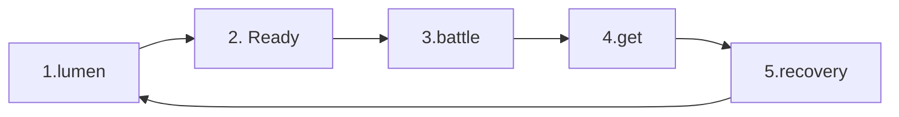

# Lumen Condenser Learn to Play

Lumen Condenser is a competitive card game where you exchange attacks and defenses like a fighting game and read your opponent's gaps. There is no need to memorize all the cards and exception rolls from the beginning. First, learn **Game Preparation → Flow of a Turn → Basic Battle**, and then look at detailed rules such as combos and Catch in order.

> [! NOTE]
> This guide is a version that directly re-contrasts the terminology, learning sequence, and visual materials of the original rulebook in 2026 and 6, and applies the judgment of the draft comprehensive rules reflecting official responses. For complex judgments, check against [Comprehensive Rulebook](./lumen-comprehensive-rules.md).

## study course

1. **Beginner:** Preparation, cards and fields, game preparation, basic battle
2. **Intermediate:** Special Judgment, Combo, Catch, Deck Construction
3. **Advanced:** Priority, Fixed Speed, special situations, detailed card grammar

---

# Features of Lumen Condenser

## A battle that constantly goes back and forth like a fighting game.

Reduce the opponent's HP with Attack Technique, block the opponent's attack with Defense Technique, and gain additional benefits. The key is to anticipate what your opponent will do and exploit their loopholes.

## Information on the opponent's card is public.

Before the game, you check your opponent's initial hand, and during the game, each other's lists are revealed. By observing which cards your opponent takes from the list, you can predict his or her next move.

## Starter deck available for immediate play upon purchase

The starter deck can be used right away without any modification. After learning the basic play, you can create your own deck with booster cards.

---

# Beginner — Game Basics

## 1. What you need in match

### essential

- 1 legal decks per player

**Deck** is a set of cards required for play. Starter decks can be used right out of the box, or you can create your own according to the deck construction rules.

### Convenient to have

- **Calculator:** Used to calculate damage and HP.
- **Battlefield and tokens:** HP, FP, indicates the zone in which the card is placed.
- **Dice or Counters:** Useful for displaying persistent effects or counts.
- **Card Protector:** Prevents card damage. If you use a protector, you must use the same protector on all cards in a deck. However, Character Card and Trait Card can use different protectors.

## 2. Battlefield

Battlefield specifies the location and name of the card. In a real game, two players place their fields facing each other.

| number | Zone | Use |
| ---: | --- | --- |
| 1 | list | Among the Techniques you primarily want to use, place cards that are not in your hand face up. The maximum is 14 sheets. |
| 2 | Side Deck | Place the initial hand, any cards not included in the list, and Special Technique face down. |
| 3 | Break Zone | Place the Break card. This card generally cannot be used again in that game. |
| 4 | Character Zone | Leave Character Card. |
| 5 | Trait Zone | Place Trait Card on the character. |
| 6 | Battle Zone | Place the selected Technique Card on the back side of Ready Phase. |
| 7 | Lumen Zone | Place the card placed on Lumen Zone as a card effect. |
| 8 | FP area | Displays your and your opponent's FP. |
| 9 | Ultimate Zone | Leave Ultimate Technique Card as front by default. |

> [! IMPORTANT]
> If a card would move to a List that already contains 14 cards, that card is Broken instead. For details, see the [List rule in the Comprehensive Rules](./lumen-comprehensive-rules.md#rule-2-1-1).

## 3. Types of cards and how to read them

### 3.1 Character Card

Character Card represents the player and displays his current HP.

| item | Description |
| --- | --- |
| Hand Limit | This is the maximum number of cards you can have in your hand at your current HP range. |
| HP | Displays the player's current HP. |
| Character Emblem | Determines the mark of the Technique that can be placed in the deck. |
| Character Information | Affiliation, pseudonym, name, etc. are displayed. |
| Card Number | This is the number of the pack containing the card and the corresponding series, and is used for organizing cards and retrieving data. |

As your HP changes, the loss limit for your current HP range may also change. If your hand exceeds the limit after one effect has been processed, the excess amount is immediately discarded.

### 3.2 Trait Card

Trait Card is a card with character-specific functions and effects. When starting the game, place it on Trait Zone next to Character Card and apply it immediately after starting the game.

### 3.3 Special Technique Card

Special Technique is a card used when certain conditions are met.

1. Check the terms of use.
2. Reveal the card.
3. Place it on Lumen Zone etc. as instructed by the card.
4. Process effects.

Special Technique Card can only exist in Side Deck, Lumen Zone, Ultimate Zone, and Break Zone. If you try to move to the hand or list, it will be Break instead. Even if Special Technique becomes Break, it does not replenish from Side Deck like a normal Technique.

### 3.4 Ultimate Technique Card

Ultimate Technique is a powerful card with limited use during the game. You can put 0 or 1 cards in your deck, and they will be revealed face-up by default at Ultimate Zone at the start of the game.

#### Ultimate Attack·Defense Technique

- Instead of taking list card 1 from Get Phase, you can put it into your hand from Ultimate Zone.
- After adding it to your hand, use it in the same way as a normal attack Defense Technique.
- It does not automatically return to Ultimate Zone after use. Depending on the actual processing results, it will remain in the list Break Zone.

#### Ultimate Special Technique

- Depending on the conditions and processing procedures written on the card, it is placed in Lumen Zone, etc.
- You cannot add it to your hand.
- If you try to move to a zone that is not allowed, you will get Break instead.

### 3.5 Attack Technique Card

Attack Technique is a card that causes damage to the opponent when used in Battle Zone.

| item | Description |
| --- | --- |
| card name | This is the name of the Technique. |
| Position determination | Displays Attack Level among the top, middle, and bottom. |
| speed | The lower the number, the faster it is. |
| hand/Foot Attribute | Indicates whether the attack is with the hand or the foot. |
| Judgment result FP | This is the FP increase/decrease value based on hit/blocked/counter results. |
| Special Judgment | These are special judgments of cards such as evasion, Clash, Grab, and combo. |
| card effect | Functions and effects are displayed. |
| Character Emblem | Decide whether deck formation is possible. |
| Flavor Text | This is a phrase related to setting up the Technique. |
| damage | This is the amount reduced from the opponent's HP when hit or countered. |

### 3.6 Defense Technique Card

Defense Technique is a card used in Battle Zone to block or avoid the opponent's attack.

| item | Description |
| --- | --- |
| card name | This is the name of the Technique. |
| defense decision | Indicates whether to block or avoid attacks from the top, middle, or bottom. |
| Special Judgment | This is a special judgment that the card has. |
| card effect | Functions and effects are displayed. |
| Character Emblem | Decide whether deck formation is possible. |
| Flavor Text | This is a phrase related to setting up the Technique. |

## 4. Game Ready

Each player starts with the HP shown on the far left of Character Card. If your opponent's HP is less than 0 and your HP is more than 1, you win. If both HP points fall below 0 in the same processing unit, proceed with Sudden Death.

### Preparation order

1. After greeting each other, Character Card, Trait Card, place the selected Ultimate Card face up, and use dice, rock, paper, scissors, coin toss, etc. to determine the first Priority holder.
2. In the deck, select Technique Card 5 rather than Special Technique as the initial hand, and 9 as the initial list. The remaining Technique Card and Special Technique Card are placed face down in Side Deck.
3. Place the initial list 9 card face down and wait for your opponent to prepare to this stage as well.
4. After exchanging and confirming the initial 5 cards, they are returned to their owners.
5. Each person reveals the card 9 from their list face up.

> [! NOTE]
> To create your initial hand and list, you will need at least 14 copies of Technique Card in your deck, not Special Technique.

## 5. Game progress

The game progresses in **turns** and **phases**.**Turn** is the entire flow from Lumen Phase to Recovery Phase, and **Phase** is a section where both players clearly divide the actions they will take in that turn. One turn consists of five phases.

### 5.1 Lumen Phase

Card effects that say “does on Lumen Phase” are processed starting from the owner of Priority.

### 5.2 Ready Phase

Each player chooses the Technique Card 1 card they want to use, places it face down on Battle Zone and declares **Ready**.

- Cards cannot be changed after being declared ready.
- The declaration cannot be canceled.
- Your choice is confirmed even if your opponent is not ready yet.

### 5.3 Battle Phase

Both sides' ready cards are revealed face up at the same time, and the attack and defense results are judged. At the end of the battle, the cards used are basically returned to the hand, but if there are other movement rules such as combo · Catch · Break, those rules will be followed.

### 5.4 Get Phase

1. Get Phase Processes all effects upon entry.
2. Compare in the following order: FP → HP → Hands and re-determine Priority.
3. Priority Show the list card 1 to the opponent and put it in your hand.
4. Instead of a list card, you can add Ultimate Zone's ultimate attack·Defense Technique to your hand.

If your hand has reached the upper limit, you may not take the Get action. Even if you skip just one side, the get on the other side will proceed normally. Even if the list is empty, Get Phase will proceed, and you can choose to get the ultimate attack Defense Technique.

### 5.5 Recovery Phase

First, we deal with the “At Turn End” effect. It then ends any effects that last “for this turn” or “until the end of the turn” and declares the end of the turn.

## 6. Basics of Battle

The battle is decided as either **win by decision**, **loss by decision**, or **draw** by comparing the Techniques of both sides.

### 6.1 Order to check first

1. Check whether avoidance holds.
2. Verify that the defense holds.
3. For attacks, the speed reflecting FP is compared.
4. Check whether Clash holds.

An attack that establishes evasion will no longer be checked for defense against that attack, speed win or loss, or Clash.

### 6.2 Win by decision

#### hit

The attack hits if one of the following occurs:

- There is no valid block/evade that matches Attack Level.
- Defense Technique cannot block the opponent Attack Level.

When hit, the card's hit-related effects and damage are applied. If the hit judgment is a combo, proceed with Combo Time.

#### counter

In attack-to-attack, if your Final Speed is faster, it counters your opponent. Even if the attack is successful while avoiding the opponent's attack with your Special Judgment, it is treated as a counter rather than a hit.

#### defense

If the defense card's defense position matches the opponent's Attack Level, it defends. The effect is applied when defending and no damage is taken from opponent's attacks.

#### avoidance

If the defense card's evasion position matches the opponent's Attack Level, it will evade. When evading, the effect is applied and no damage is taken from the opponent's attack.

### 6.3 decision card

- If your opponent blocks, your attack becomes **blocked**.
- If your opponent evades, your attack will be **Dodged**.
- If the opponent's attack Final Speed is faster, your attack will be **countered**.
- If Defense Level does not match the opponent's attack, the defense card will be **hit**.

### 6.4 draw

#### Both Hit / Simultaneous Hit

If Attack Technique and FP are the same after Final Speed correction, it is Both Hit / Simultaneous Hit. Both hit-related effects are processed in Priority order, then FP is applied simultaneously and damage is also applied simultaneously. If both attacks are combos, each player will only deal with that attack once as a 1 combo and end Combo Time.

#### Clash

If the Clash conditions are met, the hit-related effects and Clash city effects of both attacks are processed, and the side with the lower damage loses HP equal to the difference in attack damage. The damage of Defense Technique is calculated as 0 and there is no hit judgment.

#### Both Defense

If both players use Defense Technique, it is a draw. Effects for hit, counter, defense, and evasion are not applied, and only effects unrelated to the judgment result, such as when used, before judgment, after judgment, and after use, are processed.

#### avoid each other

If both attacks evade each other, it is a draw. When dodging, the effect is processed and no damage from the dodged attack is applied.

## 7. FP

FP(Frame Point) is a value that affects the speed of Attack Technique.

- Positive FP makes attacks faster by that amount. The speed numbers are lowered.
- Negative FP slows attacks by an absolute value. The speed numbers increase.
- After applying all FP in the battle, both sides' FP becomes 0.
- Even if you use Defense Technique or Fixed Speed Technique, FP itself will be consumed entirely.
- Speed changes due to FP are not applied to Fixed Speed Techniques.

### example

| situation | calculation | Final Speed |
| --- | --- | ---: |
| Speed 8 Attack, +3FP | 8 - 3 | 5 |
| Speed 8 Attack, -4FP | 8 + 4 | 12 |

When the evasion, defense, Clash conditions refer to attack speed, use **Reference Speed**, which does not reflect FP.

## 8. Priority

Priority is the authority to act first when both parties must act at the same time.

Compare in the following order:

1. Player with high FP
2. If FP is the same, the player with higher HP
3. If the HP is the same, the player with the most cards
4. If all are equal, the previous Priority holder retains

## 9. Break and discard

### Break

Cards with Break are sent to Break Zone. If an attack or Defense Technique in the hand·list·Lumen Zone·Battle Zone is Break, immediately after that, the attack of Side Deck or Defense Technique 1 can be placed face up on the list.

- If a suitable card is missing or cannot be moved, it will not be replenished.
- If Special Technique becomes Break, it will not be supplemented.
- If the list is 14, the card you were trying to replenish will be Break instead, and no additional replenishment will occur.

### discard

Lumen Condenser to **discard** means placing a card from your hand face up on the list. This is different from Break.

## 10. Not responding

If the opponent is not ready within 10 seconds from the moment the opponent clearly declares ready, does not have a ready Technique, or prepares a Technique that does not meet the conditions for use, it is treated as not responding.

1. Players who do not respond reveal their entire current hand to their opponents.
2. The opponent selects 1 of the desired cards and treats them as ready.
3. If there are no Techniques in your hand that can legally be ready, standard virtual Techniques are treated as ready.
4. If you fail to respond three times in a game, you lose the current game.

> [! WARNING]
> The only thing confirmed is that standard virtual techniques have no effect, Special Judgment, FP change, or damage. Attack/defense type, position judgment, and speed values ​​still need to be officially confirmed.

## 11. game manners

- Play so as not to harm those around you.
- Treat your opponent’s cards with care.
- Special Judgment and the effect activation are clearly announced to the opponent.
- We prioritize not only winning and losing, but also creating enjoyable games for each other.

---

# Intermediate — Detailed rules of the game

## 12. Special Judgment

Special Judgment is a special judgment that the card has. There are keywords such as avoidance, Clash, Grab, etc.

### 12.1 Grab

The moment you try to apply the hit/counter judgment of the opponent's Grab technique, you can nullify Grab by Break the Grab technique 1 from your hand.

If Grab is invalidated, processing is as follows.

1. Stops roll effects and damage that have not yet been processed.
2. Return both ready cards to your hand.
3. Repeat Ready Phase in the same turn.
4. On-use effects and FP changes that have already been processed will not be reversed.

### 12.2 Clash

#### With the attack Clash

Occurs when your attack Clash location is the same as the opponent's Attack Level and your attack is slower than the opponent's.

#### In defense Clash

Occurs when your defense Clash position is the same as the opponent's Attack Level. Speed ​​comparison does not apply to defense Clash.

#### Clash Processing

1. Processes the on-hit effect of both attacks.
2. Clash Handles poetry effects.
3. FP from both judgment results is applied simultaneously.
4. Calculate the difference between the attack damage of both sides.
5. The one with less damage loses HP equal to the difference.

The damage of Defense Technique is calculated as 0, and Defense Technique is considered to have no hit judgment.

## 13. Combo Time

If an attack that is a combo judgment hits or is countered, the attack becomes a 1 combo and starts Combo Time.

### 13.1 default connection

1. After processing the 1 combo, you can quit Combo Time on the spot.
2. To continue, draw a random legal attack card from your hand, along with an attack card whose speed value is exactly 1 greater than that card.
3. The first card becomes the 2 combo, and the second card becomes the 3 combo.
4. If both sheets cannot be legally presented, Combo Time will be terminated.
5. After the 3 combo, you can use one attack card after another that has exactly 1 higher speed values than the previous card.

> [! NOTE]
> The lower the speed number, the faster it is, so “the speed number is 1 larger” means it is one level slower than the previous Technique. Example: Velocity 7 followed by Velocity 8.

### 13.2 Processing order

Each combo card is dealt in the following order:

`When used → When combo → Damage → After use`

Hit/counter judgments do not apply to combo cards.

### 13.3 Damage Correction

| combo | correction |
| ---: | ---: |
| 1Combo | 0 |
| 2Combo | -100 |
| 3Combo | -200 |
| 4Combo | -300 |
| 5Combo | -400 |
| After | Added each time a combo increases -100 |

After processing the effect during a combo, if the compensation result is less than 0, the Technique cannot be used in the combo.

> [! WARNING]
> If the damage is confirmed to be less than 0 after the effect has already been processed during the combo, the effect reversal, return to hand, and reselection range still need to be officially confirmed.

### 13.4 Combo ends

- 1Sends all cards used in combos, including combos, to the list.
- Set both FPs to 0.
- Catch will not proceed in the battle in which Combo Time has started.
- When Combo Time is finished, immediately exit Battle Phase.

### 13.5 Combo example from existing rulebook

| step | card | basic damage | correction | Apply Damage |
| ---: | --- | ---: | ---: | ---: |
| 1Combo | Sets slash | 500 | 0 | 500 |
| 2Combo | cutting | 400 | -100 | 300 |
| 3Combo | throw kick | 300 | -200 | 100 |
| 4Combo | counter rat | 500 | -300 | 200 |
| 5Combo | Setsumei Kick | 500 | -400 | 100 |
| total |  |  |  | **1,200** |

If the last card, Setsumei Kick, was Break due to its own effect, only the remaining combo cards are sent to the list at the end of the battle.

## 14. Catch

Catch is an automatic hit attack that occurs as a FP or card effect at the end of the battle.

### 14.1 FP Catch Condition

| status | Cards that can be used |
| --- | --- |
| own FP > 0, opponent FP = 0 | Attacks with a speed value equal to or lower than FP |
| own FP = 0, opponent FP < 0 | An attack with a speed value less than the absolute value of the opponent's lost FP |

If a card effect indicates Catch, the effect will follow the conditions set.

### 14.2 Catch Processing

1. Set both FPs to 0.
2. Catch The attack automatically hits.
3. Processes in `When used → When Catch → When hit → Damage → After use` order.
4. Effects before judgment are not applied.
5. Catch The card is sent to the list at the end of the battle.
6. Catch If the hit judgment of the attack is a combo, it enters Combo Time.

Catch cannot be blocked by defense, evasion, or Clash other than Grab invalidation.

### 14.3 Multiple Catch

- Process Catch by effect first.
- Afterwards, if the conditions FP Catch are satisfied, an additional Catch can be declared.
- Once a player starts Catch, only that player has Catch rights for that Catch time.
- Even after Catch ends, the same player can continue Catch if the conditions are met again.
- If both can Catch, then the Priority holder goes first.

## 15. Full sequence of Battle Phase

1. Ready card released simultaneously
2. Effect processing when used in the order of Priority
3. Process effects before judgment in order of Priority
4. Apply both FPs to attack speed and consume all FP
5. Evasion check
6. Defense check
7. Check the speed of each attack to win or lose
8. Clash OK
9. Grab Special processing such as invalidity
10. Process judgment effects in the following order: Evasion → Defense → Hit/Counter → Clash → Combo
11. Both judgment results FP applied simultaneously
12. Apply damage to both sides simultaneously
13. Check status such as HP 0 and hand limit
14. Effect processing after judgment in the order of Priority
15. Process effects after use in the order of Priority
16. Do a combo if possible
17. If there is no combo and possible, proceed with Catch
18. Move the used card to the designated zone and end the battle.

## 16. How to make a deck

The basic deck consists of **a total of 22 or 23 cards** as follows. The number of cards may vary depending on the character's characteristics.

| card type | buy |
| --- | ---: |
| Character Card | 1 Chapter |
| Trait Card | 1 Chapter |
| Attack·Defense·Special Technique Card | Total 20 sheets |
| ultimate card | Chapters 0~1 |

### Deck composition restrictions

- Technique Card must be Neutral Emblem or equal to its own Character Emblem.
- At least 10 of Technique Card must be equal to its Character Emblem.
- Character Emblem in Trait Card must be equal to its Character Card.
- If a character trait changes deckbuilding restrictions, only the items specified in the card text will change.
- Basically, you cannot have more than 2 cards with the same name in one deck. In other words, there is a maximum of 1 cards with the same name.
- Even if the card number, illustration, and edition are different, if the card name is the same, it is considered a card with the same name.

### Tips for building a deck

This topic is not a rule, but rather strategy advice for beginners.

- **Insert neutral Defense Technique:** Compensates for positions that are difficult to block with only the character's unique defense.
- **Creating psychological warfare with dashes:** Anticipate your opponent’s next move and aim for a big advantage.
- **Dividing the top, middle, and bottom:** If Attack Level is concentrated on one side, it becomes easier for the opponent to respond.

---

# Advanced – In-depth rules of the game

## 17. Handling special situations

### 17.1 Defense Over

If none of the following occurs in three successive Battle Phases, Defense Over occurs.

- Use Attack Technique
- Damage occurs
- FP Variation
- Effect activated

If even one occurs, the continuation count is initialized to 0. Even if the effect did not change the actual state, if the effect was triggered, it is reset.

When Defense Over occurs, both Battle Zone Techniques are used Break. The general Break supplementary rules also apply. If the same stagnation continues, the process will be repeated every time in the fourth and subsequent battles.

### 17.2 Sudden Death

At the end of the same processing unit, if both HP points are below 0, proceed with Sudden Death.

1. Reorganize your hand, list, and Side Deck as you normally would for a new game.
2. Both starting HP is 1000.
3. The starting hand consists of the maximum number of hands in the HP range 1000.
4. The initial hand confirmation and list disclosure procedures will be performed again.
5. Set both FPs to 0.
6. Existing Priority holders will retain Priority.
7. Turns proceed from Lumen Phase to 3.
8. At the end of the 3 turn, the player with higher HP wins.
9. If the HP is the same, it is a draw.
10. During Sudden Death, if both sides' HP reaches 0 again at the same time, it is an immediate draw.

## 18. Priority Detailed rules

### 18.1 Sequence of multiple effects

If there are multiple effects to be processed by both sides at one time, the Priority holder takes turns processing one effect at a time. Each player chooses one of their atmospheric effects on their turn.

> [! EXAMPLE]
> If A has Priority and A has 2 effects, and B has 3 effects, they are processed in `A → B → A → B → B` order.

### 18.2 Public Trigger and Hidden Trigger

- The effect generated from Public Information, such as the face-up card, is **Public Trigger**.
- Side Deck, etc. The effect that occurred in Hidden Information is **Hidden Trigger**.
- If the timing is the same, the Public Trigger group is processed first, and then the Hidden Trigger group is processed first.

### 18.3 If you exceed the random effect

“Could” is a random effect. If you do not use it during your turn to process the effect, you cannot use it again at the same time.

## 19. Battle detailed rules

### 19.1 Fixed Speed

- “Fix at X speed” first changes the speed to X and then fixes it.
- FP and other speed changes after fixation will not be applied.
- FP is consumed entirely even if it is not reflected in speed.
- If a speed change is applied first and fixed later, changes already applied will not be undone.
- If different fixing effects conflict, the fix applied first will be kept.

### 19.2 It gets faster and slower

- Lower the speed number that makes it faster.
- Increase the speed number to slow down.
- If it is not fixed, then FP will be corrected.
- The rate may exceed 13 or fall below 5.
- If the calculation result is 0 or less, the actual speed is 1.

> [! EXAMPLE]
> Speed 13 If a Technique is 8 faster with an effect, then Reference Speed is 5. If the player has -3FP, Final Speed becomes 8. The effect “avoid speed below 6” checks Reference Speed before FP 5, so this attack is avoided.

### 19.3 Technique countered

A Technique that is countered is a loss. Only functions that explicitly set invalidity as a condition, such as “if this card is not invalidated,” will not be activated when countered.

### 19.4 Card retrieval order

Techniques used in battle are returned to your hand in the order in which they were used. For both ready cards, the Priority holder's card is considered to have been used first.

- Combo·Catch cards are sent to the list, not to the hand.
- Cards with Break are sent to Break Zone.

## 20. Combo Detailed Rules

- 2·3Combo cards are revealed together, but used in order.
- Even after 2combo processing, the 3combo must still be legally usable.
- Even if there are no cards to use in the 2·3 combo, Combo Time starts and the 1 combo card is sent to the list.
- If you enter Combo Time as an effect, the two cards that meet the conditions can be used as 1 combo and 2 combo, respectively. If you cannot present both cards, no card is played.
- If you use a card that was handled at a certain speed, the next card must have a value 1 greater than that handling speed.
- When the speed changes due to a card effect, the next combo is connected based on the changed speed.
- If Break occurs during a combo, immediately process Break and replenishment and then resume the combo.
- Normal trigger effects are processed after the current processing unit, and only effects that are officially classified as intervening are processed during the current processing unit.
- Both Hit / Simultaneous HitIf both attacks are combos, both sides' 1combos are confirmed, and each player only deals the 1combo and ends Combo Time.
- If both Clash attacks are combos, each player only deals the 1 combo.

## 21. Catch Detailed rules

- Grab used as Catch can also be nullified by Break the Grab card in your hand.
- Even if Catch Grab is invalidated, the original battle damage, FP, and card movement results are maintained.
- Only the invalidated Catch card is returned to the hand, and Ready Phase is played again in the same turn.
- Process effect Catch before FP Catch.
- When one player starts Catch, the opponent cannot Catch during that Catch time.

## 22. Card Detailed Rules

### 22.1 Functions and Effects

- A description without a number before the sentence is a **function**. Applies in all zones without separate activation.
- Descriptions with a number before the sentence are **effects**.
- “Shall” is a forcing effect.
- “Could” is a random effect.

### 22.2 Omitted objects and subjects

If the object or subject is omitted, the subject of action is regarded as **themselves**, the card owner, and the card status, value, and movement object is regarded as **this card**.

### 22.3 Forced text collision

1. Prefer negative forms that make an action impossible, such as “can’t.”
2. For other conflicts, the effect of the Priority holder is applied first.
3. Any subsequent effects that conflict with the effect applied first will not be applied.

### 22.4 Guard Damage

The Guard Damage inflicted upon a successful defense is treated as damage inflicted by the owner of the defense card to himself, not as damage inflicted by the opponent.

- The “when you take damage” condition is satisfied.
- The condition “when the opponent inflicts damage” is not satisfied.

## 23. Get Phase Detailed rules

Even if there are no cards in the list, Get Phase itself proceeds. You cannot take cards from the list, but you can choose to take Ultimate Zone's ultimate attack·Defense Technique.

## 24. Ultimate Technique Detailed rules

| situation | processing |
| --- | --- |
| Ultimate Attack/Defense moves to list | Remains on the list like normal attack and defense |
| Ultimate attack/defense is Break | Side Deck can be replenished like normal attack and defense. |
| Ultimate Special Technique moves to Side Deck | Place at Side Deck |
| Ultimate Special Technique moves to a zone that is not allowed, such as the hand or list. | Replaced by Break Zone Move |

---

# quick reference

## turn order

`Lumen → Ready → Battle → Get → Recovery`

## Battle Order

`Reveal → When used → Before judgment → FP → Evasion → Defense → Speed → Clash → Special processing → Judgment effect → FP → Damage → Check status → After judgment → After use → Combo → Catch → Summary`

## Something that often confuses me

| question | answer |
| --- | --- |
| Is the speed faster with larger numbers? | No. Lower numbers are faster. |
| Do I preserve FP if I play a defense card? | No. Consumes all FP you have. |
| Are discard and Break the same? | No.discard is a card → list, and Break is a Break Zone move. |
| Can I Catch after the combo starts? | You cannot do this in this battle. |
| Can Catch be defended? | Grab It cannot be blocked by defense, evasion, or Clash other than invalidation. |
| There are 14 cards in the list, but what if more cards are added? | The card you were trying to move is Break instead. |
| During the effect, does it stop immediately when the HP reaches 0? | Finishes the current processing unit and checks its status. |

---

# Related documents

- [Lumen Condenser Comprehensive Rulebook](./lumen-comprehensive-rules.md)
- Card-specific FAQs and errata: To be announced `/rules/rulings`
- Contest Rules and Instructions for Handling Violations: `/rules/tournament`
