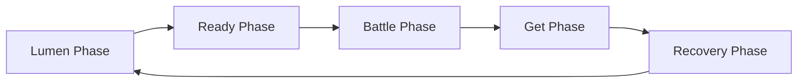

# Lumen Condenser Comprehensive Rules

> **Document Status:** This is web edition v0.6, cross-checked against the June 2026 rulebook from review draft v0.1. It incorporates the existing Master Rulebook and answers to 65 official ruling questions, but some details still require official confirmation.

## How to use this document

- Players learning the game for the first time are recommended to read [First time play guide](./lumen-beginner-guide.md) first.
- This document is the standard for searching and citing situations requiring a ruling by **reference key** or rule number.
- A `rule-...` reference key is the unique identity of a rule object; its `Chapter.Section.Clause` number is a display number derived from the current layout.
- Card-specific exceptions and errata should cite this document's reference keys in a separate card ruling index.
- `[Confirmation required]` is an item that the production team needs to confirm once more.
- Visuals of the original page and web usage can be found at [visual index](./VISUAL_ASSET_INDEX.md).

> [! WARNING]
> Before the official publication of this document, please check the latest official rulings for each card and announcements from the production team.

## table of contents

- [0. Before Reading This Rulebook](#chapter-0)
- [1. Definitions of Game Objects](#chapter-1)
- [2. Definitions of Game Areas](#chapter-2)
- [3. Game Setup](#chapter-3)
- [4. Game Progression](#chapter-4)
- [5. Game End](#chapter-5)
- [6. Card Effects and Priority](#chapter-6)
- [7. Battle](#chapter-7)
- [8. Combos and Catches](#chapter-8)
- [9. Rule-Based Effects](#chapter-9)
- [Appendix A. Glossary](#appendix-a)
- [Appendix B. Quick Reference Table](#appendix-b)
- [Appendix C. Edit Checklist](#appendix-c)
- [Appendix T. Draft Competition/Operating Regulations](#appendix-t)

---

# 0. Before Reading This Rulebook

This chapter explains the game overview, the status of this document, the priority among rules, and the cautions to know before reading.

## 0.1 Game Overview

**0.1.1** Lumen Condenser is a competitive card game where you reduce your opponent's HP with Attack Technique and block the opponent's attacks with Defense Technique.

## 0.2 Status and Priority of Documents

**0.2.1** This document is a review draft incorporating the existing Master Rulebook and Official Decision Response. Before official publication, check the latest official judgments for each card and announcements from the production team.`[Review Draft]`

**0.2.2** The priorities between documents and the standard languages for the Korean, English, and Japanese versions have not yet been officially confirmed. In this draft, it is interpreted in the following order for editing convenience.`[Confirmation required]`

1. Latest errata and official card rulings
2. card text
3. comprehensive rules
4. introductory guide
5. example

> [! WARNING]
> The above order is not a rule confirmed by an official answer, but a temporary priority for editing the document. Before formal publication, the legal status of examples and the reference language in case of conflicting translations must be confirmed.

## 0.3 Rule Objects and Reference Contracts

**0.3.1** Each rule is an independent **rule object**. A rule object has a reference key, a parent rule, normative text, and referenced rules. Its normative text states each applicable subject, precondition, operation, result, and exception; no unstated condition, result, or exception is inferred.

**0.3.2** A **reference key** is a unique, persistent string identifying one rule object. It uses the `rule-...` form, and no two rules may share a key. A layout or display-number change does not change the key's meaning; an earlier key is retained as an alias of the same rule.

**0.3.3** A child rule inherits the definitions and scope established by its parent. If a child expressly restricts or declares an exception to part of its parent, the child governs that part; everything not expressly changed applies together with the parent. A child of one rule does not automatically change the scope of a sibling rule.

**0.3.4** When a rule object references another rule, it uses the referenced rule's definitions, conditions, and procedure without restating them. If a procedure references another procedure while resolving, complete the referenced procedure and then resume with the caller's next operation. A mutual semantic reference does not itself cause repeated processing; repetition occurs only when a rule states both a repeat condition and a termination condition.

**0.3.5** A conditional rule performs its instructed operation only when its condition is true. “Do” is mandatory and “may” is optional, and a result changes game state only within the scope stated by that sentence. An exception must identify its subject and replacement operation; after the exception ends, every unchanged general rule continues to apply.

---

# 1. Definitions of Game Objects

A **game object** is something that a rule or card effect can designate as a target. The two kinds of game objects are **players** and **cards**. A deck is a card configuration used during setup, while zones and the FP Area are game areas; none of them is itself a game object.

## 1.1 Players

**1.1.1** A player is a game object that participates in the game and may be targeted by rules and card effects. A game has two players, distinguished as yourself and the other player, your opponent.

**1.1.2** A player object has the following information. Rules and card effects may inspect or change some of this information.

| Information | Description |
|---|---|
| Self or opponent | The owner of the card producing an effect is yourself; the other player is the opponent. |
| Current HP | The player's remaining HP, displayed on their Character Card. |
| Current FP | A public positive, zero, or negative value displayed in the FP Area. |
| Hand size | The number of cards currently in the Hand; this is public information. |
| Hand limit | The maximum Hand size shown in the Character Card's current HP bracket. Recalculate it after a processing unit ends if HP changed. |
| Priority | Whether the player currently determines the order of simultaneous actions or effects. |
| Character Emblem | The emblem printed on the player's Character Card, referenced by deck construction and some effects. |
| Connected areas | Game areas connected to that player, such as their Hand and zones. |

**1.1.3** If a player's Hand exceeds their current Hand limit after a processing unit ends, that player immediately discards the excess. Perform this before processing the next effect.

**1.1.4** In card text, “you” designates the player object who owns the card producing the effect, and “your opponent” designates the other player object. An effect that targets a player targets that player object, not a card or zone.

> [! EXAMPLE]
> Even if you add multiple cards to your hand while processing the effect and exceed the limit, the effect will be processed until the end. Immediately after the effect ends, check the hand limit for the current HP range and discard any excess.

## 1.2 Cards

**1.2.1** A card is a printed game component that may be targeted by rules and card effects. A card remains the same object when it moves between zones or changes between face-up and face-down states.

**1.2.2** A card object has the following common information, though some information may not apply to every card type.

| Information | Description |
|---|---|
| Owner | The player who began the game with that card in their deck. Moving the card to another zone does not change its owner unless an instruction expressly says so. |
| Card name | The card's name, used for same-name determinations and references in card effects. |
| Card type and classifications | Character, Trait, Attack, Defense, or Special Technique, plus classifications such as Ultimate. |
| Character Emblem | An emblem referenced by deck construction and card effects. A Neutral Technique has the Neutral Emblem. |
| Functions and effects | Functions that continuously apply and effects processed at specified times. |
| Values and ruling information | Type-specific information such as HP, Hand limit, Speed, damage, FP, position, and special rulings. |
| Display state and current zone | Whether the card is face up or face down and the zone it currently occupies. These determine visibility and which rules may use the card. |
| Printing identifiers | Card number, illustration, and edition information used to organize and identify a printing. |

**1.2.3** A Character Card represents a player. It has character information such as affiliation, epithet, and name; game information such as HP and Hand limits by HP bracket and a Character Emblem; and a card number as printing identification. During the game, it displays the player's current HP and Hand limit.

**1.2.4** A Trait Card contains a character's unique functions and effects. It has a card name, Trait classification, functions and effects, and Character Emblem, and is placed in the Trait Zone beside the Character Card during setup.

**1.2.5** A Trait Card's functions and effects apply immediately after the game begins.

**1.2.6** An Attack Technique Card is a Technique Card used in the Battle Zone to deal damage to the opponent. Its information may include card name, attack position, Speed, hand or foot designation, FP by ruling result, special rulings, functions and effects, Character Emblem, damage, and flavor text.

**1.2.7** A Defense Technique Card is a Technique Card used in the Battle Zone to guard against or evade an opposing attack. Its information may include card name, guarded or evaded positions, special rulings, functions and effects, Character Emblem, and flavor text.

**1.2.8** A Special Technique Card is a Technique Card whose effect is processed when its printed use condition is met. Its information may include card name, Special Technique classification, use condition, functions and effects, Character Emblem, and the zone where it is placed. To use it, check the condition, reveal the card, place it in the designated zone, and process the effect in that order. A Special Technique whose condition is not met cannot be revealed or placed.

**1.2.9** A Special Technique Card may exist only in the Side Deck, Lumen Zone, Ultimate Zone, or Break Zone and cannot enter the Hand.

**1.2.10** Ultimate is an additional classification that an Attack, Defense, or Special Technique Card may have. An Ultimate Technique has the information of its base card type plus its Ultimate classification. A deck may include zero or one Ultimate Technique, which is revealed face up in the Ultimate Zone at the start of the game. It uses the same card sleeve as the other Technique Cards.

**1.2.11** After an Ultimate Attack or Defense Technique enters the Hand, process it under the same rules as a normal Attack or Defense Technique. After use, its actual movement to the Hand, List, Break Zone, or another zone remains in effect; it does not automatically return to the Ultimate Zone.

**1.2.12** When its condition is met, place an Ultimate Special Technique in the Lumen Zone or another designated zone according to the procedure printed on the card. It cannot enter the Hand.

**1.2.13** If an Ultimate Attack or Defense Technique is sent to the List, it remains there under the same rules as a normal Attack or Defense Technique.

**1.2.14** If an Ultimate Special Technique is sent to the Side Deck, place it in the Side Deck.

---

# 2. Definitions of Game Areas

An area where cards are placed is called a **zone**. A zone determines its purpose, permitted cards, face-up or face-down state, visibility, capacity, and the result of moving a card into it. The **FP Area** is a game area used to display values, not a zone that holds cards.

## Area Attribute Summary

| Area | Purpose and permitted cards | Default state | Visibility | Capacity and order |
| --- | --- | --- | --- | --- |
| Character Zone | Character Card representing the player | Face up | Public | 1 at setup; no order |
| Trait Zone | Trait Card containing the character's unique effects | Face up | Public | 1 at setup; no order |
| Hand | Technique Cards available to Ready or use through effects | Hidden | Owner only; initial hand is mutually checked | Current HP bracket's hand limit; no order |
| List | Public Techniques not being used during the Ready Phase | Face down before setup completes; face up after the game begins | Public after the game begins | Maximum 14; no order |
| Side Deck | Techniques and Special Techniques not placed in the initial hand or List | Face down | Count is public; contents and order are hidden from the opponent | Owner may set and inspect the order |
| Battle Zone | Technique readied from the hand | Face down while Ready; face up after reveal | Hidden from the opponent while face down; public after reveal | 1 Ready card per player |
| Lumen Zone | Cards placed there by a card effect | As specified by the effect; draft default is face up | As specified by the effect; draft default is public | No fixed maximum; follows the effect |
| Ultimate Zone | The selected Ultimate Technique | Face up by default; may be face down by an effect | Public while face up | 0–1 at setup |
| Break Zone | Broken cards | Face up | Public | No fixed maximum; no order |
| FP Area | Each player's current FP value | Public value | Public | No card capacity or order |

> [!WARNING]
> The default state and visibility of a card placed in the Lumen Zone remain to be officially confirmed when the placing effect does not specify them. This review draft treats such a card as face up and public.

## 2.1 Definition of Zones

**2.1.1** Each player has one connected Character Zone, Trait Zone, Hand, List, Side Deck, Battle Zone, Lumen Zone, Ultimate Zone, and Break Zone, so two of each kind exist during a game. An area connected to a player is that player's area. Unless a card effect or rule says otherwise, a card moving to a zone follows that zone's permitted-card, display-state, visibility, and capacity rules.

**2.1.2** The Character Zone holds the Character Card that represents the player and displays their remaining HP. Each player has one connected Character Zone and places their one Character Card there face up during setup. The card's information and current HP display are public information that every player may inspect. A normal deck contains only one Character Card, so that one card remains in the Character Zone unless a card effect or rule says otherwise.

**2.1.3** The Trait Zone holds the Trait Card containing a character's unique functions and effects. Each player has one connected Trait Zone and places their one Trait Card face up beside their Character Card during setup. Its information is public to every player, and its functions and effects apply immediately after the game begins. Unless a card effect or rule says otherwise, that one card is the only card in the Trait Zone and card order has no rules meaning.

**2.1.4** The Hand is a hidden zone holding Technique Cards that a player may Ready or use through card effects. Each player has one Hand. It may contain Attack and Defense Techniques and Ultimate Attack or Defense Techniques that are permitted to enter the Hand, but it cannot contain Special Techniques. The owner may inspect their entire Hand and card order has no rules meaning, while the opponent may not inspect its contents during the game. As an exception, players mutually check their initial hands during setup, return them to their owners, and treat them as hidden again once the game begins. Hand size is public information; its maximum is the [[rule-3-2-2|hand limit]] shown for the Character Card's current HP bracket, and any excess is [[rule-3-2-3|discarded immediately]] after a processing unit ends.

**2.1.5** The List is a zone that holds each player's public Techniques that are not being used during the Ready Phase. Each player has one connected List, so two Lists exist during a game. A List has a maximum capacity of 14 cards and may never contain more than that number. If a card would move to a List that already contains 14 cards, it is [[rule-10-2-1|Broken]] instead of moving to the List. The initial List remains face down and hidden until setup is complete, is revealed simultaneously after both players are ready, and remains face up after the game begins. Every player may inspect the information and count of face-up cards in a List, and card order has no rules meaning.

**2.1.6** The Side Deck is a face-down zone holding Technique Cards and Special Technique Cards not placed in the initial hand or initial List. Each player has one connected Side Deck, so two Side Decks exist during a game. With the normal twenty-Technique deck composition, it begins with six cards after removing the five-card initial hand and nine-card initial List; an effect that changes deck construction or setup takes precedence. Its card count is public information, but its contents and order are hidden from the opponent. The owner may set the order before the game and inspect the contents and order of their Side Deck during the game. It has no fixed maximum during play, and its count may change through card effects and zone movement.

**2.1.7** The Battle Zone is where a player places one Technique Card chosen from their Hand and declares it Ready during the Ready Phase. Each player has one connected Battle Zone, so two Battle Zones exist during a game, and the normal capacity is one Ready card per player. A Ready card remains face down until the Battle Phase begins, so the opponent may not inspect its contents, and the player may not change the card or cancel the declaration after declaring Ready. Both Ready cards are revealed face up simultaneously during the Battle Phase, after which every player may inspect their information. At the end of the battle, a Ready card normally returns to the Hand, but separate movement rules for Combos, Catches, Break, and similar cases take precedence.

**2.1.8** The Lumen Zone holds a card that a card effect instructs a player to “place in the Lumen Zone.” Each player has one connected Lumen Zone, so two Lumen Zones exist during a game. It mainly holds Special Techniques after their use procedure, but the placing effect determines which cards may enter it and when they move. That effect also determines the card's duration, movement, count, and order, and the zone has no fixed maximum. If an effect specifies the face-up or face-down state or visibility, follow that instruction; if it does not, this review draft treats the card as face up and public to every player. `[Confirmation required]`

**2.1.9** The Ultimate Zone holds the Ultimate Technique selected for the deck. Each player has one connected Ultimate Zone, so two Ultimate Zones exist during a game, but the zone is empty for a player who did not include an Ultimate Technique. During setup, a player places zero or one selected Ultimate Technique face up, and every player may inspect its information while it is face up. A card effect may turn it face down, in which case that effect determines its visibility. After an Ultimate Attack or Defense Technique leaves this zone, it follows the same movement rules as a normal Technique and does not automatically return; an Ultimate Special Technique cannot enter the Hand.

**2.1.10** The Break Zone is a public zone holding cards Broken by a rule or card effect. Each player has one connected Break Zone, so two Break Zones exist during a game. Broken cards are placed face up; every player may inspect their information and count; card order has no rules meaning; and the zone has no fixed maximum. A card in the Break Zone generally cannot be used again during that game, but a card effect or rule that instructs another movement takes precedence. When an Attack or Defense Technique is Broken from a Hand, List, Lumen Zone, or Battle Zone, apply the [[rule-10-2-1|Break replenishment rule]]; Special Techniques do not receive that replenishment.

**2.1.11** The FP Area is not a card-holding zone; it is a game area that separately displays each player's current FP value. Each player has one independent FP value, and both values are public information that every player may inspect. FP may be positive, zero, or negative and has no defined upper or lower limit; card-capacity and card-order rules do not apply. FP is used for matters such as determining Priority and calculating attack Speed, and during battle each player applies all FP they hold and then resets it to zero.

## 2.2 Public Information by Zone

**2.2.1** The number of cards in each zone and both players' current HP and FP are public information needed to compare Priority and confirm legal play. Every player may inspect the information printed on face-up cards in a public zone. Hidden information, including Hands and face-down cards, may be inspected only by the owner or a player permitted by that zone's rules; the mutual check of initial hands during setup is an exception. A player who needs to pick up an opponent's public card to inspect it must first obtain permission and must return it without changing its position or order.

---

# 3. Game Setup

## 3.1 Deck Construction Rules

**3.1.1** A deck is a group of cards used during game setup and is not a game object. A starter deck can be used immediately after opening; a custom-built deck must follow the construction restrictions in this section.

**3.1.2** A basic deck contains 22 or 23 cards in total, with the following composition. If a character's Trait changes a deck count, follow that card text.

- Chapter Character Card 1
- Chapter Trait Card 1
- Offense, Defense, Special Technique Card Total 20 pieces
- 0 or 1 Ultimate Cards

**3.1.3** If a character Trait changes deck construction restrictions, only the items expressly specified by the card text change. Unspecified restrictions on deck size, card types, emblems, and same-name cards continue to apply.

**3.1.4** By default, a deck cannot include two or more cards with the same name. Cards with the same card name are same-name cards even if their card numbers, illustrations, or editions differ.

**3.1.5** Each Technique Card in a deck must have either the Neutral Emblem or the same Character Emblem as the player's Character Card.

**3.1.6** At least ten Technique Cards in the deck must have the same Character Emblem as the player's Character Card.

**3.1.7** The Trait Card's Character Emblem must match the Character Card's Character Emblem.

## 3.2 Game Setup Procedure

**3.2.1** Before the game begins, each player places Character Card, Trait Card, and the selected Ultimate Card face up.

**3.2.2** At the start of the game, the initial Priority holder is determined by an agreed upon method such as dice, rock, paper, scissors, or coin toss.

**3.2.3** Each player selects Technique Card 5 rather than Special Technique as the initial hand, and 9 as the initial list. Therefore, a legal deck must contain at least Technique Card, not Special Technique, at least 14.

**3.2.4** Technique Card and Special Technique Card not selected in the initial hand or list are placed face down on Side Deck.

**3.2.5** The initial list 9 is first placed on the back, and after both sides are ready, it is revealed on the front.

**3.2.6** Both players exchange the initial cards 5, check them, and then return them to their owners.

---

# 4. Game Progression

One turn progresses through five phases: **Lumen → Ready → Battle → Get → Recovery**.

## 4.1 turns and phases

**4.1.1** A turn includes five phases, from Lumen Phase to Recovery Phase.

**4.1.2** One turn proceeds in the following order: Lumen Phase, Ready Phase, Battle Phase, Get Phase, Recovery Phase.

## 4.2 Lumen Phase

**4.2.1** In Lumen Phase, card effects that are described as being processed “in Lumen Phase” are processed starting from the holder of Priority.

## 4.3 Ready Phase

**4.3.1** At Ready Phase, each player selects the Technique Card 1 card to use, places it face down on Battle Zone, and declares ready. After declaring Ready, you cannot change the card or cancel the declaration.

> [! IMPORTANT]
> Once you declare Ready, you cannot change the card even if your opponent has not yet done so. The non-response time of 10 seconds in the competition and operation regulations is also calculated from the moment the opponent clearly declares ready.

## 4.4 Battle Phase

**4.4.1** In Battle Phase, both ready cards are revealed face up at the same time and the attack and defense results are judged.

**4.4.2** Battle Phase At the end, bring the ready card to your hand. If there are separate movement rules such as combo·Catch·Break, those rules take priority. Both ready cards are treated as if they were used starting from the card of the Priority holder.

## 4.5 Get Phase

**4.5.1** After processing all effects that occur when entering Get Phase, decide on Priority again. The order determined at this time is not recalculated until Get Phase is completed.

**4.5.2** In Get Phase, show 1 cards from the list starting from the Priority holder decided at the time of entry to the opponent and then place them in your hand.

**4.5.3** A player whose hand reaches Hand Limit may not take the Get action. Even if one player skips, the other player's get will not be skipped.

**4.5.4** Instead of taking list card 1 to Get Phase, you can add Ultimate Zone's Ultimate Attack·Defense Technique 1 to your hand.

**4.5.5** If there is no list card in Get Phase, you cannot retrieve a card from the list, but Get Phase itself will proceed. Even in this case, you can take the action of adding Ultimate Zone's ultimate attack·Defense Technique to your hand.

## 4.6 Recovery Phase

**4.6.1** In Recovery Phase, the trigger effect “at the end of the turn” is processed first. Afterwards, the continuous effect for that turn and the “until the end of the turn” effect ends and the turn ends.

---

# 5. Game End

## 5.1 Victory and Defeat

**5.1.1** Each player starts with the HP indicated on the far left of Character Card. After the processing unit ends, if it is confirmed that the opponent's HP is less than 0 and the player's HP is more than 1, that player wins.

## 5.2 Sudden Death

**5.2.1** If both players' HP is below 0 at the end of the same effect or same judgment result processing unit, it is assumed that both players' HP has reached 0 at the same time and proceed with Sudden Death.

**5.2.2** When Sudden Death is reached, reconfigure the hand, list, and Side Deck using the same procedure as normal new game preparation. However, the starting HP of both sides is 1000, and the starting hand is made up of the same number of HP 1000 as Hand Limit.

**5.2.3** Sudden Death's initial cards and lists also follow the general preparation procedure of mutual confirmation and disclosure. Only the initial number of cards is changed from 5 to Hand Limit in HP 1000.

**5.2.4** Sudden Death When starting, both FPs are set to 0.

**5.2.5** Sudden Death proceeds from Lumen Phase to 3 turns with the existing Priority holder maintaining Priority. At the end of the 3 turn, the player with higher HP wins, and if the HP is the same, it is a draw.

**5.2.6** In Sudden Death state, if both sides' HP becomes 0 at the same time again, the game is treated as a draw.

---

# 6. Card Effects and Priority

## 6.1 Function, Effect, and Omission Grammar

**6.1.1** In the card description, a description without a number before the sentence is a **function**. The function is always applied without any separate activation, and applies regardless of which zone the card is in.

**6.1.2** In the card description, the description with a number before the sentence is the **effect**.

**6.1.3** If the target or subject of the effect is omitted, it is interpreted as follows.

- The subject of the action is considered to be the player **himself**, the owner of the card.
- Expressions indicating the status, value, or movement of a card are regarded as **this card**.

> [! EXAMPLE]
> - “Clash poetry” is interpreted as “your own Clash poetry.”
> - “Lumen Zone’s card” is interpreted as “your Lumen Zone’s card”.

## 6.2 Processing Units and State Checks

**6.2.1** “Processing Unit” means one of the following:`[edit definition]`

- The scope of processing one effect, identified by one number, from beginning to end.
- A set of numerical treatments set to be applied simultaneously, such as both FP or both damage.

**6.2.2** After each processing unit, check the status of HP 0, Hand Limit excess, etc. After performing all necessary status processing, proceed to the next effect or next step.

**6.2.3** The effect currently being processed will not be interrupted due to a normal trigger effect. Only actions explicitly classified as “intervening” in the card text or official decision may enter between the current effects.

> [! EXAMPLE]
> If an effect reduces both HP by 500, check both HP after finishing the entire effect. If both sides are below 0, they are considered to have reached 0 HP at the same time in the same processing unit.

## 6.3 Priority

**6.3.1** Priority is the authority to act first when you must act at the same timing.

**6.3.2** Priority is compared in the following order.

1. Player with high FP
2. If FP is the same, the player with higher HP
3. If the HP is the same, the player with the most cards

**6.3.3** When deciding on Priority again, if FP, HP, and hand are all the same, the previous Priority holder keeps Priority. This rule applies to all Priority re-determinations, not just Get Phase.

## 6.4 Effects to be processed simultaneously

**6.4.1** If there are multiple effects to be processed by both sides at one time, the Priority holder takes turns processing one effect at a time. When it's your turn, the player chooses one of the effects he or she can deal with. If the opponent has no effects to process, the same player selects the next effect after the current effect is finished processing.

> [! EXAMPLE]
> If A has Priority and A has 2 atmospheric effects, and B has 3 atmospheric effects, they are processed in `A → B → A → B → B` order. Each turn a player chooses one of their atmospheric effects.

**6.4.2** Effects that activate on face-up cards are treated as **Public Trigger**, and effects that activate on face-down cards such as Hidden Information** are treated as **Hidden Trigger**.

**6.4.3** If both Public Trigger and Hidden Trigger can be processed at the same timing, the Public Trigger group is processed first. Within each group, it is processed according to Priority and effect selection rules.

## 6.5 Forced and Random Effects

**6.5.1** “~” is a forced effect and “may” is a random effect. If a player skips his effect processing turn without using a random effect, he cannot use that effect again during the same timing.

## 6.6 text conflict

**6.6.1** When coercive text conflicts, negatives that disable an action, such as “can’t”, take precedence.

**6.6.2** If forced text other than the negative form collides, the effect of the Priority holder is applied first. Subsequent effects that conflict with the effect applied first are not applied to the extent of the conflict.

## 6.7 Interruption and waiting effects

**6.7.1** An “interruption effect” is an effect designated as an intervention in the card text or official decision. Other triggering effects are processed as waiting effects after the current processing unit ends.`[Need to check notation method]`

> [! WARNING]
> It has not yet been decided what text or icon will identify the interrupt effect in existing cards. Your card review book should provide a classification for each card or add a common notation.

---

# 7. Battle

The entire flow of the battle, attack, defense, Both Hit / Simultaneous Hit, Clash, Grab are integrated into one procedure.

## Battle processing order

1. Ready card released simultaneously
2. Effect when used
3. Effect before judgment
4. FP applied/consumes all
5. Evasion check
6. Defense check
7. Speed win/loss check
8. Clash OK
9. Grab Special processing such as invalidity
10. Judgment effect: Evasion → Defense → Hit/Counter → Clash → Combo
11. Apply both FP simultaneously
12. Apply damage to both sides simultaneously
13. Check status
14. Effect after judgment
15. Effects after use
16. combo
17. Catch
18. card organization

## speed terminology

| terminology | definition | Mainly used |
| --- | --- | --- |
| print speed | Original speed printed on card | basic information |
| Reference Speed | Speed that reflects the increase/decrease/fixation of card effects and does not reflect FP | Evasion·Defense·Clash conditions, combo connection |
| Final Speed | Final speed reflecting FP in Reference Speed | Attack vs attack speed comparison |

> [! NOTE]
> “Reference Speed” and “Final Speed” are editing terms to clearly distinguish the speed before and after applying FP of the existing rulebook.

## 7.1 Full sequence of battle

**7.1.1** The battle is decided as a win, loss, or draw by comparing both techniques.

**7.1.2** The battle proceeds in the following order: effect upon use/before judgment, FP speed correction, battle judgment, effect upon judgment, judgment result FP and damage, effect after judgment/after use, combo, Catch.

**7.1.3** When used, the effect is processed starting from the Priority holder, and the pre-judgment effect is processed starting from the Priority holder.

**7.1.4** Battle decisions are made in the following order: evasion confirmation, defense confirmation, decision win/loss decision, and Clash confirmation. If evasion is established for an attack, no further defense, speed win/loss, or Clash checks are made for that attack.

**7.1.5** Grab Special processing that invalidates a decision result, such as invalidation, is declared and processed immediately after confirming a hit or counter decision, but before processing the effect of that decision.

**7.1.6** Effects based on combat judgment are applied in the order of evasion, defense, hit/counter, Clash, and combo.

**7.1.7** Effects that are activated “when the opponent makes the relevant decision” are processed after the effect of the relevant decision.

**7.1.8** Calculate all FP changes according to both judgment results and apply them simultaneously, then calculate both damage and apply them simultaneously.

**7.1.9** After the decision, the effect is processed starting from the Priority holder, and after use, the effect is processed starting from the Priority holder.

## 7.2 Speed and FP

**7.2.1** The speed of Attack Technique is faster as the number is lower.

**7.2.2** When comparing the speed of Attack Technique in battle, all of the player's current FP are applied. It becomes faster by a positive number FP and slower by the absolute value of a negative number FP.

**7.2.3** Regardless of whether the ready card is attack or defense, or has a fixed speed, consume all FP you have in battle and set both FPs to 0. Fixed Speed Only speed changes due to FP are not applied to the Technique.

**7.2.4** Techniques with fixed speed are not affected by FP and other speed changes that occur after the speed is fixed. If a speed change is applied first and then fixed, the change already applied will not be canceled.

**7.2.5** “Fixed at X speed” changes the Technique speed to X and applies the fixed state.

**7.2.6** Decrease the speed value for “faster” and increase the speed value for “slower.”If the Technique is not fixed, it will receive FP correction afterwards.

**7.2.7** When referring to Technique speed in evasion, defense, Clash conditions, use Reference Speed, which does not apply FP.

**7.2.8** The rate may vary above 13 or below 5. If the calculation result is less than 0, the actual speed is treated as 1.

**7.2.9** If different Fixed Speed effects conflict, the fixation applied first is maintained in the effect processing order, and subsequent fixations are not applied to the extent of conflict.

> [! EXAMPLE]
> When using a speed 8 attack with +3FP, Final Speed becomes 5. At -4FP, Final Speed becomes 12. Techniques with fixed speed also consume all FP, but this is not reflected in speed.

## 7.3 attack vs attack

**7.3.1** If the opponent's Technique does not have an effective defense or evasion that blocks your Attack Level, your attack will hit.

**7.3.2** Hit attacks apply hit judgment and related effects and deal damage. If the hit judgment is a combo, proceed with Combo Time.

**7.3.3** When comparing Attack Technique, if the opponent's attack's Final Speed is slower or the opponent's attack is avoided with Special Judgment, your attack will be countered.

**7.3.4** Counter attacks apply counter judgments and related effects and deal damage. If the counter decision is a combo, proceed with Combo Time.

**7.3.5** If the opponent's attack is Final Speed faster than your attack, or if your attack is evaded by the opponent's Special Judgment, your attack will be countered.

Attacks that are evaded and countered with **7.3.6** Special Judgment apply the “when evading the opponent” effect and do not cause damage.

**7.3.7** Countered techniques are treated as decision losses.

**7.3.8** “Functions conditioned on invalidation” that do not activate when countered only refer to phrases that explicitly state invalidity as a condition, such as “if this card has not been invalidated.”

**7.3.9** Avoid the opponent's attack with your own attack Special Judgment, and if the attack is successful, a counter judgment is applied rather than a hit.

## 7.4 Offense vs. Defense

**7.4.1** Defense Technique's defense or evasion position decision must match the opponent's attack position decision for the decision to be valid.

**7.4.2** If the defense position of the defense card matches the opponent's Attack Level, it defends. The effect is applied when defending and does not apply opponent attack damage.

**7.4.3** If the defense card's evasion position matches the opponent's Attack Level, evade. When evading, the effect is applied and the opponent's attack damage is not applied.

**7.4.4** If the defense position of the opponent's card matches your Attack Level, your attack is blocked. The “when the opponent defends” effect is applied, no damage is inflicted, and the guard decision is applied to FP.

**7.4.5** If the evasion position of the opponent's card matches your Attack Level, your attack will be evaded. The effect “when evading the opponent” is applied and no damage is inflicted.

**7.4.6** If there is no valid defense decision that matches the opponent's Attack Level, the defense card is hit and no defense or evasion effects are applied.

## 7.5 Draw and Clash

**7.5.1** After FP correction between Attack Technique, if Final Speed is the same, it becomes Both Hit / Simultaneous Hit.

**7.5.2** In Both Hit / Simultaneous Hit, the hit-related effects of both attacks are processed in the order of Priority. After that, both FP changes are applied simultaneously, and then both damage is applied simultaneously.

**7.5.3** If the attack or Clash judgment of Defense Technique meets the conditions, the battle is processed as Clash.

**7.5.4** An attack Clash occurs when the position of Clash of Attack Technique is the same as the opponent's Attack Level and your attack speed is slower than the opponent's attack.

**7.5.5** If the Clash position of Defense Technique is the same as the opponent's Attack Level, defense Clash occurs.

**7.5.6** The restriction “If the speed of a Technique with Clash judgment is the same or faster than the opponent’s Technique, it will not be activated” only applies to Clash of Attack Technique. Speed ​​comparison is not applied to Clash of Defense Technique.

**7.5.7** When Clash, the hit effect of both attacks is processed, and then when Clash, the effect is processed. Next, the FP of the judgment result is applied simultaneously, and the HP of the side with lower damage is reduced by the difference between the attack damage of both sides.

**7.5.8** The damage of Defense Technique is calculated as 0, and Defense Technique is treated as if there is no hit judgment.

**7.5.9** If both sides use Defense Technique, the effect is not applied when hitting, countering, defending, or evading. When used, only effects that satisfy the conditions are processed, regardless of the judgment result, such as before, after, or after judgment.

**7.5.10** If both attacks evade each other, the battle is a draw, and the trigger effect from evasion is processed and the damage from the evaded attack is not applied.

**7.5.11** “Defending each other” only means when both players have used Defense Technique Card. This battle is a draw and the effect does not activate when defending.

## 7.6 Judgment result FP

**7.6.1** Attack Technique shows the increase/decrease value of FP according to the hit, blocked, and counter results, respectively.

## 7.7 damage

**7.7.1** When Attack Technique hits or counters, the opponent's HP is reduced by the amount of damage indicated on the card.

**7.7.2** The Guard Damage inflicted upon a successful defense is the damage caused by that Defense Technique Card, and is treated as damage inflicted on the owner of the card. Therefore, the condition “when you suffer damage” is satisfied, but the condition “when the opponent inflicts damage” is not satisfied.

## 7.8 Summary of used cards

**7.8.1** Techniques used in battle are returned to the hand in the order in which they were used. Both ready cards are treated as if the Priority holder's card was used first. Combo·Catch cards are sent to the list, and cards with Break effects are sent to Break Zone.

## 7.9 Special Judgment and Grab

**7.9.1** Special Judgment is a special judgment of the card and has keywords such as avoidance, Clash, and Grab.

**7.9.2** When applying the hit/counter judgment of the opponent's Grab technique, you can nullify Grab by Break the Grab technique 1 in your hand.

**7.9.3** If Grab is invalidated, return both Ready cards to the hand without processing the remainder, and proceed with Ready Phase again in the same turn. Effects and FP changes that have already been processed upon use will not be reversed.

> [! IMPORTANT]
> Grab Invalidation does not rewind the entire battle. The use effect and FP that have already been processed are maintained, and only judgment effects and damage that have not yet been processed are stopped.

---

# 8. Combos and Catches

## Combos

A combo is a continuous attack sequence that begins with a hit or counter combo roll or card effect.

## Combo Correction Table

| combo number | Connection conditions | Damage Correction |
| --- | --- | ---: |
| 1Combo | The first card specified by the attack or effect that caused the combo | 0 |
| 2Combo | Random legal attacks in basic combos | -100 |
| 3Combo | The speed value is exactly 1 greater than the 2 combo. | -200 |
| 4combo or more | The speed value is exactly 1 higher than the previous card. | Add every time the combo number increases to 1 -100 |

## 8.1 Combo entry and legality

**8.1.1** If an attack that is a combo judgment hits or is countered, the attack becomes a 1 combo and starts Combo Time.

**8.1.2** Cards presented in a combo must actually be usable after the previous cards have been processed. If an illegal declaration is made, the card is treated as unused and returned to the hand, and another legal card can be presented again during the same combo phase.

**8.1.3** Cards not used due to illegal combo declarations are returned to Hidden Information in the hand, but the information that has already been revealed does not disappear.`[Edit Codification]`

## 8.2 Combo common processing

**8.2.1** Combo cards are processed in the order of use, combo, damage processing, and post-use effects.

**8.2.2** Cards used in combos are not subject to hit/counter judgments.

**8.2.3** The 2 combo reduces card damage by 100, the 3 combo reduces card damage by 200, and each time the number of combos increases by one, the card damage decreases by 100.

**8.2.4** After processing the effect during a combo, if the damage is less than 0 as a result of damage compensation, the technique cannot be used in the combo.

**8.2.5** All cards used in the combo, including the 1 combo, are sent to the list at the end of the combo.

**8.2.6** Once Combo Time starts, that Battle Phase's Catch opportunity is gone. When Combo Time is terminated, Battle Phase is terminated immediately.

**8.2.7** Cancellation of use of cards whose damage has become 0 or less after processing the effect during a combo, reversal of already processed effects, and reselection range require additional official decisions. Until then, only the conclusion that the card cannot be used is applied.`[Confirmation required]`

> [! WARNING]
> 0 It has not yet been confirmed whether the effect of a card whose damage has become less than that will be reversed, whether the card will be returned to the hand, or whether another card can be played again.

## 8.3 Basic combo connection

**8.3.1** After the 1 combo, the player can either end Combo Time, or present a random attack card from their hand and an attack card with a speed value exactly 1 greater than that card in order. If you present two cards, they become 2 combo and 3 combo, respectively.

**8.3.2** If you cannot present both the 2 combo and the 3 combo that can be used legally, Combo Time will end.

**8.3.3** After the 3 combo, you can continue to use one attack card with a speed value 1 higher than the previous combo card.

## 8.4 Combo special handling

**8.4.1** Even if there are no cards to use in the 2·3 combo, Combo Time starts, and the 1 combo card is sent to the list at the end.

**8.4.2** When Combo Time ends, both FPs are set to 0.

**8.4.3** When you enter Combo Time with an effect other than a hit/counter, you can present two attack cards that meet the conditions in order and use them as a 1 combo and 2 combo, respectively. If you cannot present both cards, end Combo Time without using any cards.

**8.4.4** If a card is used in a combo by handling it at a certain speed, the next card must be a card with a value 1 greater than that handling speed.

**8.4.5** If the speed of Attack Technique changes due to a card effect during a combo, the next combo is connected based on the changed speed.

**8.4.6** If Break occurs during combo processing, the combo is paused and the combo is resumed after completing Break and immediate replenishment processing. However, the pair of 2 combo and 3 combo must be a combination in which both cards can be used legally.

**8.4.7** 2 combo and 3 combo are presented together, but used in order. Even after applying the processing results of the 2combo, the 3combo must be legally usable, and otherwise, combinations cannot be presented from the beginning.

**8.4.8** When a new effect is triggered during a combo, if the effect is classified as “interrupting” by card or official judgment, it will stop current processing and be processed immediately. Normal trigger effects are processed after the current effect's processing unit ends.

**8.4.9** When presenting the 2 combo and the 3 combo together, the mandatory effect of the 2 combo must be applied and then the 3 combo must be combined to satisfy both usage conditions and connection speed.

> [! WARNING]
> If a legally declared 2·3 combo becomes illegal due to an unexpected intervention effect, additional decisions may be made for each card to determine which cards are returned.

## 8.5 Both Hit / Simultaneous Hit·Clash combo

**8.5.1** If both Both Hit / Simultaneous Hit attacks are considered combos, each player's 1 combo is considered to have already been confirmed. Effects are processed in Priority order, damage is applied simultaneously, and one side's HP is treated as if it reached 0 first, so the other side's 1 combo is not interrupted. Each side only processes the 1 combo and ends Combo Time.

**8.5.2** If both Clash attacks are considered combos, each player only processes the 1 combo and ends Combo Time.

## Catches

Catch is an automatic hit attack that occurs at the end of the battle due to the FP status or card effect.

## Catch Type

| type | condition | card to use |
| --- | --- | --- |
| Positive number FP Catch | self FP > 0, opponent FP = 0 | An attack whose speed value is less than FP |
| Negative FP Catch | self FP = 0, opponent FP < 0 | An attack whose speed value is less than the absolute value of FP lost by the opponent. |
| Effect Catch | Card effect indicates Catch | Attack under the conditions determined by the effect |

## 8.6 Catch Condition

**8.6.1** Catch can be progressed by satisfying the conditions before the end of Battle Phase after all Techniques in the battle have processed their effects after use.

**8.6.2** If your FP is greater than 0 and your opponent's FP is 0, you can use Attack Technique with a speed value less than FP in your hand to Catch.

**8.6.3** If your FP is 0 and the opponent's FP is less than 0, you can use Attack Technique in your hand with a speed value less than the absolute value of the opponent's lost FP to Catch.

**8.6.4** When a card effect tells you to “Catch,” use Attack Technique that satisfies the conditions specified by the effect to Catch.

## 8.7 Catch Processing

**8.7.1** If Catch is performed, both FPs are set to 0.

**8.7.2** The attack used in Catch automatically hits and the hit judgment and related effects are applied. Catch attacks cannot be blocked by defense, evasion, or Clash other than Grab nullification. If the hit judgment is a combo, it enters Combo Time.

**8.7.3** Catch cards are processed in the order of use, Catch, hit, damage processing, and post-use effect, and the effect before the decision is not applied.

**8.7.4** Attack cards used in Catch are sent to the list at the end of Battle Phase.

## 8.8 Continuation Catch and special situations

**8.8.1** When a player starts Catch, only that player has Catch rights during that Catch time. Even after Catch ends, if the conditions are met again, the same player can continue Catch.

**8.8.2** Even if you use a Catch Grab attack, your opponent can nullify the attack by Break a Grab card in his hand.

**8.8.3** If Grab used with Catch is invalidated, the original battle damage, FP, and card movement results are maintained. Return only the invalidated Catch card to your hand and proceed with Ready Phase again in the same turn.

**8.8.4** Catch due to the effect is processed first regardless of FP. After that, Catch by FP can be additionally declared if possible.

**8.8.5** If both can Catch, then the Priority holder does Catch first. When that player starts Catch, the opponent's Catch rights are lost until the Catch time runs out. If Grab is invalidated, etc., and you proceed with Ready Phase again, this limitation will disappear.

---

# 9. Rule-Based Effects

## 9.1 Zone Movement and Discarding

**9.1.1** Break cards are sent to Break Zone.

**9.1.2** “discard” means placing a card from your hand face up on the list, and is different from Break.

## 9.2 Break and Replenishment

**9.2.1** If an attack or Defense Technique is Break in the hand, list, Lumen Zone, Battle Zone, supplementary processing is inserted immediately thereafter. The owner of that card can place Side Deck's attack or Defense Technique 1 card face up on the list. If there is no suitable card or the move is not possible, it is not replenished.

**9.2.2** Break Techniques are generally no longer available in that game.

**9.2.3** When the ultimate attack·Defense Technique becomes Break, it can be replenished from the list from Side Deck in the same way as the normal attack·Defense Technique.

> [! EXAMPLE]
> If the list already has 14 cards, the moment the card you were trying to replenish is about to be moved to the list, that card will be Break instead. This card has been Break from Side Deck, so no further replenishment will occur.

## 9.3 Illegal Movement of Special Techniques

**9.3.1** If Special Technique Card attempts to move to the hand or list, that move is replaced with a move to Break Zone.

**9.3.2** Even if Special Technique Card becomes Break, cards are not replenished from Side Deck to the list.

**9.3.3** Ultimate Special Technique can only exist in Side Deck, Lumen Zone, Ultimate Zone, and Break Zone. If you try to move to another zone, it is replaced with Break Zone movement.

## 9.4 Defense Over

**9.4.1** If all of the following four items are missing in three consecutive Battle Phase, Defense Over occurs.

- Use Attack Technique
- Damage occurs
- FP Variation
- Effect activated

If any of the four items occurs, the continuation count is initialized to 0. Even if the effect did not change the actual state, if there was an “effect activation”, it is reset.

**9.4.2** If Defense Over occurs, both Battle Zone techniques are Break performed. The general Break supplementary rules also apply to this Break. If the same stagnation continues after the fourth time, it will be processed again for each battle.

---

# Appendix A. Glossary

| terminology | definition |
| --- | --- |
| Public Trigger | Effects that activate on face-up cards, etc. Public Information |
| function | Card description without number. Always applied in all zones without separate activation |
| Interrupt | Officially designated processing to stop the current effect's processing unit and process it first. |
| Damage Correction | Processing to further reduce card damage by 100 depending on the combo number |
| Ready | A declaration that places Technique Card face down on Battle Zone and confirms the selection. |
| list | A zone where up to 14 public Technique Card are placed.“discard” moves from hand to list. |
| Break | Sending a card to Break Zone to prevent it from being normally reused in that game |
| Hidden Trigger | Effects that activate in Hidden Information, such as Side Deck |
| use | Present the card according to the relevant procedure and start processing the effects when used. |
| Clash | Attack or Defense Technique's Clash roll to apply both hits and deal with the damage difference, resulting in a draw. |
| speed figures | A number representing the speed of Attack Technique. The lower the faster |
| Reference Speed | Speed that reflects speed change/fixation due to effects and does not reflect FP |
| Final Speed | Final speed reflecting FP in Reference Speed |
| processing unit | Scope of processing a single effect or a set of values applied simultaneously from start to finish |
| Catch | At the end of the battle, an automatic hit attack performed under FP or effect conditions. |
| Combo Time | The procedure of entering a combo judgment or card effect and using an attack followed by a speed value. |
| Priority | When both sides act at the same timing, the authority to select and process the effect first |
| effect | Numbered card description.“I should” is mandatory, “I can” is arbitrary. |

---

# Appendix B. Quick Reference Table

## flow of one turn

`Lumen → Ready → Battle → Get → Recovery`

| phase | key actions |
| --- | --- |
| lumen | Lumen Phase Effect processing |
| Ready | Description 1Select sheet, place back, declare ready |
| battle | Reveal, Judgment, Effect, Combo, Catch |
| get | Obtain List Card or Ultimate Attack/Defense |
| recovery | Continuous effect ends after triggering at end of turn |

## Battle processing order

`Reveal → When used → Before judgment → FP → Evasion → Defense → Speed win or loss → Clash → Special processing → Judgment effect → FP → Damage → Check status → After judgment → After use → Combo → Catch → Summary`

## Key results by card combination

| yourself\opponent | attack | defense |
| --- | --- | --- |
| attack | Check evasion → Compare speed → Clash. If the faster one is equal to the counter, Both Hit / Simultaneous Hit | If it matches the opponent Defense Level, it will block/evade, otherwise it will hit. |
| defense | If your Defense Level matches the opponent's attack, you will block/evade. If it does not match, you will be hit. | Both Defense. Process only effects unrelated to judgment results |

> [! IMPORTANT]
> At the end of each effect or batch of simultaneous stat, check your HP 0 and loss cap. Once the combo starts, the Catch chance for that battle disappears.

---

# Appendix C. Edit Checklist

The following items must be finalized before the Comprehensive Rules are formally published:

- [ ] **Document priority:** The exact precedence and controlling language of errata, card rulings, card text, the Comprehensive Rules, introductory guides, and examples
- [ ] **Default Lumen Zone visibility:** The default face-up or face-down state and visibility when the placing effect does not specify them
- [ ] **Interrupt classification:** Common wording, icons, or a card-by-card ruling list that identifies interrupt effects
- [ ] **0-damage Combo:** Whether to reverse effects, return the card to the Hand, reselect, or end the Combo when a card's damage becomes 0 or less after effect processing
- [ ] **Exceptions during 2- and 3-Combos:** What to reverse when an unexpected interrupt makes a legally declared Combo illegal
- [ ] **Standard virtual Technique:** The attack or defense type, position ruling, and Speed of the virtual Technique used for Failure to Respond

---

# Appendix T. Competition/Operating Regulations

Competition progress, participant roles, time limit, Failure to Respond, result reporting, tardiness, Time Extension, and penalties are confirmed based on a separate document, [Lumen Condenser Floor rules](/rules/tournament/).

This comprehensive rulebook covers the core rules of card and game handling, and any judgment regarding tournament operation should be made in conjunction with floor rules and tournament-specific notices.

## T.1 Go to floor rules

- [Competition floor rules](/rules/tournament/)
- [Win/loss decision and Failure to Respond](/rules/tournament/#floor-win-and-no-response)
- [Competition time limit and timeout processing](/rules/tournament/#floor-match-time)
- [Report results, surrender, abstain, be late](/rules/tournament/#floor-participation)
- [penalty](/rules/tournament/#floor-penalties)

---

# Revision History

| Version | Date | Highlights | Status |
| --- | --- | --- | --- |
| v0.6-web | 2026-09-01 | Added rule-object contracts, reference keys, parent scope, inter-rule dependencies, and reference-integrity validation | Review draft |
| v0.5-web | 2026-09-01 | Redefined game objects as players and cards, detailed their information, and simplified clause display | Review draft |
| v0.4-web | 2026-09-01 | Expanded every game area's purpose, player association, visibility, capacity, and movement exceptions | Review draft |
| v0.3-web | 2026-09-01 | Reorganized the chapter structure and reading order of the Comprehensive Rules | Review draft |
| v0.1 | 2026-08-13 | Integrated the existing rule inventory and 65 official ruling answers | Review draft |
| v0.1-web | 2026-08-24 | Added web-editing Markdown, stable rule anchors, and visualization instructions | Review draft |
