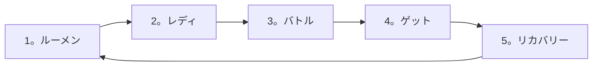

# ルーメンコンデンサー はじめてのプレイガイド

ルーメンコンデンサーは、格闘ゲームのように攻撃と守備をやり取りし、相手の隙間を読む大戦型カードゲームです。最初からすべてのカードと例外判定を覚える必要はありません。まず**ゲーム準備→1ターンの流れ→基本バトル**を覚えた後、コンボやキャッチのような詳細ルールを順に見てみましょう。

> [!NOTE]
> このガイドは、2026年6月のオリジナルルールブックの用語・学習手順・視覚資料を直接再照合し、公式回答が反映された総合ルール草案の判定を適用したバージョンです。複雑な判定は[総合規則書](./lumen-comprehensive-rules.md)を目安にご確認ください。

## 学習コース

1. **初級編:** 準備物、カードとフィールド、ゲーム準備、基本バトル
2. **中級編：** 特殊判定、コンボ、キャッチ、デッキ構成
3. **上級編:** 優先権、速度固定、特殊状況、詳細カード文法

---

# ルーメンコンデンサーの特徴

## 格闘ゲームのように絶えず行き来する工房

攻撃技で相手の体力を減らし、防御技で相手の攻撃を防ぎ、追加のゲインを獲得します。相手がどんな行動をするかを予想し、その抜け穴を突くことが重要です。

## 相手カードの情報が公開されている

ゲーム前に相手の初期手札を確認し、ゲーム中はお互いのリストが公開されます。相手がリストからどのカードを取るかを観察すると、次の行動を予測できます。

## スターターデッキ購入即座にプレイ可能

スターターデッキは別途変更せずにすぐに使用できます。基本プレイを習った後、ブースターカードで自分だけのデッキを作ることができます。

---

# 初級編 — ゲームの基礎

## 1. 対戦に必要なもの

### 必ず必要なもの

- プレイヤーごとに合法的なデッキ1個

**デッキ**はプレイに必要なカードの束です。スターターデッキは開封直後に使用することができ、デッキ構成ルールに従って直接作成することもできます。

### あれば便利なもの

- **計算機:** ダメージと体力を計算するときに使用します。
- **バトルフィールドとトークン:** 体力、FP、カードが置かれるゾーンを表示します。
- **サイコロやカウンター：**持続効果や回数を表示するのに便利です。
- **カードプロテクター：**カードの損傷を防ぎます。プロテクターを使用する場合は、1 つのデッキのすべてのカードに同じプロテクターを使用する必要があります。ただし、キャラクターカードとその特性カードは異なるプロテクターを使用できます。

## 2. バトルフィールド

バトルフィールドには、カードが置かれる場所と名称が決まります。実際のゲームでは、2人のプレイヤーが自分のフィールドに向かい合っています。

| 番号 | ジョン | 用途 |
| ---: | --- | --- |
| 1 | リスト | 主に使用したい技術のうち、手札に入れていないカードを前面にしておきます。最大14枚です。 |
| 2 | サイドデッキ | 初期手札とリストに入れていないカードと特殊技を裏にしてください。 |
| 3 | ブレイクゾーン | ブレイクカードを残してください。このカードは通常そのゲームでは再利用できません。 |
| 4 | キャラクターゾーン | キャラクターカードを残してください。 |
| 5 | 特性ゾーン | キャラクターの特性カードを残します。 |
| 6 | バトルゾーン | レディフェイズで選択した技カードを背面にしてください。 |
| 7 | ルーメンゾーン | カード効果としてルーメンゾーンに配置されたカードを残します。 |
| 8 | FPエリア | 自分と相手のFPを表示します。 |
| 9 | アルティメットゾーン | アルティメット技カードをデフォルトで前面にしてください。 |

> [!IMPORTANT]
> リストが14の場合、他のカードがリストに移動しようとすると、そのカードは代わりにブレイクになります。詳しくは[ルール2.1.1](./lumen-comprehensive-rules.md#rule-2-1-1)をご覧ください。

## 3. カードの種類と読み方

### 3.1 キャラクターカード

キャラクターカードはプレイヤーを代弁し、現在の体力を表示します。

| アイテム | 説明 |
| --- | --- |
| 手札上限 | 現在の体力区間で持つことができる手札の最大長数です。 |
| 体力 | プレイヤーの現在の体力を表示します。 |
| キャラクターマーク | デッキに入れることができる技術のマークを決めます。 |
| キャラクター情報 | 所属、耳鳴り、名前などが表示されます。 |
| カードナンバー | カードが収録されたパックとそのシリーズの番号で、カードの整理やデータ検索に使用します。 |

体力が変わると、現在の体力区間の敗上限度も変わることがあります。一つの効果処理が終わった後、手札が上限を超えると、超過した分すぐに捨てます。

### 3.2 特性カード

特性カードはキャラクター固有の機能と効果を持つカードです。ゲーム開始時にキャラクターカードの横の特性ゾーンに置き、ゲーム開始直後から適用します。

### 3.3 特殊技カード

特殊技は、特定の条件を満たしたときに使用するカードです。

1. 使用条件を確認してください。
2. カードを公開します。
3. カードの指示に従ってルーメンゾーンなどに配置します。
4. 効果を処理します。

特殊技カードは、サイドデッキ、ルーメンゾーン、アルティメットゾーン、ブレイクゾーンにのみ存在できます。またはリストに移動しようとすると、代わりにブレイクになります。特殊技がブレイクになっても、通常の技術のようにサイドデッキでは補足されません。

### 3.4 アルティメット技カード

アルティメット技は、ゲーム中に制限的に使用する強力なカードです。デッキに0章または1章を入れることができ、ゲーム開始時にアルティメットゾーンにデフォルトで前面に公開します。

#### アルティメット攻撃・防御技

- ゲットフェイズにリストカード1の章をインポートする代わりに、アルティメットゾーンから手札に入れることができます。
- 手札に入れた後には一般攻撃・防御技と同じ方法で使用します。
- 使用後はアルティメットゾーンに自動復帰しません。実際の処理結果によってパ・リスト・ブレイクゾーンに残ります。

#### アルティメット特殊技

- カードに書かれた条件や処理過程に応じてルーメンゾーンなどに配置します。
- 手札に入れられません。
- 許可されていないゾーンに移動しようとすると、代わりにブレイクになります。

### 3.5 攻撃技カード

攻撃技は、バトルゾーンに使用して相手にダメージを与えるカードです。

| アイテム | 説明 |
| --- | --- |
| カード名 | 技術の名前です。 |
| 位置判定 | 上段・中段・下段のうち攻撃位置を表示します。 |
| スピード | 数字が低いほど高速です。 |
| 手/足属性 | 手を使った攻撃か足を使った攻撃かを表示します。 |
| 判定結果FP | ヒット・防御済み・カウンタ結果によるFP増減値です。 |
| 特殊判定 | 回避・相殺・グラブ・コンボなどカードが持つ特別な判定です。 |
| カード効果 | 機能と効果が表示されます。 |
| キャラクターマーク | デッキの編成可否を決めます。 |
| フレーバーテキスト | 技術の設定に関するフレーズです。 |
| ダメージ | ヒットまたはカウンター時相対体力で減少する数値です。 |

### 3.6 防御技カード

防御技は、バトルゾーンに使用して相手の攻撃を防いだり回避したりするカードです。

| アイテム | 説明 |
| --- | --- |
| カード名 | 技術の名前です。 |
| 守備判定 | 上段・中段・下段のうちどの攻撃を防御したり回避するかを表示します。 |
| 特殊判定 | カードが持つ特別な判定です。 |
| カード効果 | 機能と効果が表示されます。 |
| キャラクターマーク | デッキの編成可否を決めます。 |
| フレーバーテキスト | 技術の設定に関するフレーズです。 |

## 4. ゲームの準備

各プレイヤーはキャラクターカードの一番左に表示されたスタミナから始まります。相手の体力を0以下にし、自分の体力が1以上で勝利します。両方の体力が同じ処理単位ですべて0以下になると、サドンデスに進みます。

### 準備順序

1. お互いに挨拶した後、キャラクターカード、特性カード、選択したアルティメットカードを前面に置き、サイコロ・はさみロック・コイントースなど合意した方法で最初の優先権保有者を決めます。
2. デッキの特殊技ではなく、技カード5の章を初期パロ、9の章を初期リストとして選択します。残りの技カードと特殊技カードはサイドデッキの裏側にしておきます。
3. 初期リスト9章を裏にして、相手もこの段階まで準備するのを待ちます。
4. お互いに初期手札5章を交換して確認した後、主人に返します。
5. 各リストのカード9章を表側に公開します。

> [!NOTE]
> 初期手札とリストを作成するには、デッキに特殊技ではなく技カードが最小14の長が必要です。

## 5. ゲーム進行

ゲームは**ターン**と**フェイズ**に進みます。**ターン**はルーメンフェイズからリカバリーフェイズまで続く全体の流れであり、**フェイズ**は両方のプレイヤーがそのターンで行う行動を明確に分けた区間です。1ターンは5フェーズで行われます。

### 5.1 ルーメンフェイズ

「ルーメンフェイズに〜する」と書かれたカード効果を優先権保有者から処理します。

### 5.2 レディフェイズ

各プレイヤーは使用する技カード 1の章を選び、バトルゾーンの裏側に置き、**レディ**を宣言します。

- レディを宣言した後はカードを変更できません。
- 宣言を取り消すこともできません。
- 相手がまだレディーしていなくても、自分の選択は確定されます。

### 5.3 バトルフェイズ

両側のレディカードを同時に表側に公開した後、攻撃・守備結果を判定します。バトル終了時に使用したカードは基本的に手札に戻りますが、コンボ・キャッチ・ブレイクなど他の移動規則があればその規則に従います。

### 5.4 ゲットフェイズ

1. ゲットフェイズ エントリー時の効果をすべて処理します。
2. FP→体力→敗順で比較して優先権を再設定します。
3. 優先権保有者からリストカード1章を相手に見せてから手札に入れます。
4. リストカードの代わりにアルティメットゾーンのアルティメット攻撃・防御技を手札に入れることができます。

手札が上限に達した場合、ゲット行動をしないことがあります。片方だけスキップしても他方のゲットは正常に進行します。リストが空であってもゲットフェイズは進行し、アルティメット攻撃・防御技をインポートする選択はできます。

### 5.5 リカバリーフェイズ

まず、「ターン終了時」の効果を処理します。その後、「このターン中」または「ターン終了時まで」持続する効果を終了し、ターン終了を宣言します。

## 6. バトルの基本

バトルは両手が出した技能を比較し、**判決勝**、**判定敗**、**引き分け**のいずれかで決定します。

### 6.1 まず確認する順序

1. 回避が成立していることを確認してください。
2. 防御が成立していることを確認してください。
3. 攻撃同士ならFPを反映した速度を比較します。
4. 相殺が成立していることを確認してください。

回避が成立した攻撃は、その攻撃に対する防御、速度勝敗、相殺をさらに確認しません。

### 6.2 判定勝

#### ヒット

次のいずれかで攻撃がヒットします。

- 攻撃位置と一致する有効な防御・回避がありません。
- 防御技は相手攻撃位置をブロックしません。

ヒット時カードのヒット関連効果とダメージを適用します。ヒット判定がコンボの場合はコンボタイムに進みます。

#### カウンター

攻撃対攻撃で自分の判定速度が速い場合は相手をカウンターします。自分の特殊判定で相手の攻撃を回避しながら攻撃に成功した場合もヒットではなくカウンターで処理します。

#### 防衛

ディフェンスカードの防御位置が相手攻撃位置と一致すると防御します。防御時に効果を適用し、相手攻撃ダメージは受けません。

#### 回避

守備カードの回避位置が相手攻撃位置と一致した場合は回避します。回避時に効果を適用し、相手攻撃ダメージは受けません。

### 6.3 判定

- 相手が防御すると、自分の攻撃は**防御**になります。
- 相手が回避すると、自分の攻撃は「回避される」になります。
- 相手攻撃の判定速度が早ければ、自分の攻撃は**カウンター当たり**になります。
- 防御位置が相手の攻撃と一致しない場合、ディフェンスカードは**ヒットする**になります。

### 6.4 引き分け

#### 同時ヒット

攻撃技同士のFP補正後、判定速度が同じ場合は同時ヒットです。両ヒット関連効果を優先権順に処理した後、FPを同時に適用し、ダメージも同時に適用します。両方の攻撃がコンボ判定の場合、各プレイヤーはその攻撃を1コンボとして1回だけ処理し、コンボタイムを終了します。

#### 相殺

相殺条件を満たすと、両攻撃のヒット関連効果と相殺時の効果を処理し、攻撃ダメージの差分ダメージが低い方が体力を失います。防御技のダメージは0で計算し、ヒット判定はないものとみなします。

#### 両者防御

両方のプレイヤーが防御技を使用すると、引き分けになります。ヒート・カウンター・防御・回避時効果は適用せず、使用時・判定前・判定後・使用後のように判定結果とは無関係の効果のみ処理します。

#### 互いに回避

両方の攻撃がお互いを回避すると、引き分けです。回避時に効果を処理し、回避された攻撃のダメージは適用しません。

## 7. FP

FP(Frame Point)は、攻撃技の速度に影響する数値です。

- 正のFPは攻撃をその数だけ速くします。スピード数が低くなります。
- 負のFPは攻撃を絶対値ほど遅くします。スピード数が上がります。
- バトルで保有FP全部を適用した後、両FPを0にします。
- 防御技を使用する場合、または速度固定技術を使用しても、FP自体はすべて消費されます。
- 速度固定技術にはFPによる速度変化は適用されません。

### 例

| 状況 | 計算 | 判定速度 |
| --- | --- | ---: |
| 速度8攻撃、+3FP | 8 - 3 | 5 |
| 速度8攻撃、-4FP | 8 + 4 | 12 |

回避・防御・相殺条件が攻撃速度を参照するときは、FPが反映されていない**参照速度**を使用します。

## 8. 優先権

優先権 は、両者が同じタイミングで行動する必要があるときに最初に行動する権限です。

次の順序で比較します。

1. FPの高いプレーヤー
2. FPが同じなら体力の高いプレイヤー
3. 体力も同じなら負けたプレイヤー
4. すべてが同じ場合、以前の優先権の保有者が保持します

## 9. ブレイクと捨てる

### ブレイク

ブレイクのカードはブレイクゾーンに送られます。手札・リスト・ルーメンゾーン・バトルゾーンにあった攻撃または防御技がブレイクになったら、その直後にサイドデッキの攻撃または防御技1があります。

- 適切なカードがない場合や移動できない場合は補足しません。
- 特殊技がブレイクの場合は補足しません。
- リストが14章の場合、補足しようとしていたカードが代わりにブレイクになり、追加の補充は発生しません。

### 捨てる

ルーメンコンデンサー の **捨てる** は、手札のカードをリストの前面に置くことを意味します。ブレイクとは異なります。

## 10. 対応していない

相手が明確にレディを宣言した瞬間から10秒以内にレディしない、レディする技術がない、または使用条件を満たしていない技術をレディすると対応しないものとして扱います。

1. 対応していないプレイヤーは、現在の敗北全体を相手に公開する。
2. 相手はその中から希望のカード1枚を選んでレディなものとして扱います。
3. 手札に合法的にレディするスキルが全くない場合、標準仮想スキルをレディなものとして扱います。
4. 1ゲームで3回対応しないと現在ゲームで敗北します。

> [!WARNING]
> 標準仮想技術は効果・特殊判定・FP変動・ダメージがないという点のみ確定しています。攻撃/守備の種類、位置判定、速度値はまだ公式確定が必要です。

## 11. ゲームマナー

- 周囲の人にダメージを与えないようにプレイします。
- 相手のカードを大切に扱います。
- 特殊判定と効果発動を相手に明確に知らせます。
- 勝敗だけでなく、お互いに楽しいゲームを作ることを優先します。

---

# 中級編 — ゲームの詳細ルール

## 12. 特殊判定

特殊判定はカードが持つ特別な判定です。回避、相殺、グラブなどのキーワードがあります。

### 12.1 グラブ

相手グラブ技術のヒット・カウンタ判定を適用しようとした瞬間、自分の手札からグラブ技術1章をブレイクするとグラブを無効にできます。

グラブを無効にすると、次のように処理します。

1. まだ処理していない判定効果とダメージを中断します。
2. 両レディカードを手札に戻します。
3. 同じターンのレディフェイズに戻ります。
4. すでに処理した使用時の効果とFPの変動は元に戻しません。

### 12.2 相殺

#### 攻撃で相殺

自分の攻撃相殺の位置が相手攻撃位置と同じで、自分の攻撃が相手より遅いときに発生します。

#### 守備として相殺

自分の守備相殺の位置が相手攻撃位置と同じ場合に発生します。防御相殺には速​​度比較は適用されません。

#### 相殺処理

1. 両攻撃のヒット時の効果を処理します。
2. 相殺時の効果を処理します。
3. 両判定結果FPを同時に適用します。
4. 両攻撃ダメージの差を計算します。
5. ダメージの低い方がその差分だけ体力を失います。

防御技のダメージは0で計算し、防御技にはヒット判定がないものとみなします。

## 13. コンボタイム

コンボ判定の攻撃がヒットしたりカウンターすると、その攻撃が1コンボになりコンボタイムを開始します。

### 13.1 基本接続

1. 1コンボを処理した後、その場でコンボタイムを終了できます。
2. 続行するには手札から任意の合法的な攻撃カードと、そのカードよりも速度数値が正確に1大きい攻撃カードを一緒に提示します。
3. 最初のカードは2コンボ、2枚目のカードは3コンボになります。
4. 両方の章を合法的に提示できない場合は、コンボタイムを終了してください。
5. 3コンボ以降は、直前のカードよりも速度数値が正確に1の大きな攻撃カードを1枚ずつ続けて使用できます。

> [!NOTE]
> 速度数が低いほど速いので「速度数値が1大きい」というのは直前技術より一段階遅い数字という意味です。例：速度7次は速度8です。

### 13.2 処理順序

各コンボカードは次の順序で処理します。

`使用時→コンボ時→ダメージ→使用後`

コンボカードにはヒット・カウンタ判定を適用しません。

### 13.3 ダメージ補正

| コンボ | 校正 |
| ---: | ---: |
| 1コンボ | 0 |
| 2コンボ | -100 |
| 3コンボ | -200 |
| 4コンボ | -300 |
| 5コンボ | -400 |
| 以来 | コンボが1つ増えるたびに追加 - 100 |

コンボ時の効果を処理した後、補正結果ダメージが0以下の場合、その技術はコンボには使用できません。

> [!WARNING]
> すでにコンボ時の効果を処理した後、ダメージが0以下に確認されている場合、効果を元に戻し、敗復帰と再選択範囲はまだ公式確定が必要です。

### 13.4 コンボ終了

- 1コンボを含め、コンボに使用したすべてのカードをリストに送信します。
- 両方のFPを0にします。
- コンボタイムが開始されたバトルでは、キャッチは進行しません。
- コンボタイムが終了すると、バトルフェイズを直ちに終了します。

### 13.5 既存のルールブックのコンボの例

| ステップ | カード | 基本ダメージ | 校正 | 適用ダメージ |
| ---: | --- | ---: | ---: | ---: |
| 1コンボ | セッツスラッシュ | 500 | 0 | 500 |
| 2コンボ | 切る | 400 | -100 | 300 |
| 3コンボ | スローキック | 300 | -200 | 100 |
| 4コンボ | カウンターラット | 500 | -300 | 200 |
| 5コンボ | セツメイキック | 500 | -400 | 100 |
| 合計 |  |  |  | **1,200** |

最後のカードであるセツメイキックが自分の効果でブレイクになった場合、残りのコンボカードのみバトル終了時にリストに送ります。

## 14. キャッチ

キャッチは、バトルの最後にFPまたはカード効果で発生する自動ヒット攻撃です。

### 14.1 FP キャッチ条件

| 状態 | 利用可能なカード |
| --- | --- |
| 自分のFP > 0、相手FP = 0 | 自分が得たFP以下の速度数値を持つ攻撃 |
| 自分のFP = 0、相手FP < 0 | 相手が失ったFPの絶対値以下の速度数値を持つ攻撃 |

カード効果がキャッチを指示すると、その効果が定めた条件に従います。

### 14.2 キャッチ処理

1. 両方のFPを0にします。
2. キャッチ 攻撃は自動的にヒットします。
3. `使用時→キャッチ時→ヒット時→ダメージ→使用後`の順に処理します。
4. 判定前の効果は適用しません。
5. キャッチカードはバトル終了時にリストに送られます。
6. キャッチ 攻撃のヒット判定がコンボならコンボタイムに入ります。

キャッチはグラブ無効以外の防御・回避・相殺でブロックできません。

### 14.3 複数キャッチ

- 効果によるキャッチを先に処理します。
- その後、FP キャッチ条件を満たすと、追加のキャッチを宣言できます。
- あるプレイヤーがキャッチを起動すると、そのキャッチ時間の間、キャッチの権利はそのプレイヤーのみになります。
- キャッチ終了後も条件を再度満たせば、同じプレイヤーが連続キャッチできます。
- 両方がキャッチできる場合は、優先権の保有者が最初に起動します。

## 15. バトルフェイズの完全な順序

1. レディカード同時公開
2. 優先権 順に使用時の効果処理
3. 優先権順に判定前効果処理
4. 両方のFPを攻撃速度に適用し、FPすべてを消費
5. 回避確認
6. 防御確認
7. 攻撃同士の速度勝敗確認
8. 相殺確認
9. グラブ無効など特殊処理
10. 回避→防御→ヒット/カウンタ→相殺→コンボ順で判定効果処理
11. 両判定結果FP同時適用
12. 両ダメージ同時適用
13. 体力0と敗上限などの状態確認
14. 優先権順に判定後の効果処理
15. 優先権順に使用後の効果処理
16. 可能であればコンボを進める
17. コンボなしで可能ならキャッチ
18. 使用したカードを決まったゾーンに移動してバトル終了

## 16. デッキの作り方

デフォルトのデッキは、**合計22章または23章**で次のように設定します。キャラクターの性質によってカード枚数が異なる場合があります。

| カードの種類 | 枚数 |
| --- | ---: |
| キャラクターカード | 1章 |
| 特性カード | 1章 |
| 攻撃・守備・特殊技カード | 合計20章 |
| アルティメットカード | 0〜1章 |

### デッキ構成の制限

- 技カードはニュートラルマークまたは自分のキャラクターマークと同じでなければなりません。
- 技カードのうち少なくとも10の長は、自分のキャラクターマークと同じでなければなりません。
- 特性カードのキャラクターマークは自分のキャラクターカードと同じでなければなりません。
- キャラクター属性がデッキ構成制限を変更すると、カードテキストが指定した項目のみが変わります。
- デフォルトでは、同じ名前のカードを1つのデッキに2枚以上入れることはできません。つまり、同名カードは最大1枚です。
- カード番号・イラスト・収録版が違ってもカード名称が同じであれば同名カードとみなします。

### デッキ構成のコツ

これはルールではなく、初心者のための戦略アドバイスです。

- **中立防御技を入れる：**キャラクター固有の守備だけで防ぎにくい位置を補完します。
- **ダッシュで心理戦を作る：**相手の次の行動を予想して大きな利得を狙います。
- **上段・中段・下段を分散する：** 攻撃位置が片側に集まると相手が対応しやすくなります。

---

# 上級編 — ゲームの深化ルール

## 17. 特殊状況処理

### 17.1 ディフェンスオーバー

3つの連続したバトルフェイズに次の項目がない場合は、ディフェンスオーバーが発生します。

- 攻撃技を使う
- ダメージ発生
- FP変動
- 効果発動

1つでも発生した場合、連続回数を0に初期化します。効果が実際の状態を変えていなくても効果発動があった場合は初期化します。

ディフェンスオーバーが発生した場合は、両方のバトルゾーンの技術をブレイクにします。一般的なブレイク補足規則も適用します。同じ渋滞状態が続くと、4回目以降のバトルでも毎回再処理します。

### 17.2 サドンデス

同じ処理単位が終了したときに両方の体力が0以下の場合、サドンデスに進みます。

1. 一般的な新しいゲームの準備のように、パ・リスト・サイドデッキを再構成します。
2. 両開始体力は1000です。
3. 開始手札は、体力1000区間の負け上限だけ構成します。
4. 初期手続きの確認とリスト公開手順を再度進めます。
5. 両方のFPを0にします。
6. 既存の優先権保有者が優先権を保持します。
7. ルーメンフェイズから3ターン進行します。
8. 3ターン終了時に体力の高いプレイヤーが勝利します。
9. 体力が同じなら引き分けです。
10. サドンデスのうち、両方の体力が再び同時に0になるとすぐに引き分けです。

## 18. 優先権詳細ルール

### 18.1 複数の効果の順序

1つのタイミングで両方が処理する効果が複数ある場合、優先権保有者から交互に1つずつ処理します。各プレイヤーは自分のターンに自分の大気効果の1つを選びます。

> [!EXAMPLE]
> Aが優先権を持ち、Aの効果が2個、Bの効果が3個なら`A → B → A → B → B`の順に処理します。

### 18.2 公開誘発と非公開誘発

- フロントカードなど公開情報で発生した効果は**公開誘発**です。
- サイドデッキなど非公開情報で発生した効果は**非公開誘発**です。
- 同じタイミングの場合は、公開誘発グループを最初に処理してから非公開誘発グループを処理します。

### 18.3 ランダム効果を渡した場合

「～できる」というランダム効果です。自分のエフェクト処理の順番に使わずに渡すと、同じタイミングには再利用できません。

## 19. バトル詳細ルール

### 19.1 速度固定

- 「X速度で固定する」はまず速度をXに変えてから固定します。
- 固定後のFPとは異なる速度変化は適用されません。
- FPはスピードに反映されなくても全部消費します。
- 速度変化が最初に適用され、後で固定されると、すでに適用された変更はキャンセルされません。
- 異なる固定効果が衝突すると、最初に適用された固定が維持されます。

### 19.2 早くなる・遅くなる

- 速くなる速度数を下げます。
- 遅くなる速度数を上げます。
- 固定されていない場合は、FP補正を受けます。
- 速度は13を超えるか、5未満にすることができます。
- 計算結果が0以下の場合、実際の速度は1です。

> [!EXAMPLE]
> 速度13技術が効果的に8速くなると、参照速度は5になります。プレイヤーが-3FPの場合、判定速度は8になります。「速度6以下を回避する」という効果は、FP前参照速度5を確認するので、この攻撃を回避します。

### 19.3 カウンターされた技術

カウンターされた技術は判定敗です。「このカードが無効になっていない場合」のように無効かどうかを明示的に条件とした機能だけカウンター時に発動しません。

### 19.4 カードの回収順序

バトルに使用した技は、使用した順番で手札で回収します。両レディカードは、優先権保有者のカードが最初に使用されたものとみなします。

- コンボ・キャッチカードは手札ではなくリストに送ります。
- ブレイクのカードはブレイクゾーンに送られます。

## 20. コンボ詳細ルール

- 2・3コンボカードは一緒に公開しますが、順番に使用します。
- 2コンボ処理後も3コンボが合法的に利用可能でなければなりません。
- 2・3コンボとして使用するカードがなくてもコンボタイムは始まり、1コンボカードはリストに送ります。
- 効果でコンボタイムに入った場合、条件を満たす2枚をそれぞれ1コンボと2コンボとして使用できます。両方の章を提示できない場合、カードは使用しません。
- 特定の速度で処理されたカードを使用した場合、次のカードはその処理速度よりも数値が1大きくなければなりません。
- カード効果で速度が変わった場合は、変化した速度に基づいて次のコンボを接続します。
- コンボ中にブレイクが発生すると、すぐにブレイクと補足を処理してからコンボを再開します。
- 一般的な誘発効果は現在の処理単位の後ろに処理され、正式に割り込みとして分類された効果だけが現在の処理の途中に入ります。
- 同時ヒット片方の攻撃がすべてコンボなら、両側の1コンボが確定し、各プレイヤーは1コンボのみ処理してコンボタイムを終了します。
- 相殺 両方の攻撃がコンボなら、各プレイヤーは 1 コンボのみを処理します。

## 21. キャッチ詳細ルール

- キャッチで使用したグラブマップのグラブカードをブレイクで無効にすることができます。
- キャッチ グラブを無効にしても本来バトルのダメージ・FP・カード移動結果は維持します。
- 無効なキャッチカードのみ手札に戻り、同じターンのレディフェイズをもう一度進めます。
- 効果キャッチをFPキャッチの前に処理します。
- 1人のプレイヤーがキャッチを開始すると、相手はそのキャッチ時間中にキャッチできません。

## 22. カード詳細ルール

### 22.1 機能と効果

- 文章の前に番号がない説明は**機能**です。別途発動せずにすべてのゾーンで適用します。
- 文の前に番号がある説明は**効果**です。
- 「～する」という強制効果です。
- 「～できる」というランダム効果です。

### 22.2 省略された対象と主体

対象や主体が省略されると、行動主体はカード所有者である**自分**、カード状態・数値・移動対象は**このカード**とみなします。

### 22.3 強制テキストの衝突

1. 「できない」のように行動を不可能にする不定形を優先します。
2. その他の競合は、優先権保有者の効果を最初に適用します。
3. 最初に適用された効果と矛盾する後ろの効果は適用されません。

### 22.4 ガードダメージ

防御成功時に着るガードダメージは相手が与えたダメージではなく、守備カードの所有者が自分に与えたダメージとして扱います。

- 「自分がダメージを受けた時」の条件は満足です。
- 「相手がダメージを与えた時」の条件は満足しません。

## 23. ゲットフェイズ詳細ルール

リストにカードがなくてもゲットフェイズ自体は進行します。リストではカードをインポートできませんが、アルティメットゾーンのアルティメット攻撃・防御技をインポートする選択はできます。

## 24. アルティメット技詳細ルール

| 状況 | 処理 |
| --- | --- |
| アルティメット攻撃・守備がリストに移動 | 一般攻撃・守備のようにリストに残る |
| アルティメット攻撃・守備がブレイク | 一般攻撃・守備のようにサイドデッキ補充可能 |
| アルティメット特殊技をサイドデッキに移動 | サイドデッキにドロップ |
| アルティメット特殊技この手札・リストなど許可されていないゾーンに移動 | ブレイクゾーン移動に置き換え |

---

# クイックリファレンス

## ターン順

`ルーメン→レディ→バトル→ゲット→リカバリー`

## バトル順

`公開→使用時→判定前→FP→回避→防御→速度→相殺→特殊処理→判定効果→FP→ダメージ→状態確認→判定後→使用後→コンボ→キャッチ→整理`

## 頻繁に混乱する

| 質問 | 答え |
| --- | --- |
| スピードは大きい数字が速いですか？ | いいえ。低い数字が高速です。 |
| 守備カードを出すとFPを保存しますか？ | いいえ。保有FPすべてを消費します。 |
| 捨てるとブレイクは同じですか？ | いいえ。捨てるは手札→リスト、ブレイクはブレイクゾーン移動です。 |
| コンボが始まってからキャッチできますか？ | そのバトルではできません。 |
| キャッチは防御できますか？ | グラブ無効以外の防御・回避・相殺で防げません。 |
| リストが14枚ですが、カードがさらに入ったら？ | 移動しようとしていたカードが代わりにブレイクになります。 |
| 効果中に体力が0になったらすぐに切れますか？ | 現在の処理単位を終了したら、状態を確認してください。 |

---

# 関連文書

- [ルーメンコンデンサー 総合規則書](./lumen-comprehensive-rules.md)
- カードごとのよくある質問と正誤表：今後`/rules/rulings`
- コンテストの規則と違反処理のガイドライン：今後`/rules/tournament`
