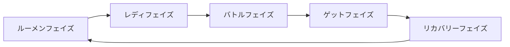

# ルーメンコンデンサー 総合ルール

> **文書ステータス:** レビュードラフトv0.1を2026年6月版ルールブックと再照合したウェブ編集版v0.6です。既存のマスタールールブックと65件の公式裁定回答を統合していますが、一部の詳細は引き続き公式確認が必要です。

## この文書の使い方

- 初めてゲームを学ぶプレイヤーは、最初に[初プレイガイド](./lumen-beginner-guide.md)を読むことをお勧めします。
- この文書は、判断が必要な状況を**参照キー**または規則番号で検索・引用するための基準です。
- `rule-...`形式の参照キーは規則オブジェクトの固有識別子であり、`章・節・項`番号は現在の配置から自動的に定まる表示番号です。
- カード別の例外裁定と正誤表は、別のカード裁定集からこの文書の参照キーを引用して管理することを推奨します。
- `【確認が必要】`は、制作スタッフがもう一度確定しなければならない項目です。
- 元のページの視覚資料やウェブ利用方法は、[ビジュアルマテリアルインデックス](./VISUAL_ASSET_INDEX.md)で確認できます。

> [!WARNING]
> この文書の正式発行までカード別の最新公式判定と製作陣のお知らせを一緒に確認してください。

## 目次

- [0. ルールブックを読む前に](#chapter-0)
- [1. ゲーム内オブジェクトの定義](#chapter-1)
- [2. ゲーム内領域の定義](#chapter-2)
- [3. ゲームの準備](#chapter-3)
- [4. ゲームの進行](#chapter-4)
- [5. ゲームの終了](#chapter-5)
- [6. カードの効果と優先権](#chapter-6)
- [7. バトル](#chapter-7)
- [8. コンボとキャッチ](#chapter-8)
- [9. ルールによる効果](#chapter-9)
- [付録A.用語集](#appendix-a)
- [付録B.クイックリファレンステーブル](#appendix-b)
- [付録C.編集チェックリスト](#appendix-c)
- [付録T.大会・運営規定草案](#appendix-t)

---

# 0. ルールブックを読む前に

この章では、ゲームの概要、この文書の位置づけ、ルール間の優先順位、読む前の注意事項を説明します。

## 0.1 ゲームの概要

**0.1.1** ルーメンコンデンサーは攻撃技で相手の体力を減らし、防御技で相手の攻撃を防ぐ対戦型カードゲームです。

## 0.2 文書の地位と優先順位

**0.2.1** この文書は、既存のマスタールールブックと公式決定の回答を統合したレビュー草案である。正式発行までカード別の最新公式判定と製作陣のお知らせを一緒に確認する。`[レビュードラフト]`

**0.2.2** 文書間優先順位と韓国語・英語・日本語版の基準言語はまだ公式確定されていない。このドラフトでは、編集の便宜のために次の順序で解釈します。`【確認が必要】`

1. 最新の正誤表と公式カードの判定
2. カードテキスト
3. 総合ルール
4. 入門ガイド
5. 例

> [!WARNING]
> 上記の順序は公式の回答で確定された規則ではなく、文書編集のための一時的な優先順位です。正式に発行する前に、例の法的地位と翻訳の競合の際に基準言語を確定する必要があります。

## 0.3 規則オブジェクトと参照契約

**0.3.1** 各規則は独立した**規則オブジェクト**である。規則オブジェクトは参照キー、上位規則、規範本文、参照規則を持つ。規範本文は、該当する適用対象、前提条件、実行する処理、処理結果、例外を明示し、明示されていない条件・結果・例外を任意に補わない。

**0.3.2** **参照キー**は1つの規則オブジェクトを識別する一意かつ永続的な文字列である。`rule-...`形式を用い、2つ以上の規則に同じキーを付与できない。配置や表示番号が変わってもキーの意味は変わらず、変更前のキーは同じ規則の別名として保持する。

**0.3.3** 下位規則は上位規則が定めた定義と適用範囲を継承する。下位規則が上位規則の一部を明示的に制限し、または例外として宣言した場合、その範囲では下位規則を優先し、明示的に変更していない部分は上位規則とともに適用する。ある規則の下位規則は、別の兄弟規則の範囲を自動的に変更しない。

**0.3.4** 規則オブジェクトが別の規則を参照する場合、参照先の定義・条件・手順を再記述せずそのまま使用する。手順の処理中に別の手順を参照した場合、参照先の手順を完了してから呼出元の次の処理へ戻る。単純な相互参照だけでは処理を反復せず、反復条件と終了条件の両方を規則が明示した場合にのみ反復する。

**0.3.5** 条件付き規則は条件が真の場合にのみ指示された処理を行う。「行う」は必須処理、「できる」は選択処理であり、処理結果はその文が定めた範囲でのみゲーム状態を変更する。例外は適用対象と置換する処理を明示し、例外の終了後は変更されていない一般規則を引き続き適用する。

---

# 1. ゲーム内オブジェクトの定義

**ゲームオブジェクト**とは、ルールやカード効果が対象として指定できるものをいいます。ゲームオブジェクトは**プレイヤー**と**カード**の2種類です。デッキはゲーム準備に使用するカード構成であり、ゾーンとFP領域はゲーム領域であるため、それ自体はゲームオブジェクトではありません。

## 1.1 プレイヤー

**1.1.1** プレイヤーはゲームに参加し、ルールやカード効果の対象になり得るゲームオブジェクトである。1つのゲームには2人のプレイヤーが存在し、各プレイヤーから見て自分と、自分ではない相手プレイヤーに区別する。

**1.1.2** プレイヤーオブジェクトは次の情報を持つ。ルールやカード効果は、これらの情報の一部を確認または変更できる。

| 情報 | 説明 |
|---|---|
| 自分・相手の区別 | 効果を発生させたカードの所有者を自分、もう一方のプレイヤーを相手とする。 |
| 現在の体力 | キャラクターカードに表示するプレイヤーの残り体力。 |
| 現在のFP | FP領域に表示する正数・0・負数の公開値。 |
| 手札枚数 | 現在の手札にあるカード枚数であり、公開情報である。 |
| 手札枚数上限 | キャラクターカードの現在の体力区分に示された手札の最大枚数。体力が変化した場合、処理単位の終了後に再計算する。 |
| 優先権 | 同時に処理する行動や効果の順序を決める保有状態。 |
| キャラクターマーク | 自分のキャラクターカードに表示されたマークで、デッキ構築や一部の効果が参照する。 |
| 対応する領域 | 自分の手札や各ゾーンなど、そのプレイヤーに対応するゲーム領域。 |

**1.1.3** 処理単位の終了後、プレイヤーの手札が現在の手札枚数上限を超えている場合、そのプレイヤーは超過分を直ちに捨てる。この処理は次の効果を処理する前に行う。

**1.1.4** カードテキストが「自分」を指定する場合、その効果を発生させたカードの所有者であるプレイヤーオブジェクトを指し、「相手」を指定する場合、もう一方のプレイヤーオブジェクトを指す。プレイヤーを対象とする効果は、カードやゾーンではなく、そのプレイヤーオブジェクトを対象とする。

> [!EXAMPLE]
> 効果処理中に複数枚を手札に入れて上限を超えてもその効果を最後まで処理します。効果が終わった直後、現在の体力区間の敗上限を確認し、超過分を捨てます。

## 1.2 カード

**1.2.1** カードはゲームに使用する印刷物であり、ルールやカード効果の対象になり得るゲームオブジェクトである。カードはゾーンを移動したり表向き・裏向きの状態が変化したりしても、同じオブジェクトとして扱う。

**1.2.2** カードオブジェクトは次の共通情報を持つ。ただし、カードの種類によっては一部の情報を持たない。

| 情報 | 説明 |
|---|---|
| 所有者 | そのカードを自分のデッキに入れてゲームを開始したプレイヤー。カードが別のゾーンへ移動しても所有者は変わらず、別の指示がある場合にのみ変更される。 |
| カード名 | カードの名称であり、同名カードの判定やカード効果の参照に使用する。 |
| カード種類・分類 | キャラクター、特性、攻撃・防御・特殊技、およびアルティメットであるかなどの分類。 |
| キャラクターマーク | デッキに入れられるかどうかやカード効果が参照するマーク。ニュートラル技はニュートラルマークを持つ。 |
| 機能・効果 | 常に適用する機能と、指定された時点に処理する効果。 |
| 数値・判定情報 | 体力、手札上限、速度、ダメージ、FP、位置、特殊判定など、カード種類に応じて使用する情報。 |
| 表示状態・現在のゾーン | カードが表向きか裏向きか、および現在置かれているゾーン。公開範囲や使用可能なルールを決める際に参照する。 |
| 収録識別情報 | カード番号、イラスト、収録版など、カードを整理し版を識別する情報。 |

**1.2.3** キャラクターカードはプレイヤーを表すカードである。所属・異名・名前などのキャラクター情報、体力区分ごとの体力と手札枚数上限およびキャラクターマークというゲーム情報、収録識別情報としてのカード番号を持つ。ゲーム中は、このカードにプレイヤーの現在の体力と手札枚数上限を表示する。

**1.2.4** 特性カードはキャラクター固有の機能と効果を持つカードである。カード名、特性分類、機能・効果、キャラクターマークを持ち、ゲーム準備時にキャラクターカードの隣の特性ゾーンへ置く。

**1.2.5** 特性カードの機能と効果はゲーム開始直後から適用する。

**1.2.6** 攻撃技カードはバトルゾーンで使用し、相手にダメージを与えることができる技カードである。カード名、攻撃位置、速度、手・足判定、判定結果別FP、特殊判定、機能・効果、キャラクターマーク、ダメージ、フレーバーテキストを情報として持つことがある。

**1.2.7** 防御技カードはバトルゾーンで使用し、相手の攻撃を防御または回避する技カードである。カード名、防御または回避する位置、特殊判定、機能・効果、キャラクターマーク、フレーバーテキストを情報として持つことがある。

**1.2.8** 特殊技カードは、記載された使用条件を満たしたときに効果を処理する技カードである。カード名、特殊技分類、使用条件、機能・効果、キャラクターマーク、配置するゾーンなどの情報を持つことがある。使用時は、条件確認、カード公開、指定されたゾーンへの配置、効果処理の順に進め、条件を満たしていない場合は公開または配置できない。

**1.2.9** 特殊技カードは、サイドデッキ、ルーメンゾーン、アルティメットゾーン、ブレイクゾーンにのみ存在でき、手札に入れることはできない。

**1.2.10** アルティメットは、攻撃・防御・特殊技カードが追加で持つことができる分類である。アルティメット技カードは基本となるカード種類の情報に加えてアルティメット分類を持ち、デッキに0枚または1枚採用し、ゲーム開始時にアルティメットゾーンで表向きに公開する。スリーブは他の技カードと同じものを使用する。

**1.2.11** アルティメット攻撃・防御技は手札に入った後、通常の攻撃・防御技と同じルールで処理する。使用後も手札・リスト・ブレイクゾーンなどへの実際の移動結果を維持し、アルティメットゾーンへ自動的には戻らない。

**1.2.12** アルティメット特殊技は条件を満たしたとき、カードに記載された手順でルーメンゾーンなどに配置し、手札に入れることはできない。

**1.2.13** アルティメット攻撃・防御技がリストへ送られた場合、通常の攻撃・防御技と同じくリストに残る。

**1.2.14** アルティメット特殊技がサイドデッキへ送られた場合、サイドデッキに置く。

---

# 2. ゲーム内領域の定義

カードを置く場所を**ゾーン**といいます。ゾーンごとに用途、置くことができるカード、表裏、公開範囲、枚数上限、移動結果が異なります。**FP領域**はカードを置くゾーンではなく、数値を表示するゲーム領域です。

## 領域属性の要約

| 領域 | 用途・置くことができるカード | 基本状態 | 公開範囲 | 枚数・順序 |
| --- | --- | --- | --- | --- |
| キャラクターゾーン | プレイヤーを表すキャラクターカード | 表向き | 公開 | 準備時1枚・順序なし |
| 特性ゾーン | キャラクター固有の効果を持つ特性カード | 表向き | 公開 | 準備時1枚・順序なし |
| 手札 | レディまたは効果で使用できる技カード | 非公開 | 所有者のみ確認、初期手札のみ相互確認 | 現在の体力区分の手札枚数上限・順序なし |
| リスト | レディフェイズに使用していない公開技 | 準備完了前は裏向き、ゲーム開始後は表向き | ゲーム開始後は公開 | 最大14枚・順序なし |
| サイドデッキ | 初期手札・リストに入れなかった技および特殊技 | 裏向き | 枚数のみ公開、内容・順序は相手に非公開 | 所有者が順序を決めて確認可能 |
| バトルゾーン | 手札からレディした技 | レディ中は裏向き、公開後は表向き | 裏向きの間は相手に非公開、公開後は公開 | 各プレイヤーのレディカード1枚 |
| ルーメンゾーン | カード効果で配置されたカード | 効果が指定、指定がなければレビュードラフト上は表向き | 効果が指定、指定がなければレビュードラフト上は公開 | 固定上限なし・効果に従う |
| アルティメットゾーン | 採用したアルティメット技 | 表向きが基本、効果で裏向きになり得る | 表向きの間は公開 | 準備時0～1枚 |
| ブレイクゾーン | ブレイクされたカード | 表向き | 公開 | 固定上限なし・順序なし |
| FP領域 | 各プレイヤーの現在のFP値 | 公開数値 | 公開 | カードの枚数・順序なし |

> [!WARNING]
> ルーメンゾーンにカードを置く効果が表示状態や公開範囲を指定していない場合の基本値は、まだ正式な確認が必要です。本レビュードラフトでは、そのカードを表向き・公開として扱います。

## 2.1 ゾーンの定義

**2.1.1** キャラクターゾーン、特性ゾーン、手札、リスト、サイドデッキ、バトルゾーン、ルーメンゾーン、アルティメットゾーン、ブレイクゾーンは、各プレイヤーに1つずつ対応しているため、ゲーム中は各種類につき2か所存在する。プレイヤーに対応する領域を、そのプレイヤーの領域という。カード効果やルールに別の指定がない限り、移動するカードは移動先ゾーンのカード種別、表示状態、公開範囲、枚数上限に関する規則に従う。

**2.1.2** キャラクターゾーンは、プレイヤーを表し、残り体力を表示するキャラクターカードを置く場所である。各プレイヤーにはキャラクターゾーンが1つ対応し、ゲーム準備時に自分のキャラクターカード1枚を表向きで置く。キャラクターカードの情報と現在の体力表示は公開情報であり、すべてのプレイヤーが確認できる。通常のデッキにはキャラクターカードが1枚だけ含まれるため、カード効果やルールに別の指定がない限り、その1枚だけがキャラクターゾーンに置かれる。

**2.1.3** 特性ゾーンは、キャラクター固有の機能と効果を持つ特性カードを置く場所である。各プレイヤーには特性ゾーンが1つ対応し、ゲーム準備時に自分の特性カード1枚をキャラクターカードの隣へ表向きで置く。特性カードの情報は公開され、すべてのプレイヤーが確認でき、その機能と効果はゲーム開始直後から適用される。カード効果やルールに別の指定がない限り、その1枚だけが特性ゾーンに置かれ、カードの順序にルール上の意味はない。

**2.1.4** 手札は、プレイヤーがレディまたはカード効果で使用できる技カードを保持する非公開ゾーンである。各プレイヤーには手札が1つ対応する。攻撃・防御技および手札に入れることができるアルティメット攻撃・防御技を置けるが、特殊技を置くことはできない。所有者は自分の手札の内容をすべて確認でき、カードの順序にルール上の意味はないが、相手はゲーム中にその内容を確認できない。ただし、ゲーム準備時には初期手札を互いに確認して所有者へ戻し、ゲーム開始後は再び非公開として扱う。手札枚数は公開情報であり、最大枚数はキャラクターカードの現在の体力区分に示された[[rule-3-2-2|手札枚数上限]]に従い、1つの処理単位が終わった後に上限を超えていれば[[rule-3-2-3|超過分を直ちに捨てる]]。

**2.1.5** リストは、各プレイヤーがレディフェイズに使用していない公開された技をまとめて置くゾーンである。各プレイヤーにはリストが1つ対応するため、ゲーム中は2か所存在する。リストの最大枚数は14枚であり、この上限を超えることはできない。リストに14枚ある状態でカードがリストへ移動しようとする場合、そのカードはリストへ移動する代わりに[[rule-10-2-1|ブレイク]]される。初期リストはゲーム準備が終わるまで裏向き・非公開で置き、両プレイヤーの準備が終わった後に同時に表向きで公開し、ゲーム開始後は表向き・公開の状態を維持する。リストの表向きカードの情報と枚数はすべてのプレイヤーが確認でき、カードの順序にルール上の意味はない。

**2.1.6** サイドデッキは、初期手札と初期リストに入れなかった技カードおよび特殊技カードを置く裏向きのゾーンである。各プレイヤーにはサイドデッキが1つ対応するため、ゲーム中は2か所存在する。通常の技カード20枚構成では、初期手札5枚と初期リスト9枚を除いた6枚でゲームを開始するが、デッキ構築や準備を変更する効果がある場合はその効果に従う。サイドデッキの枚数は公開情報だが、内容と順序は相手に非公開である。所有者はゲーム開始前に順序を決め、ゲーム中に自分のサイドデッキの内容と順序を確認できる。ゲーム中の固定された最大枚数はなく、カード効果やゾーン移動によって枚数が変化し得る。

**2.1.7** バトルゾーンは、レディフェイズに手札から選んだ技カード1枚を置いてレディを宣言するゾーンである。各プレイヤーにはバトルゾーンが1つ対応するため、ゲーム中は2か所存在し、通常のレディカードの収容枚数は各プレイヤー1枚である。レディしたカードはバトルフェイズ開始まで裏向きで置くため、相手はその内容を確認できず、レディ宣言後はカードを変更したり宣言を取り消したりできない。バトルフェイズには両方のレディカードを同時に表向きで公開し、公開後はすべてのプレイヤーがその情報を確認できる。バトル終了時、レディカードは通常手札に戻るが、コンボ、キャッチ、ブレイクなど別の移動規則がある場合はその規則に従う。

**2.1.8** ルーメンゾーンは、カード効果が「ルーメンゾーンに配置する」と指定したカードを置くゾーンである。各プレイヤーにはルーメンゾーンが1つ対応するため、ゲーム中は2か所存在する。主に使用手順を終えた特殊技が置かれるが、実際に置くことができるカードと移動時点はその効果に従う。カードの滞在期間、移動方法、枚数、順序はそのカードを配置した効果が定め、固定された最大枚数はない。効果が表裏や公開範囲を指定する場合はその指示に従い、指定がない場合、本レビュードラフトでは表向き・公開で置き、すべてのプレイヤーが情報を確認できるものとして扱う。`[確認が必要]`

**2.1.9** アルティメットゾーンは、デッキに採用したアルティメット技カードを置くゾーンである。各プレイヤーにはアルティメットゾーンが1つ対応するため、ゲーム中は2か所存在するが、アルティメット技を採用していないプレイヤーのゾーンは空になる。ゲーム準備時に採用したアルティメット技0枚または1枚を表向きで置き、表向きの間はすべてのプレイヤーがそのカード情報を確認できる。カード効果が指定した場合は裏向きになり、そのときの公開範囲は該当する効果に従う。アルティメット攻撃・防御技がこのゾーンを離れた後は通常の技と同じ移動規則を適用し、アルティメットゾーンへ自動的には戻らない。アルティメット特殊技は手札に入れることができない。

**2.1.10** ブレイクゾーンは、ルールまたはカード効果によってブレイクされたカードを置く公開ゾーンである。各プレイヤーにはブレイクゾーンが1つ対応するため、ゲーム中は2か所存在する。ブレイクされたカードは表向きで置き、その情報と枚数はすべてのプレイヤーが確認できる。カードの順序にルール上の意味はなく、固定された最大枚数もない。ブレイクゾーンのカードは通常そのゲーム中に再使用できないが、カード効果やルールが別の移動を指示する場合はその指示に従う。手札・リスト・ルーメンゾーン・バトルゾーンから攻撃または防御技がブレイクされた場合は[[rule-10-2-1|ブレイク補充規則]]を適用し、特殊技にはその補充を適用しない。

**2.1.11** FP領域はカードを置くゾーンではなく、各プレイヤーの現在のFP値を区別して表示するゲーム領域である。各プレイヤーは互いに独立したFP値を1つ持ち、両方のFPはすべてのプレイヤーが確認できる公開情報である。FPは正数、0、または負数になり得る。定められた上限と下限はなく、カードの枚数や順序に関する規則は適用しない。FPは優先権の決定や攻撃速度の計算などに使用し、バトルでは両プレイヤーが保有するFPをすべて適用した後に0にする。

## 2.2 ゾーン別公開情報

**2.2.1** 各ゾーンのカード枚数と両プレイヤーの現在の体力・FPは、優先権の比較と適法性の確認に必要な公開情報である。公開ゾーンにある表向きカードの記載情報は、すべてのプレイヤーが確認できる。手札や裏向きカードのように非公開と定められた情報は、所有者またはそのゾーンの規則で許可されたプレイヤーだけが確認でき、ゲーム準備時に初期手札を互いに確認する場合は例外とする。相手の公開カードを手に取って確認する必要がある場合は、先に許可を得て、確認後は元の位置と順序を維持しなければならない。

---

# 3. ゲームの準備

## 3.1 デッキ構築ルール

**3.1.1** デッキはゲーム準備に使用するカードの組であり、ゲームオブジェクトではない。スターターデッキは開封後すぐに使用でき、構築したデッキは本節のデッキ構築制限に従わなければならない。

**3.1.2** 基本デッキは合計22枚または23枚で構成し、カード構成は次のとおりとする。キャラクターの特性がデッキ構成枚数を変更する場合、そのカードテキストに従う。

- キャラクターカード 1章
- 特性カード 1章
- 攻撃・守備・特殊技カード合計20章
- アルティメットカード0章または1章

**3.1.3** キャラクター特性がデッキ構築制限を変更する場合、カードテキストが明示した項目だけを変更する。明示されていないデッキ枚数・カード種類・マーク・同名制限はそのまま適用する。

**3.1.4** 基本的に、同じ名前のカードを1つのデッキに2枚以上入れることはできない。カード番号、イラスト、収録版が異なっても、カード名が同じなら同名カードとみなす。

**3.1.5** デッキの技カードはニュートラルマーク、または自分のキャラクターカードと同じキャラクターマークを持たなければならない。

**3.1.6** デッキの技カードのうち少なくとも10枚は、自分のキャラクターカードと同じキャラクターマークを持たなければならない。

**3.1.7** 特性カードのキャラクターマークは、自分のキャラクターカードのキャラクターマークと同じでなければならない。

## 3.2 ゲーム準備手順

**3.2.1** ゲーム開始前に、各プレイヤーはキャラクターカード、特性カード、選択したアルティメットカードを前面に置きます。

**3.2.2** ゲーム開始時にサイコロ、はさみロック、コイントースなど合意した方法で最初の優先権保有者を決定する。

**3.2.3** 各プレイヤーは、特殊技ではなく技カード5章を初期手札に、9章を初期リストとして選択する。したがって、正当なデッキには特殊技ではなく、技カードを最小14の長さに含める必要があります。

**3.2.4** 初期手札とリストで選択しなかった技カードと特殊技カードはサイドデッキに裏側に置く。

**3.2.5** 初期リスト 9章を先に裏側に置いて両側が準備を終えた後、表側に公開する。

**3.2.6** 両プレイヤーは初期手札5章を互いに交換して確認した後、主人に返す。

---

# 4. ゲームの進行

1ターンは**ルーメン→レディ→バトル→ゲット→リカバリー**の5フェイズで進行されます。

## 4.1 ターンとフェイズ

**4.1.1**ターンは、ルーメンフェイズからリカバリーフェイズまでの5フェーズを含む。

**4.1.2** 1ターンはルーメンフェイズ、レディフェイズ、バトルフェイズ、ゲットフェイズ、リカバリーフェイズの順に進む。

## 4.2 ルーメンフェイズ

**4.2.1** ルーメンフェイズには「ルーメンフェイズに」処理すると記載されたカード効果を優先権保有者から処理する。

## 4.3 レディフェイズ

**4.3.1** レディフェイズに各プレイヤーは使用する技カード1章を選んでバトルゾーンに裏側に置いてレディを宣言する。レディを宣言した後は、そのカードを変更したり、宣言を取り消すことはできない。

> [!IMPORTANT]
> 一度レディを宣言すると、相手がまだレディしていなくてもカードを交換できません。大会・運営規定の10超未対応時間も相手の明確なレディ宣言時点から計算します。

## 4.4 バトルフェイズ

**4.4.1** バトルフェイズに両側のレディカードを同時に表側に公開し、攻撃・守備結果を判定する。

**4.4.2** バトルフェイズ 終了時にレディーなカードを手札に持ってくる。コンボ・キャッチ・ブレイクなど別途移動規則があればその規則を優先する。両レディカードは、優先権保有者のカードから使用されたものとして扱う。

## 4.5 ゲットフェイズ

**4.5.1** ゲットフェイズに入ったときに発生する効果をすべて処理した後、優先権を再決定します。この時定めた順序はそのゲットフェイズが終わるまで再計算しない。

**4.5.2** ゲットフェイズには進入時に決定した優先権保有者からリストのカード1章を相手に見せてから手札に入れる。

**4.5.3** 敗北が手札上限に達したプレイヤーはゲット行動をしないことができる。あるプレイヤーだけがスキップしても他のプレイヤーのゲットはスキップされない。

**4.5.4** ゲットフェイズにリストカード1章をインポートする代わりにアルティメットゾーンのアルティメット攻撃・防御技 1章を手札に入れることができる。

**4.5.5** ゲットフェイズにリストカードがないと、リストからカードをインポートできませんが、ゲットフェイズ自体は進行します。この場合にもアルティメットゾーンのアルティメット攻撃・防御技を手札に入れる行動はできる。

## 4.6 リカバリーフェイズ

**4.6.1** リカバリーフェイズには、まず「ターン終了時」の誘発効果を処理する。その後、そのターン中の持続効果と「ターン終了時まで」効果を終了し、ターン終了を宣言する。

---

# 5. ゲームの終了

## 5.1 勝利と敗北

**5.1.1**各プレイヤーは、キャラクターカードの左端に表示されているスタミナから始まります。処理単位終了後、相手の体力が0以下で、自分の体力が1以上の状態が確認されると、そのプレイヤーが勝利する。

## 5.2 サドンデス

**5.2.1** 同じ効果または同じ判定結果処理単位が終わった時点で両体力が全て0以下であれば、両方のプレイヤーの体力が同時に0になったとみなしてサドンデスを進行する。

**5.2.2** サドンデスになると、一般的な新しいゲーム準備と同じ手順で手札・リスト・サイドデッキを再構成する。ただし、両開始体力は1000であり、開始敗は体力1000における手札上限と同じ枚数で構成する。

**5.2.3** サドンデスの初期手札とリストも互いに確認・公開する一般準備手続きに従う。初期敗枚数だけ5場ではなく、体力1000での手札上限に変わる。

**5.2.4** サドンデス 起動時に両FPを0にする。

**5.2.5** サドンデスは既存の優先権保有者が優先権を維持したままルーメンフェイズから3ターン進行する。3ターン終了時に体力が高いプレイヤーが勝利し、体力が同じなら引き分けで処理する。

**5.2.6** サドンデス状態で両体力が再び同時に0になるとゲームを引き分けで処理する。

---

# 6. カードの効果と優先権

## 6.1 機能・効果・省略文法

**6.1.1** カードの説明で文章の前に番号がない説明は**機能**である。機能は別途発動なしで常に適用され、カードがどのゾーンにあっても適用する。

**6.1.2** カードの説明で文章の前に番号がある説明は**効果**だ。

**6.1.3** 効果の対象または主体が省略された場合、次のように解釈する。

- 行動の主体は、そのカードの所有者であるプレイヤー**自分**とみなす。
- カードの状態・数値・移動を指す表現は**このカード**とみなす。

> [!EXAMPLE]
> - 「相殺時」は「自分が相殺時」と解釈します。
> - 「ルーメンゾーンのカードを」は「自分のルーメンゾーンのカードを」と解釈します。

## 6.2 処理単位と状態確認

**6.2.1** 「処理単位」とは、次のいずれかを意味します。`[編集定義]`

- ナンバーワンで区切られたエフェクトを最初から最後まで処理する範囲
- 両方のFPまたは両方のダメージのように同時に適用されるように決定された数値処理された束

**6.2.2** 各処理単位が終了すると、体力0、手札上限超過などの状態を確認する。必要な状態処理をすべて実行した後、次の効果または次のステップに進みます。

**6.2.3** 現在処理中の効果は一般誘発効果のため中断しない。カードのテキストまたは公式の判断で明示的に「割り込む」と分類された処理のみが現在の効果の間に入ることができます。

> [!EXAMPLE]
> 1つの効果が両方の体力をそれぞれ500減少させた場合、その効果全体を終えた後、両方の体力を確認します。両方とも0以下なら、同じ処理単位で同時に体力0になったものとみなします。

## 6.3 優先権

**6.3.1** 優先権は、同じタイミングで行動する必要があるときに最初に行動する権限です。

**6.3.2**優先権は次の順序で比較します。

1. FPの高いプレーヤー
2. FPが同じなら体力の高いプレイヤー
3. 体力も同じなら負けたプレイヤー

**6.3.3** 優先権を再決定するときにFP・体力・負けが全て同じであれば前の優先権保有者が優先権を維持する。この規則は、ゲットフェイズだけでなく、すべての優先権再決定にも適用されます。

## 6.4 同時に処理する効果

**6.4.1** 1つのタイミングで両方が処理する効果が複数ある場合、優先権保有者から交互に1つずつ処理する。自分の番になったプレイヤーは、自分が処理できる効果の一つを選択する。相手に処理する効果がない場合、現在の効果の処理が終わった後、同じプレイヤーが次の効果を選択する。

> [!EXAMPLE]
> Aが優先権を持ち、Aの大気効果が2個、Bの大気効果が3個なら`A → B → A → B → B`の順に処理します。各ターンのプレイヤーが自分の待機効果の1つを選びます。

**6.4.2** 前面カードで発動する効果は**公開誘発**、裏面など非公開情報で発動する効果は**非公開誘発**として扱う。

**6.4.3** 同じタイミングで公開誘発と非公開誘発の両方を処理できれば、公開誘発グループを先に処理する。各グループ内では、優先権と効果選択規則に従って処理する。

## 6.5 強制効果とランダム効果

**6.5.1** 「～する」は強制効果であり、「～できる」という任意の効果だ。プレイヤーが自分のエフェクト処理の順番にランダムエフェクトを使わずに渡すと、同じタイミングでそのエフェクトを再利用することはできません。

## 6.6 テキストの競合

**6.6.1** 強制型テキストが衝突すると、「できない」のように何らかの行動を不可能にする否定型を優先する。

**6.6.2** 否定型以外の強制型テキストが衝突した場合、優先権 保有者の効果を先に適用する。最初に適用された効果と矛盾する後の効果は、矛盾する範囲では適用されません。

## 6.7 割り込みと大気効果

**6.7.1** 「割り込み効果」は、カードテキストまたは公式判定で割り込みで指定された効果である。その他の誘発効果は、現在の処理単位が終了した後、待機中の効果で処理する。`【表記方式の確認が必要】`

> [!WARNING]
> 既存カードから割り込み効果をどのようなフレーズ・アイコンで識別するかはまだ決まっていません。カード判別集でカード別分類を提供するか、共通表記法を追加する必要があります。

---

# 7. バトル

バトルの全体の流れと攻撃・守備・同時ヒット・相殺・グラブを一つの手続きに統合します。

## バトル処理シーケンス

1. レディカード同時公開
2. 使用時の効果
3. 判定前の効果
4. FP 適用・全消耗
5. 回避確認
6. 防御確認
7. スピード勝敗確認
8. 相殺確認
9. グラブ無効など特殊処理
10. 判定効果：回避→防御→ヒット/カウンタ→相殺→コンボ
11. 両側FP同時適用
12. 両ダメージ同時適用
13. 状態確認
14. 判定後の効果
15. 使用後の効果
16. コンボ
17. キャッチ
18. カードの整理

## 速度用語

| 用語 | 定義 | 主に使用する場所 |
| --- | --- | --- |
| 印刷速度 | カードに印刷された元の速度 | 基本情報 |
| 参照速度 | カード効果の増減・固定を反映し、FPは反映しない速度 | 回避・防御・相殺条件、コンボ接続 |
| 判定速度 | 参照速度にFPを反映した最終速度 | 攻撃対攻撃の高速比較 |

> [!NOTE]
> 「参照速度」と「判定速度」は、既存のルールブックのFP適用前・後速度を明確に区別するための編集用語です。

## 7.1 バトルの全順序

**7.1.1** バトルは両技術を比較して判定勝ち、判定敗または引き分けで決定する。

**7.1.2** バトルは使用時・判定前効果、FP速度補正、戦闘判定、判定時効果、判定結果FPとダメージ、判定後・使用後効果、コンボ、キャッチ順に進行する。

**7.1.3** 使用時の効果を優先権保有者から処理した後、判定前の効果を優先権保有者から処理する。

**7.1.4** 戦闘判定は、回避確認、防御確認、判定勝ち・判決決定、相殺確認順に進行する。ある攻撃に回避が成立すれば、その攻撃に対しては防御、速度勝敗、相殺確認をさらに進めない。

**7.1.5** グラブ 無効等判定結果を無効にする特殊処理は、ヒット又はカウンタ判定を確認した直後、その判定の効果を処理する前に宣言して処理する。

**7.1.6** 戦闘判定による効果は回避時、防御時、ヒット・カウンタ時、相殺時、コンボ時順に適用する。

**7.1.7** 「相手が該当判定をしたとき」発動する効果は、自身の該当判定効果の後に処理する。

**7.1.8** 両判定結果によるFP変動を全て計算して同時に適用した後、両方のダメージをすべて計算して同時に適用する。

**7.1.9** 判定後の効果を優先権保有者から処理した後、使用後の効果を優先権保有者から処理する。

## 7.2 速度とFP

**7.2.1** 攻撃技の速度は、数値が低いほど速くなります。

**7.2.2** バトルで攻撃技の速度を比較するとき、プレイヤーの現在のFPすべてを適用する。正のFPほど速くなり、負のFPの絶対値ほど遅くなる。

**7.2.3** レディーなカードが攻撃か守備か、または速度が固定されているかどうかにかかわらずバトルで保有FPすべてを消耗し、両FPを0にする。速度固定技術にはFPによる速度変化だけは適用されない。

**7.2.4** 速度が固定された技術は、固定後に発生するFPと他の速度変化の影響を受けない。速度変化が最初に適用された後に固定されている場合、すでに適用された変更はキャンセルされません。

**7.2.5** 「X速度で固定する」という記述速度をXに変更した後、固定状態を適用する。

**7.2.6** 「速くなる」という速度数値を下げ、「遅くなる」という速度数値を上げる。技術が固定されていない場合は、その後FP補正を受けます。

**7.2.7** 回避・防御・相殺条件で技術速度を参照するときは、FPが適用されていない参照速度を使用する。

**7.2.8**の速度は13を超えるか、5未満に変化します。計算結果が0以下になると、実際の速度は1で処理される。

**7.2.9** 異なる速度固定効果が衝突した場合、効果処理順に先に適用された固定を維持し、後の固定は矛盾する範囲では適用しない。

> [!EXAMPLE]
> 速度8攻撃を+3FP状態で使用すると、判定速度は5です。-4FP状態の場合、判定速度は12です。速度が固定された技術もFPは全て消費しますが速度には反映しません。

## 7.3 攻撃対攻撃

**7.3.1** 相手技術に自分の攻撃位置を防ぐ有効な防御・回避がなければ、自分の攻撃はヒットする。

**7.3.2** ヒットした攻撃はヒット判定と関連効果を適用してダメージを与える。ヒット判定がコンボであれば、コンボタイムに進む。

**7.3.3** 攻撃技同士を比較すると、相手攻撃の判定速度が遅くなったり、相手攻撃を特殊判定で回避したり、自分の攻撃はカウンターする。

**7.3.4** カウンターした攻撃はカウンター判定と関連効果を適用してダメージを与える。カウンタ判定がコンボであればコンボタイムに進む。

**7.3.5** 相手攻撃が自分の攻撃より判定速度が速いか、相手特殊判定で自分の攻撃が回避されると、自分の攻撃はカウンターされる。

**7.3.6** 特殊判定で回避され、カウンターされた攻撃は「相手回避時」効果を適用してダメージを与えない。

**7.3.7** カウンターされた技術は判定敗として扱う。

**7.3.8** カウンターされたときに発動しない「無効化を条件とする機能」は、「このカードが無効になっていなければ」のように無効かどうかを明示的に条件として少ないフレーズのみを意味する。

**7.3.9** 自分の攻撃特殊判定で相手攻撃を回避し、攻撃に成功すればヒットではなくカウンタ判定を適用する。

## 7.4 攻撃対守備

**7.4.1**防御技の防御または回避位置判定が相手攻撃の位置判定と一致しなければ該当判定が有効である。

**7.4.2** ディフェンスカードの防御位置が相手攻撃位置と一致すれば防御する。防御時に効果を適用し、相手攻撃ダメージを適用しない。

**7.4.3** 守備カードの回避位置が相手攻撃位置と一致した場合は回避する。回避時に効果を適用し、相手攻撃ダメージを適用しない。

**7.4.4** 相手カードの防御位置が自分の攻撃位置と一致すると、自分の攻撃は防御される。「相対防御時」効果を適用してダメージを与えず、ガード判定をＦＰに適用する。

**7.4.5** 相手カードの回避位置が自分の攻撃位置と一致すると、自分の攻撃は回避される。「相対回避時」効果を適用してダメージを与えない。

**7.4.6** 相手攻撃位置と一致する有効な守備判定がなければ、守備カードはヒットされ、防御・回避効果を適用しない。

## 7.5 引き分けと相殺

**7.5.1** 攻撃技同士でFP補正後判定速度が同じであれば同時ヒットとなる。

**7.5.2** 同時ヒットでは、両攻撃のヒット関連効果を優先権の順に処理する。その後、両側のFP変動を同時に適用し、続いて両方のダメージを同時に適用する。

**7.5.3** 攻撃または防御技の相殺判定が条件を満たした場合、バトルは相殺で処理する。

**7.5.4**攻撃技の相殺位置が相手攻撃位置と同じで、自分の攻撃速度が相手攻撃より遅いときに攻撃相殺が発生する。

**7.5.5**防御技の相殺位置が相手攻撃位置と等しい場合、守備相殺が発生する。

**7.5.6** 「相殺判定を持つ技の速度が相手技と同じか早ければ発動しない」という制限は、攻撃技の相殺にのみ適用する。防御技の相殺には速​​度比較は適用されません。

**7.5.7** 相殺 時 両攻撃のヒット時効果を処理した後、相殺 時効果を処理する。その後、判定結果ＦＰを同時に適用し、両攻撃ダメージの差分だけダメージが低い側の体力を減少させる。

**7.5.8** 防御技のダメージは0で計算し、防御技にはヒット判定がないものとして扱う。

**7.5.9** 両方が防御技を使用すると、ヒット・カウンター・防御・回避時に効果を適用しない。使用時、判定前、判定後、使用後など判定結果とは無関係に条件を満たす効果のみ処理する。

**7.5.10** 両方の攻撃がお互いを回避すると、そのバトルは引き分けになり、回避時に誘発効果を処理し、回避された攻撃のダメージは適用しない。

**7.5.11** 「お互いを守る」とは、両方のプレイヤーが防御技カードを使用した場合にのみ意味します。このバトルは引き分けであり、防御時の効果は発動しない。

## 7.6 判定結果FP

**7.6.1** 攻撃技には、ヒット・防御・カウンタ結果に応じたFP増減値がそれぞれ表示される。

## 7.7 ダメージ

**7.7.1** 攻撃技がヒットまたはカウンターすると、カードに表示されたダメージ分だけ相対体力を減少させる。

**7.7.2** 防御成功時に着るガードダメージはその防御技カードが発生させたダメージであり、そのカードの所有者が自分に与えたダメージとして扱う。したがって、「自分がダメージを受けたとき」の条件は満たし、「相手がダメージを与えたとき」の条件は満たさない。

## 7.8 使用カードの整理

**7.8.1** バトルに使用した技術は、使用した順に手札で回収する。両レディカードは、優先権保有者のカードが最初に使用されたものとして扱う。コンボ・キャッチカードはリストで、効果でブレイクされたカードはブレイクゾーンに送る。

## 7.9 特殊判定とグラブ

**7.9.1** 特殊判定はカードが持つ特殊な判定であり、回避、相殺、グラブなどのキーワードがある。

**7.9.2**相手グラブ技術のヒット・カウンタ判定を適用する際、自分の手札からグラブ技術1章をブレイクするとグラブを無効にする

**7.9.3** グラブを無効にすると、残りの処理をせずに両方のレディカードを手札に戻した後、同じターンのレディフェイズを再度進める。すでに処理した使用時の効果とFPの変動は元に戻さない。

> [!IMPORTANT]
> グラブ 無効はバトル全体を巻き戻す処理ではありません。既に処理した使用時効果とFPは維持し、まだ処理していない判定効果・ダメージだけを中断します。

---

# 8. コンボとキャッチ

## コンボ

コンボは、ヒットまたはカウンターのコンボ判定またはカード効果で始まる連続攻撃手順です。

## コンボ補正表

| コンボ番号 | 接続条件 | ダメージ補正 |
| --- | --- | ---: |
| 1コンボ | コンボを発生させた攻撃または効果が指定した最初のカード | 0 |
| 2コンボ | 基本コンボでランダムな正当な攻撃 | -100 |
| 3コンボ | 2コンボより速度数値が正確に1大きい | -200 |
| 4コンボ以上 | 直前のカードより速度数値が正確に1大きい | コンボ番号が1になるたびに追加 - 100 |

## 8.1 コンボ進入と合法性

**8.1.1** コンボ判定の攻撃がヒットまたはカウンターすると、その攻撃を1コンボにしてコンボタイムを開始する。

**8.1.2** コンボで提示したカードは、前のカードの処理が終わった後、実際に使用可能な状態でなければならない。合法的でない宣言は、そのカードを使用していないものとして扱い、手札に戻し、同じコンボ段階で他の合法的なカードを再提示することができる。

**8.1.3** 違法コンボ宣言で使われなかったカードは手札の非公開情報に戻るが、既に公開された情報自体をなかったものにはしない。`[編集名文化]`

## 8.2 コンボ共通処理

**8.2.1** コンボカードは使用時、コンボ時、ダメージ処理、使用後効果順で処理する。

**8.2.2** コンボに使用したカードは、ヒット・カウンタ判定を適用しない。

**8.2.3** 2コンボは100、3コンボは200、その後コンボ数が一つ増えるごとに100ずつカードダメージを減少させる。

**8.2.4** コンボ時効果を処理した後、ダメージ補正結果ダメージが0以下になると、その技法はコンボに使用できない。

**8.2.5** コンボに使用したすべてのカードは、1コンボを含むコンボ終了時にリストに送る。

**8.2.6** コンボタイムが始まると、そのバトルフェイズのキャッチ機会は消えます。コンボタイムが終了すると、バトルフェイズを直ちに終了する。

**8.2.7** コンボ時効果処理後のダメージが0以下になったカードの取り消し、既に処理した効果の戻し、再選択範囲は追加公式決定が必要である。それまでは、該当カードが使用できないという結論のみ適用する。`【確認が必要】`

> [!WARNING]
> 0 ダメージ以下になったカードの効果を元に戻すのか、カードを手札に戻すのか、他のカードを再び出せるのかはまだ確定していません。

## 8.3 基本コンボ接続

**8.3.1** 1コンボ後、そのプレイヤーはコンボタイムを終了したり、手札から任意の攻撃カードとそのカードより速度数値が正確に1大きい攻撃カードを順番に提示することができる。両方のカードを提示すると、それぞれ2コンボと3コンボになる。

**8.3.2** 合法的に使用できる2コンボと3コンボの両方を提示できない場合は、コンボタイムを終了する。

**8.3.3** 3コンボ以降は、直前のコンボカードより速度数値が1大きい攻撃カードを一枚ずつ使い続けることができる。

## 8.4 コンボ特殊処理

**8.4.1** 2・3コンボで使用するカードがなくてもコンボタイムは始まり、1コンボカードは終了時にリストに送る。

**8.4.2** コンボタイム 終了時に両FPを0にする。

**8.4.3** ヒット・カウンターではない効果でコンボタイムに進入すれば条件を満たす攻撃カード2枚を順に提示し、それぞれ1コンボと2コンボで使用できる。両方の章を提示できない場合は、カードを使用せずにコンボタイムを終了してください。

**8.4.4**コンボでカードを特定の速度で扱って使用した場合、次のカードはその取り扱い速度よりも数値が1大きいカードでなければならない。

**8.4.5** コンボ中にカード効果で攻撃技の速度が変化すると、変動した速度を基準にして次のコンボを連結する。

**8.4.6** コンボ処理中にブレイクが発生した場合、コンボを一時停止し、ブレイクと直ちに補充処理を終えた後、コンボを再開します。ただし、2コンボと3コンボのペアは、両方のカードとも合法的に使用できる組み合わせでなければならない。

**8.4.7** 2コンボと3コンボは一緒に提示するが、順番に使う。2コンボの処理結果を適用した後も3コンボが合法的に使用可能でなければならず、そうでない組み合わせは最初から提示できない。

**8.4.8** コンボ中に新しい効果が誘発されると、その効果がカードまたは公式判定で「割り込み」に分類された場合、現在の処理を中断して直ちに処理する。一般的な誘発効果は、現在の効果の処理単位が終わった後に処理する。

**8.4.9** 2コンボと3コンボを一緒に提示するとき、2コンボの義務効果を適用した後、3コンボが使用条件と接続速度の両方を満たすように組み合わせなければならない。

> [!WARNING]
> 合法的に宣言した2・3コンボが予期せぬ割り込み効果により、違法になった場合、どのカードまで戻すかはカード別の追加判定が必要になる場合があります。

## 8.5 同時ヒット・相殺コンボ

**8.5.1** 同時ヒット 一方の攻撃がすべてコンボ判定であれば、各プレイヤーの1コンボはすでに確定しているとみなす。効果は優先権の順に処理し、ダメージは同時に適用し、どちらの体力が先に0になったかのように扱い、もう一方の1コンボを中断しない。両側はそれぞれ1コンボのみ処理してコンボタイムを終了する。

**8.5.2** 相殺された両方の攻撃がコンボ判定の場合、各プレイヤーは1コンボのみ処理してコンボタイムを終了する。

## キャッチ

キャッチは、バトルの最後にFP状態またはカード効果で発生する自動ヒット攻撃です。

## キャッチ種類

| 種類 | 条件 | 使用するカード |
| --- | --- | --- |
| 正の数FP キャッチ | 自分FP > 0、相手FP = 0 | 自分が得たFP以下の速度数値である攻撃 |
| 負の数FP キャッチ | 自分FP = 0、相手FP <0 | 相手が失ったFP絶対値以下の速度数値である攻撃 |
| 効果キャッチ | カード効果がキャッチを指示 | 効果が定められた条件の攻撃 |

## 8.6 キャッチ条件

**8.6.1** キャッチは、バトルのすべての技術が使用後効果まで処理された後、バトルフェイズが終了する前に条件を満たせば進行することができる。

**8.6.2** 自分のFPが0より大きく、相対FPが0の場合、自分が得たFP以下の速度数値を持つ攻撃技を手札で使用してキャッチすることができる。

**8.6.3** 自分のFPが0で相手FPが0より小さい場合、相手が失ったFPの絶対値以下の速度数値を持つ攻撃技を手札で使用してキャッチすることができる。

**8.6.4** カード効果が“キャッチする”と指示した場合、その効果が指定した条件を満たす攻撃技を使ってキャッチする。

## 8.7 キャッチ処理

**8.7.1** キャッチを進めると、両FPを0にする。

**8.7.2** キャッチに使用した攻撃は自動的にヒットし、ヒット判定と関連効果を適用する。キャッチ攻撃はグラブ無効以外の防御・回避・相殺で防げない。ヒット判定がコンボの場合、コンボタイムに入る。

**8.7.3** キャッチカードは使用時、キャッチ時、ヒット時、ダメージ処理、使用後効果順で処理し、判定前効果は適用しない。

**8.7.4** キャッチに使用した攻撃カードは、バトルフェイズ終了時にリストに送る。

## 8.8 連続キャッチと特殊状況

**8.8.1** あるプレイヤーがキャッチを開始すると、そのキャッチタイム中にキャッチ権利はそのプレイヤーだけにある。キャッチ終了後も条件を再度満たすと、同じプレイヤーが連続してキャッチすることができる。

**8.8.2** グラブ攻撃をキャッチとして使用しても、相手は手札のグラブカードをブレイクしてその攻撃を無効にすることができる。

**8.8.3** キャッチで使用したグラブを無効にすると、本来バトルのダメージ・FP・カード移動結果は維持する。無効なキャッチカードのみ手札に戻し、同じターンのレディフェイズを再度進行する。

**8.8.4**効果によるキャッチは、FPとは無関係に先に処理する。その後、FPによるキャッチが可能であればさらに宣言することができる。

**8.8.5** 両方ともキャッチできれば優先権保有者が先にキャッチする。そのプレイヤーがキャッチを開始すると、相手のキャッチの権利はそのキャッチタイムが終わるまで消えます。グラブ無効などでレディフェイズをやり直すと、この制限は消えます。

---

# 9. ルールによる効果

## 9.1 ゾーン移動と捨てる

**9.1.1** ブレイクされたカードはブレイクゾーンに送られます。

**9.1.2** 「捨てる」は、手札のカードをリストの前面に置くことを意味し、ブレイクとは異なる。

## 9.2 ブレイクと補充

**9.2.1** 敗・リスト・ルーメンゾーン・バトルゾーンで攻撃または防御技がブレイクになったら、その直後に直ちに補充処理を入れる。そのカードの所有者は、サイドデッキの攻撃または防御技1章をリストに前面に置くことができる。適切なカードがない場合、または移動できない場合は補足しません。

**9.2.2** ブレイクされた技術は一般的にそのゲームではもはや利用できない。

**9.2.3** アルティメット攻撃・防御技がブレイクになれば一般攻撃・防御技と同様にサイドデッキでリストで補うことができる。

> [!EXAMPLE]
> リストがすでに14章の場合、補足しようとしていたカードがリストに移動しようとした瞬間、そのカードが代わりにブレイクになります。このカードはサイドデッキからブレイクになっているため、追加の補充は発生しません。

## 9.3 特殊技の不正な移動

**9.3.1** 特殊技カードが手札またはリストに移動しようとすると、その移動をブレイクゾーンへの移動に置き換えます。

**9.3.2** 特殊技カードがブレイクになっても、サイドデッキのリストでカードを補充しません。

**9.3.3** アルティメット特殊技は、サイドデッキ、ルーメンゾーン、アルティメットゾーン、ブレイクゾーンにのみ存在できます。他のゾーンに移動しようとすると、ブレイクゾーン移動に置き換える。

## 9.4 ディフェンスオーバー

**9.4.1** 3つの連続したバトルフェイズに次の4つの項目がすべてない場合、ディフェンスオーバーが発生します。

- 攻撃技を使う
- ダメージ発生
- FP変動
- 効果発動

4つの項目のいずれかが発生した場合、連続回数を0に初期化します。効果が実際の状態を変えていなくても「効果発動」があった場合は初期化する。

**9.4.2**ディフェンスオーバーが発生した場合、両方のバトルゾーンの記述をブレイクする。このブレイクにも一般ブレイク補足規則を適用する。同じ渋滞状態が4回目以降も続く場合は、バトルごとに再処理する。

---

# 付録A.用語集

| 用語 | 定義 |
| --- | --- |
| 公開誘発 | フロントカードなど公開情報で発動する効果 |
| 機能 | 番号のないカードの説明。別途発動せずにすべてのゾーンで常に適用 |
| 割り込む | 現在のエフェクトの処理単位を中断して最初に処理するように指定された処理 |
| ダメージ補正 | コンボ番号に応じてカードダメージを100ずつ追加減少させる処理 |
| レディ | 技カードをバトルゾーンに裏にして選択を確定する宣言 |
| リスト | 最大14枚の公開技カードが置かれるジョン。「捨てる」は手札からリストに移動するもの |
| ブレイク | カードをブレイクゾーンに送り、そのゲームで通常再利用できないようにする処理 |
| 非公開誘発 | サイドデッキなど非公開情報で発動する効果 |
| 使用 | カードを該当する手順に従って提示し、使用時の効果から処理を開始すること |
| 相殺 | 攻撃または防御技の相殺判定で両ヒットを適用してダメージ差を処理する引き分け判定 |
| 速度数値 | 攻撃技の速度を示す数値。低いほど速い |
| 参照速度 | 効果による速度変化・固定を反映し、FPは反映しない速度 |
| 判定速度 | 参照速度にFPを反映した最終速度 |
| 処理単位 | 効果 1 つまたは同時に適用する数値的な束を最初から最後まで処理する範囲 |
| キャッチ | バトル末尾にFPまたは効果条件で行う自動ヒット攻撃 |
| コンボタイム | コンボ判定またはカード効果に進入して速度数値が続く攻撃を使用する手順 |
| 優先権 | 同じタイミングで両側が行動するとき、まず効果を選択・処理する権限 |
| 効果 | 番号付きカードの説明。「する」という強制、「できる」という任意 |

---

# 付録B.クイックリファレンステーブル

## 1ターンの流れ

`ルーメン→レディ→バトル→ゲット→リカバリー`

| フェイズ | コアアクション |
| --- | --- |
| ルーメン | ルーメンフェイズ効果処理 |
| レディ | 技術 1章選択・裏面配置・レディ宣言 |
| バトル | 公開・判定・効果・コンボ・キャッチ |
| ゲット | リストカードまたはアルティメット攻撃/守備獲得 |
| リカバリー | ターン終了誘発処理後持続効果終了 |

## バトル処理シーケンス

`公開→使用時→判定前→FP→回避→防御→速度勝敗→相殺→特殊処理→判定効果→FP→ダメージ→状態確認→判定後→使用後→コンボ→キャッチ→整理`

## カードの組み合わせによるコア結果

| 自分\相手 | 攻撃 | 守備 |
| --- | --- | --- |
| 攻撃 | 回避確認→速度比較→相殺。早い方がカウンターして同じなら同時ヒット | 相手防御位置と一致すれば防御・回避、一致しなければヒット |
| 守備 | 自分の防御位置が相手攻撃と一致すれば防御・回避、一致しないとヒットする | 両者防御。判定結果とは無関係の効果のみ処理 |

> [!IMPORTANT]
> 各エフェクトまたは同時数値処理したバンドルの終わりに、体力0と敗北の上限を確認します。コンボが始まると、そのバトルのキャッチチャンスは消えます。

---

# 付録C.編集チェックリスト

総合ルールを正式に発行する前に、次の項目を確定する必要があります。

- [ ] **文書の優先順位:** 正誤表・カード裁定・カードテキスト・総合ルール・入門書・例の正確な優先順位と基準言語
- [ ] **ルーメンゾーンの基本公開状態:** 配置効果が表裏や公開範囲を指定していない場合に適用する基本値
- [ ] **割り込みの分類:** どのカード効果が割り込みかを識別する共通文言、アイコン、またはカード別裁定一覧
- [ ] **0ダメージコンボ:** 効果処理後にダメージが0以下になったカードの効果を戻すか、手札へ戻すか、再選択するか、コンボを終了するか
- [ ] **2・3コンボ中の例外:** 合法に宣言したコンボが予期しない割り込みで不適法になった場合に戻す範囲
- [ ] **標準仮想技:** 未対応時に使用する仮想技の攻撃・防御種別、位置判定、速度値

---

# 付録T.大会・運営規定

大会進行、参加者役割、制限時間、対応なし、結果報告、知覚、追加時間、ペナルティは別途文書である[ルーメンコンデンサーフロアルール](/rules/tournament/)を基準に確認します。

この総合ルール書はカードとゲーム処理のコアルールを扱い、大会運営上の判断はフロアルールと大会別のお知らせを一緒に確認する必要があります。

## T.1フロアルールのショートカット

- [コンテストフロアルール](/rules/tournament/)
- [勝敗判定課対応なし](/rules/tournament/#floor-win-and-no-response)
- [大会制限時間と時間終了処理](/rules/tournament/#floor-match-time)
- [結果報告・降伏・棄権・知覚](/rules/tournament/#floor-participation)
- [ペナルティ](/rules/tournament/#floor-penalties)

---

# 改訂履歴

| バージョン | 基準日 | 主な内容 | 状態 |
| --- | --- | --- | --- |
| v0.6-web | 2026-09-01 | 全規則にオブジェクト契約・参照キー・上位範囲・規則間依存関係・参照整合性検査を追加 | レビュードラフト |
| v0.5-web | 2026-09-01 | ゲームオブジェクトをプレイヤーとカードに再定義し、各情報と条項表示を整理 | レビュードラフト |
| v0.4-web | 2026-09-01 | 各ゲーム領域の用途・プレイヤーとの対応・公開状態・枚数上限・移動例外を詳細化 | レビュードラフト |
| v0.3-web | 2026-09-01 | 総合ルールの章構成と配置順を再整理 | レビュードラフト |
| v0.1 | 2026-08-13 | 既存ルールブックのルール一覧と65件の公式裁定を統合 | レビュードラフト |
| v0.1-web | 2026-08-24 | ウェブ編集用Markdown、安定したルールアンカー、可視化指示を追加 | レビュードラフト |
