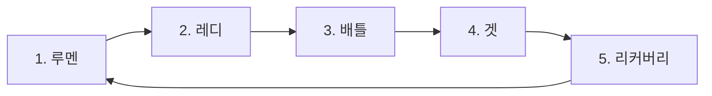

<!--
CODEX / WEB RENDERING CONTRACT
- 본문은 신규 유저를 위한 학습 순서다. 규칙 충돌 시 comprehensive rules를 참조한다.
- `VISUAL` 주석은 구현 요구사항이다. 주석 자체는 웹에 표시하지 않는다.
- 모든 동적 가이드는 동일 내용을 담은 정적 SVG/WebP 또는 텍스트 표를 fallback으로 제공한다.
- 사용자가 “간단히 보기 / 상세히 보기”를 전환할 수 있게 한다.
- 모바일에서는 왼쪽 목차 대신 하단 진행 표시와 이전/다음 버튼을 제공한다.
- 카드 내부 텍스트를 예시 이미지에 넣을 경우 실제 카드 원문을 임의로 번역·수정하지 않는다.
- 종합 규칙 링크는 `/rules/comprehensive#rule-x-x-x` 형식으로 변환한다.
-->

# 루멘콘덴서 처음 플레이 가이드

루멘콘덴서는 격투 게임처럼 공격과 수비를 주고받으며 상대의 빈틈을 읽는 대전형 카드 게임입니다. 처음부터 모든 카드와 예외 판정을 외울 필요는 없습니다. 먼저 **게임 준비 → 한 턴의 흐름 → 기본 배틀**을 익힌 뒤, 콤보와 캐치 같은 상세 규칙을 차례로 살펴보세요.

> [!NOTE]
> 이 가이드는 2026년 6월 원본 룰북의 용어·학습 순서·시각 자료를 직접 재대조하고, 공식 답변이 반영된 종합 규칙 초안의 판정을 적용한 버전입니다. 복잡한 판정은 [종합 규칙서](./lumen-comprehensive-rules.md)를 기준으로 확인하세요.

## 학습 코스

1. **초급편:** 준비물, 카드와 필드, 게임 준비, 기본 배틀
2. **중급편:** 특수 판정, 콤보, 캐치, 덱 구성
3. **고급편:** 우선권, 속도 고정, 특수 상황, 세부 카드 문법

<!-- VISUAL
id: learning-progress
priority: recommended
mode: interactive-progress
fallback: static-three-step-banner
purpose: 초급·중급·고급 학습 진도와 완료 상태를 로컬 저장한다.
-->

---

# 루멘콘덴서의 특징

## 격투 게임처럼 끊임없이 오가는 공방

공격 기술로 상대 체력을 줄이고, 수비 기술로 상대 공격을 막으며 추가 이득을 얻습니다. 상대가 어떤 행동을 할지 예상하고 그 허점을 찌르는 것이 핵심입니다.

## 상대 카드의 정보가 공개되어 있다

게임 전에 상대의 초기 패를 확인하고, 게임 중에는 서로의 리스트가 공개됩니다. 상대가 리스트에서 어떤 카드를 가져가는지 관찰하면 다음 행동을 예측할 수 있습니다.

## 스타터 덱 구매 즉시 플레이 가능

스타터 덱은 별도의 수정 없이 바로 사용할 수 있습니다. 기본 플레이를 익힌 뒤 부스터 카드로 자신만의 덱을 만들 수 있습니다.

<!-- VISUAL
id: game-features
priority: optional
mode: static-illustration
format: source-webp-or-redrawn-svg
source_asset: /assets/rules/source-pages/04-game-features.webp
items: [공격과 수비, 공개 정보, 스타터 덱]
note: 이 영역은 애니메이션보다 명확한 3분할 정적 일러스트가 적합하다.
-->

---

# 초급편 — 게임의 기초

## 1. 대전에 필요한 것

### 반드시 필요한 것

- 플레이어마다 합법적인 덱 1개

**덱**은 플레이에 필요한 카드 묶음입니다. 스타터 덱은 개봉 즉시 사용할 수 있고, 덱 구성 규칙에 따라 직접 만들 수도 있습니다.

### 있으면 편리한 것

- **계산기:** 데미지와 체력을 계산할 때 사용합니다.
- **배틀 필드와 토큰:** 체력, FP, 카드가 놓이는 존을 표시합니다.
- **주사위나 카운터:** 지속 효과나 횟수를 표시할 때 유용합니다.
- **카드 프로텍터:** 카드 손상을 막습니다. 프로텍터를 사용할 경우 하나의 덱의 모든 카드에 동일한 프로텍터를 사용해야 합니다. 단, 캐릭터 카드와 그 특성 카드는 다른 프로텍터를 사용할 수 있습니다.

<!-- VISUAL
id: required-items
priority: optional
mode: static-icon-grid
fallback: source-page-image-plus-text-list
source_asset: /assets/rules/source-pages/07-required-items.webp
assets:
  - deck
  - calculator
  - playmat-token
  - dice-counter
  - sleeves
note: 단순 준비물 안내이므로 정적 아이콘이 가장 적합하다.
-->

## 2. 배틀 필드

배틀 필드에는 카드가 놓이는 장소와 명칭이 정해져 있습니다. 실제 게임에서는 두 플레이어가 자신의 필드를 서로 마주 보게 둡니다.

<!-- VISUAL
id: battlefield-map
priority: required
mode: interactive-hotspot
fallback: source-page-images-plus-zone-table
source_assets:
  - /assets/rules/source-pages/08-battlefield-zones-a.webp
  - /assets/rules/source-pages/09-battlefield-zones-b.webp
asset_target: /assets/rules/field/battlefield-player-side.svg
purpose: 존을 클릭하거나 탭하면 명칭, 허용 카드, 공개 여부와 관련 규칙을 표시한다.
mobile: 세로형 필드 그림 아래에 존별 아코디언 제공
-->

| 번호 | 존 | 용도 |
|---:|---|---|
| 1 | 리스트 | 주로 사용하려는 기술 중 패에 넣지 않은 카드를 앞면으로 둡니다. 최대 14장입니다. |
| 2 | 사이드 덱 | 초기 패와 리스트에 넣지 않은 카드 및 특수 기술을 뒷면으로 둡니다. |
| 3 | 브레이크 존 | 브레이크된 카드를 둡니다. 이 카드는 일반적으로 그 게임에서 다시 사용할 수 없습니다. |
| 4 | 캐릭터 존 | 캐릭터 카드를 둡니다. |
| 5 | 특성 존 | 캐릭터의 특성 카드를 둡니다. |
| 6 | 배틀 존 | 레디 페이즈에 선택한 기술 카드를 뒷면으로 둡니다. |
| 7 | 루멘 존 | 카드 효과로 루멘 존에 배치된 카드를 둡니다. |
| 8 | FP 영역 | 자신과 상대의 FP를 표시합니다. |
| 9 | 얼티밋 존 | 얼티밋 기술 카드를 기본적으로 앞면으로 둡니다. |

> [!IMPORTANT]
> 리스트가 14장인 상태에서 다른 카드가 리스트로 이동하려 하면, 그 카드는 대신 브레이크됩니다. 자세한 내용은 [종합 규칙서의 리스트 규칙](./lumen-comprehensive-rules.md#rule-2-1-1)을 참고하세요.

## 3. 카드의 종류와 읽는 법

### 3.1 캐릭터 카드

캐릭터 카드는 플레이어를 대변하고 현재 체력을 표시합니다.

<!-- VISUAL
id: character-card-anatomy
priority: required
mode: interactive-hotspot
fallback: source-page-images-plus-table
source_assets:
  - /assets/rules/source-pages/10-character-card-overview.webp
  - /assets/rules/source-pages/11-character-card-anatomy.webp
asset_target: /assets/rules/cards/anatomy-character.webp
hotspots: [패 매수 상한, 체력, 캐릭터 마크, 캐릭터 정보, 카드 넘버]
-->

| 항목 | 설명 |
|---|---|
| 패 매수 상한 | 현재 체력 구간에서 가질 수 있는 패의 최대 장수입니다. |
| 체력 | 플레이어의 현재 체력을 표시합니다. |
| 캐릭터 마크 | 덱에 넣을 수 있는 기술의 마크를 결정합니다. |
| 캐릭터 정보 | 소속, 이명, 이름 등이 표시됩니다. |
| 카드 넘버 | 카드가 수록된 팩과 해당 시리즈의 번호이며, 카드 정리와 데이터 검색에 사용합니다. |

체력이 변하면 현재 체력 구간의 패 상한도 바뀔 수 있습니다. 하나의 효과 처리가 끝난 뒤 패가 상한을 넘으면 초과한 만큼 즉시 버립니다.

### 3.2 특성 카드

특성 카드는 캐릭터 고유의 기능과 효과를 가진 카드입니다. 게임 시작 시 캐릭터 카드 옆의 특성 존에 놓고, 게임 시작 직후부터 적용합니다.

<!-- VISUAL
id: trait-card-anatomy
priority: required
mode: interactive-hotspot
fallback: source-page-images-plus-table
source_assets:
  - /assets/rules/source-pages/12-trait-card-anatomy.webp
  - /assets/rules/source-pages/13-trait-special-details.webp
asset_target: /assets/rules/cards/anatomy-trait.webp
hotspots: [카드 명칭, 분류, 카드 효과, 캐릭터 마크]
-->

### 3.3 특수 기술 카드

특수 기술은 특정 조건을 만족했을 때 사용하는 카드입니다.

1. 사용 조건을 확인합니다.
2. 카드를 공개합니다.
3. 카드가 지시한 대로 루멘 존 등에 배치합니다.
4. 효과를 처리합니다.

특수 기술 카드는 사이드 덱, 루멘 존, 얼티밋 존, 브레이크 존에만 존재할 수 있습니다. 패 또는 리스트로 이동하려 하면 대신 브레이크됩니다. 특수 기술이 브레이크되어도 일반 기술처럼 사이드 덱에서 보충하지 않습니다.

### 3.4 얼티밋 기술 카드

얼티밋 기술은 게임 중 제한적으로 사용하는 강력한 카드입니다. 덱에 0장 또는 1장 넣을 수 있으며, 게임 시작 시 얼티밋 존에 기본적으로 앞면으로 공개합니다.

<!-- VISUAL
id: ultimate-card-flow
priority: recommended
mode: interactive-step-flow
fallback: source-page-images-plus-static-flow
source_assets:
  - /assets/rules/source-pages/14-ultimate-card-overview.webp
  - /assets/rules/source-pages/15-ultimate-types.webp
purpose: 얼티밋 공격/수비와 얼티밋 특수 기술의 서로 다른 사용 경로를 비교한다.
-->

#### 얼티밋 공격·수비 기술

- 겟 페이즈에 리스트 카드 1장을 가져오는 대신 얼티밋 존에서 패에 넣을 수 있습니다.
- 패에 넣은 뒤에는 일반 공격·수비 기술과 같은 방식으로 사용합니다.
- 사용 후 얼티밋 존으로 자동 복귀하지 않습니다. 실제 처리 결과에 따라 패·리스트·브레이크 존에 남습니다.

#### 얼티밋 특수 기술

- 카드에 적힌 조건과 처리 과정에 따라 루멘 존 등에 배치합니다.
- 패에 넣을 수 없습니다.
- 허용되지 않은 존으로 이동하려 하면 대신 브레이크됩니다.

### 3.5 공격 기술 카드

공격 기술은 배틀 존에 사용하여 상대에게 데미지를 주는 카드입니다.

<!-- VISUAL
id: attack-card-anatomy
priority: required
mode: interactive-hotspot
fallback: source-page-images-plus-table
source_assets:
  - /assets/rules/source-pages/16-attack-card-anatomy-a.webp
  - /assets/rules/source-pages/17-attack-card-anatomy-b.webp
asset_target: /assets/rules/cards/anatomy-attack.webp
hotspots: [카드 명칭, 위치 판정, 속도, 손/발 판정, 판정 결과 FP, 특수 판정, 카드 효과, 캐릭터 마크, 플레이버 텍스트, 데미지]
-->

| 항목 | 설명 |
|---|---|
| 카드 명칭 | 기술의 이름입니다. |
| 위치 판정 | 상단·중단·하단 중 공격 위치를 표시합니다. |
| 속도 | 숫자가 낮을수록 빠릅니다. |
| 손/발 판정 | 손을 이용한 공격인지 발을 이용한 공격인지 표시합니다. |
| 판정 결과 FP | 히트·방어됨·카운터 결과에 따른 FP 증감치입니다. |
| 특수 판정 | 회피·상쇄·그랩·콤보 등 카드가 가진 특별한 판정입니다. |
| 카드 효과 | 기능과 효과가 표시됩니다. |
| 캐릭터 마크 | 덱 편성 가능 여부를 정합니다. |
| 플레이버 텍스트 | 기술의 설정과 관련된 문구입니다. |
| 데미지 | 히트 또는 카운터 시 상대 체력에서 감소하는 수치입니다. |

### 3.6 수비 기술 카드

수비 기술은 배틀 존에 사용하여 상대 공격을 막거나 피하는 카드입니다.

<!-- VISUAL
id: defense-card-anatomy
priority: required
mode: interactive-hotspot
fallback: source-page-images-plus-table
source_assets:
  - /assets/rules/source-pages/18-defense-card-anatomy-a.webp
  - /assets/rules/source-pages/19-defense-card-anatomy-b.webp
asset_target: /assets/rules/cards/anatomy-defense.webp
hotspots: [카드 명칭, 수비 판정, 특수 판정, 카드 효과, 캐릭터 마크, 플레이버 텍스트]
-->

| 항목 | 설명 |
|---|---|
| 카드 명칭 | 기술의 이름입니다. |
| 수비 판정 | 상단·중단·하단 중 어떤 공격을 방어하거나 회피하는지 표시합니다. |
| 특수 판정 | 카드가 가진 특별한 판정입니다. |
| 카드 효과 | 기능과 효과가 표시됩니다. |
| 캐릭터 마크 | 덱 편성 가능 여부를 정합니다. |
| 플레이버 텍스트 | 기술의 설정과 관련된 문구입니다. |

## 4. 게임 준비

각 플레이어는 캐릭터 카드의 가장 왼쪽에 표시된 체력으로 시작합니다. 상대 체력을 0 이하로 만들고 자신의 체력이 1 이상이면 승리합니다. 양쪽 체력이 같은 처리 단위에서 모두 0 이하가 되면 서든 데스를 진행합니다.

<!-- VISUAL
id: game-setup-stepper
priority: required
mode: interactive-stepper
fallback: source-page-image-plus-five-panel-guide
source_asset: /assets/rules/source-pages/20-game-setup.webp
steps:
  - 캐릭터·특성·얼티밋 공개 및 최초 우선권 결정
  - 초기 패 5장·리스트 9장 선택, 나머지 사이드 덱 배치
  - 리스트 9장을 뒷면으로 두고 상대의 준비를 기다림
  - 초기 패 5장을 교환하여 확인
  - 리스트 9장을 앞면으로 공개
-->

### 준비 순서

1. 서로 인사한 뒤 캐릭터 카드, 특성 카드, 선택한 얼티밋 카드를 앞면으로 놓고, 주사위·가위바위보·코인 토스 등 합의한 방법으로 최초 우선권 보유자를 정합니다.
2. 덱에서 특수 기술이 아닌 기술 카드 5장을 초기 패로, 9장을 초기 리스트로 선택합니다. 남은 기술 카드와 특수 기술 카드는 사이드 덱에 뒷면으로 둡니다.
3. 초기 리스트 9장을 뒷면으로 놓고 상대도 이 단계까지 준비하기를 기다립니다.
4. 서로 초기 패 5장을 교환하여 확인한 뒤 주인에게 돌려줍니다.
5. 각자 리스트의 카드 9장을 앞면으로 공개합니다.

> [!NOTE]
> 초기 패와 리스트를 만들려면 덱에 특수 기술이 아닌 기술 카드가 최소 14장 필요합니다.

## 5. 게임 진행

게임은 **턴**과 **페이즈**로 진행합니다. **턴**은 루멘 페이즈부터 리커버리 페이즈까지 이어지는 전체 흐름이고, **페이즈**는 양쪽 플레이어가 그 턴에 할 행동을 명확하게 나눈 구간입니다. 한 턴은 다섯 페이즈로 이루어집니다.

<!-- VISUAL
id: turn-phase-stepper
priority: required
mode: interactive-stepper
fallback: source-page-images-plus-static-horizontal-flow
source_assets:
  - /assets/rules/source-pages/21-turn-flow.webp
  - /assets/rules/source-pages/22-phase-summary.webp
sticky: true
purpose: 현재 페이즈를 강조하고 각 페이즈의 행동·유발 시점을 펼쳐 본다.
-->

### 5.1 루멘 페이즈

“루멘 페이즈에 ~한다”라고 적힌 카드 효과를 우선권 보유자부터 처리합니다.

### 5.2 레디 페이즈

각 플레이어는 사용할 기술 카드 1장을 골라 배틀 존에 뒷면으로 놓고 **레디**를 선언합니다.

- 레디를 선언한 뒤에는 카드를 바꿀 수 없습니다.
- 선언을 취소할 수도 없습니다.
- 상대가 아직 레디하지 않았더라도 자신의 선택은 확정됩니다.

### 5.3 배틀 페이즈

양쪽의 레디 카드를 동시에 앞면으로 공개한 뒤 공격·수비 결과를 판정합니다. 배틀 종료 시 사용한 카드는 기본적으로 패로 돌아가지만, 콤보·캐치·브레이크 등 다른 이동 규칙이 있으면 그 규칙을 따릅니다.

### 5.4 겟 페이즈

1. 겟 페이즈 진입 시 효과를 모두 처리합니다.
2. FP → 체력 → 패 순으로 비교하여 우선권을 다시 정합니다.
3. 우선권 보유자부터 리스트 카드 1장을 상대에게 보여 준 뒤 패에 넣습니다.
4. 리스트 카드 대신 얼티밋 존의 얼티밋 공격·수비 기술을 패에 넣을 수 있습니다.

패가 상한에 도달했다면 겟 행동을 하지 않을 수 있습니다. 한쪽만 스킵해도 다른 쪽의 겟은 정상적으로 진행합니다. 리스트가 비어 있어도 겟 페이즈는 진행하며, 얼티밋 공격·수비 기술을 가져오는 선택은 할 수 있습니다.

### 5.5 리커버리 페이즈

먼저 “턴 종료 시” 효과를 처리합니다. 그 뒤 “이 턴 동안” 또는 “턴 종료 시까지” 지속되는 효과를 종료하고 턴 종료를 선언합니다.

## 6. 배틀의 기본

배틀은 양쪽이 낸 기술을 비교하여 **판정승**, **판정패**, **무승부** 중 하나로 결정합니다.

<!-- VISUAL
id: beginner-battle-resolver
priority: required
mode: interactive-decision-tree
fallback: source-page-images-plus-static-flowchart
source_assets:
  - /assets/rules/source-pages/23-battle-win.webp
  - /assets/rules/source-pages/24-battle-loss.webp
  - /assets/rules/source-pages/25-battle-draw.webp
  - /assets/rules/source-pages/36-battle-phase-order.webp
inputs: [내 카드 종류, 상대 카드 종류, 위치, 속도, FP, 회피/방어/상쇄]
outputs: [판정명, 적용 효과, FP, 데미지, 다음 단계]
note: 신규 유저에게 가장 큰 효용이 있는 동적 가이드다.
-->

### 6.1 먼저 확인할 순서

1. 회피가 성립하는지 확인합니다.
2. 방어가 성립하는지 확인합니다.
3. 공격끼리라면 FP를 반영한 속도를 비교합니다.
4. 상쇄가 성립하는지 확인합니다.

회피가 성립한 공격은 그 공격에 대한 방어, 속도 승패, 상쇄를 더 확인하지 않습니다.

### 6.2 판정승

#### 히트

다음 중 하나면 공격이 히트합니다.

- 공격 위치와 일치하는 유효한 방어·회피가 없습니다.
- 수비 기술이 상대 공격 위치를 막지 못합니다.

히트 시 카드의 히트 관련 효과와 데미지를 적용합니다. 히트 판정이 콤보라면 콤보 타임을 진행합니다.

#### 카운터

공격 대 공격에서 자신의 판정 속도가 더 빠르면 상대를 카운터합니다. 자신의 특수 판정으로 상대 공격을 회피하면서 공격에 성공한 경우도 히트가 아니라 카운터로 처리합니다.

#### 방어

수비 카드의 방어 위치가 상대 공격 위치와 일치하면 방어합니다. 방어 시 효과를 적용하고 상대 공격 데미지는 받지 않습니다.

#### 회피

수비 카드의 회피 위치가 상대 공격 위치와 일치하면 회피합니다. 회피 시 효과를 적용하고 상대 공격 데미지는 받지 않습니다.

### 6.3 판정패

- 상대가 방어하면 자신의 공격은 **방어됨**이 됩니다.
- 상대가 회피하면 자신의 공격은 **회피됨**이 됩니다.
- 상대 공격의 판정 속도가 더 빠르면 자신의 공격은 **카운터당함**이 됩니다.
- 수비 위치가 상대 공격과 일치하지 않으면 수비 카드는 **히트당함**이 됩니다.

### 6.4 무승부

#### 동시히트

공격 기술끼리 FP 보정 후 판정 속도가 같으면 동시히트입니다. 양쪽 히트 관련 효과를 우선권 순으로 처리한 뒤 FP를 동시에 적용하고, 데미지도 동시에 적용합니다. 양쪽 공격이 모두 콤보 판정이라면 각 플레이어는 해당 공격을 1콤보로 한 번만 처리하고 콤보 타임을 종료합니다.

#### 상쇄

상쇄 조건을 만족하면 양쪽 공격의 히트 관련 효과와 상쇄 시 효과를 처리하고, 공격 데미지의 차이만큼 데미지가 낮은 쪽이 체력을 잃습니다. 수비 기술의 데미지는 0으로 계산하며 히트 판정은 없는 것으로 봅니다.

#### 서로 수비

두 플레이어가 모두 수비 기술을 사용하면 무승부입니다. 히트·카운터·방어·회피 시 효과는 적용하지 않고, 사용 시·판정 전·판정 후·사용 후처럼 판정 결과와 무관한 효과만 처리합니다.

#### 서로 회피

양쪽 공격이 서로를 회피하면 무승부입니다. 회피 시 효과를 처리하고 회피된 공격의 데미지는 적용하지 않습니다.

## 7. FP

FP(Frame Point)는 공격 기술의 속도에 영향을 주는 수치입니다.

<!-- VISUAL
id: fp-speed-calculator
priority: required
mode: interactive-calculator
fallback: source-page-image-plus-formula-and-examples
source_asset: /assets/rules/source-pages/26-fp-priority.webp
inputs: [인쇄 속도, 효과 변화, 속도 고정 여부, FP]
outputs: [참조 속도, 판정 속도, 소모 후 FP]
-->

- 양수 FP는 공격을 그 수치만큼 빠르게 합니다. 속도 숫자가 낮아집니다.
- 음수 FP는 공격을 절댓값만큼 느리게 합니다. 속도 숫자가 높아집니다.
- 배틀에서 보유 FP 전부를 적용한 뒤 양쪽 FP를 0으로 합니다.
- 수비 기술을 사용하거나 속도 고정 기술을 사용해도 FP 자체는 전부 소모합니다.
- 속도 고정 기술에는 FP에 의한 속도 변화가 적용되지 않습니다.

### 예시

| 상황 | 계산 | 판정 속도 |
|---|---|---:|
| 속도 8 공격, +3FP | 8 - 3 | 5 |
| 속도 8 공격, -4FP | 8 + 4 | 12 |

회피·방어·상쇄 조건이 공격 속도를 참조할 때는 FP가 반영되지 않은 **참조 속도**를 사용합니다.

## 8. 우선권

우선권은 같은 타이밍에 양쪽이 행동해야 할 때 먼저 행동하는 권한입니다.

<!-- VISUAL
id: priority-comparator
priority: recommended
mode: interactive-comparator
fallback: source-page-images-plus-static-chart
source_assets:
  - /assets/rules/source-pages/26-fp-priority.webp
  - /assets/rules/source-pages/42-priority-detail.webp
inputs: [양쪽 FP, 체력, 패 수, 이전 우선권]
-->

다음 순서로 비교합니다.

1. FP가 높은 플레이어
2. FP가 같으면 체력이 높은 플레이어
3. 체력도 같으면 패가 많은 플레이어
4. 모두 같으면 이전 우선권 보유자가 유지

## 9. 브레이크와 버리기

### 브레이크

브레이크된 카드는 브레이크 존으로 보냅니다. 패·리스트·루멘 존·배틀 존에 있던 공격 또는 수비 기술이 브레이크되면, 그 직후 사이드 덱의 공격 또는 수비 기술 1장을 리스트에 앞면으로 놓을 수 있습니다.

- 적합한 카드가 없거나 이동할 수 없으면 보충하지 않습니다.
- 특수 기술이 브레이크된 경우에는 보충하지 않습니다.
- 리스트가 14장이라면 보충하려던 카드가 대신 브레이크되고, 추가 보충은 발생하지 않습니다.

### 버리기

루멘콘덴서에서 **버린다**는 패의 카드를 리스트에 앞면으로 놓는 것을 뜻합니다. 브레이크와 다릅니다.

<!-- VISUAL
id: break-vs-discard
priority: recommended
mode: static-comparison
format: source-webp-or-redrawn-svg
source_asset: /assets/rules/source-pages/27-break-discard-no-response.webp
note: 두 개념의 이동 화살표를 나란히 보여주는 정적 그림이 적합하다.
-->

## 10. 대응하지 않음

상대가 명확하게 레디를 선언한 순간부터 10초 안에 레디하지 않거나, 레디할 기술이 없거나, 사용 조건을 만족하지 못한 기술을 레디하면 대응하지 않은 것으로 취급합니다.

1. 대응하지 않은 플레이어는 현재 패 전체를 상대에게 공개합니다.
2. 상대는 그중 원하는 카드 1장을 골라 레디한 것으로 취급합니다.
3. 패에 합법적으로 레디할 기술이 전혀 없다면 표준 가상 기술을 레디한 것으로 취급합니다.
4. 한 게임에서 세 번 대응하지 않으면 현재 게임에서 패배합니다.

> [!WARNING]
> 표준 가상 기술은 효과·특수 판정·FP 변동·데미지가 없다는 점만 확정되어 있습니다. 공격/수비 종류, 위치 판정, 속도 값은 아직 공식 확정이 필요합니다.

## 11. 게임 매너

<!-- VISUAL
id: manners-poster
priority: optional
mode: static-source-page
source_asset: /assets/rules/source-pages/28-manners.webp
fallback: text-list
-->

- 주변 사람에게 피해를 주지 않도록 플레이합니다.
- 상대의 카드를 소중히 다룹니다.
- 특수 판정과 효과 발동을 상대에게 분명하게 알립니다.
- 승패뿐 아니라 서로 즐거운 게임을 만드는 것을 우선합니다.

---

# 중급편 — 게임의 상세 규칙

## 12. 특수 판정

특수 판정은 카드가 가지는 특별한 판정입니다. 회피, 상쇄, 그랩 등의 키워드가 있습니다.

### 12.1 그랩

상대 그랩 기술의 히트·카운터 판정을 적용하려는 순간, 자신의 패에서 그랩 기술 1장을 브레이크하면 그랩을 무효로 할 수 있습니다.

그랩을 무효로 하면 다음과 같이 처리합니다.

1. 아직 처리하지 않은 판정 효과와 데미지를 중단합니다.
2. 양쪽 레디 카드를 패로 되돌립니다.
3. 같은 턴의 레디 페이즈를 다시 진행합니다.
4. 이미 처리한 사용 시 효과와 FP 변동은 되돌리지 않습니다.

<!-- VISUAL
id: grab-cancel-sequence
priority: recommended
mode: interactive-stepper
fallback: source-page-image-plus-static-four-step-flow
source_asset: /assets/rules/source-pages/31-special-judgment-grab.webp
-->

### 12.2 상쇄

<!-- VISUAL
id: clash-guide
priority: recommended
mode: static-source-page-plus-annotated-flow
source_asset: /assets/rules/source-pages/32-special-judgment-clash.webp
fallback: text-rules
-->

#### 공격으로 상쇄

자신의 공격 상쇄 위치가 상대 공격 위치와 같고, 자신의 공격이 상대보다 느릴 때 발생합니다.

#### 수비로 상쇄

자신의 수비 상쇄 위치가 상대 공격 위치와 같으면 발생합니다. 수비 상쇄에는 속도 비교를 적용하지 않습니다.

#### 상쇄 처리

1. 양쪽 공격의 히트 시 효과를 처리합니다.
2. 상쇄 시 효과를 처리합니다.
3. 양쪽 판정 결과 FP를 동시에 적용합니다.
4. 양쪽 공격 데미지의 차이를 계산합니다.
5. 데미지가 낮은 쪽이 그 차이만큼 체력을 잃습니다.

수비 기술의 데미지는 0으로 계산하고, 수비 기술에는 히트 판정이 없는 것으로 봅니다.

## 13. 콤보 타임

콤보 판정인 공격이 히트하거나 카운터하면 그 공격이 1콤보가 되고 콤보 타임을 시작합니다.

<!-- VISUAL
id: beginner-combo-builder
priority: required
mode: interactive-timeline
fallback: source-page-images-plus-static-combo-ladder
source_assets:
  - /assets/rules/source-pages/33-combo-flow.webp
  - /assets/rules/source-pages/34-combo-example.webp
  - /assets/rules/source-pages/45-combo-detail-a.webp
  - /assets/rules/source-pages/46-combo-detail-b.webp
inputs: [카드 속도, 기본 데미지, 속도 변화, 사용 조건]
outputs: [콤보 번호, 연결 가능, 보정 데미지, 최종 이동]
-->

### 13.1 기본 연결

1. 1콤보를 처리한 뒤, 그 자리에서 콤보 타임을 종료할 수 있습니다.
2. 계속하려면 패에서 임의의 합법적인 공격 카드와, 그 카드보다 속도 수치가 정확히 1 큰 공격 카드를 함께 제시합니다.
3. 첫 카드는 2콤보, 두 번째 카드는 3콤보가 됩니다.
4. 두 장을 모두 합법적으로 제시할 수 없다면 콤보 타임을 종료합니다.
5. 3콤보 이후에는 직전 카드보다 속도 수치가 정확히 1 큰 공격 카드를 한 장씩 이어서 사용할 수 있습니다.

> [!NOTE]
> 속도 숫자가 낮을수록 빠르므로 “속도 수치가 1 크다”는 것은 직전 기술보다 한 단계 느린 숫자라는 뜻입니다. 예: 속도 7 다음은 속도 8입니다.

### 13.2 처리 순서

각 콤보 카드는 다음 순서로 처리합니다.

`사용 시 → 콤보 시 → 데미지 → 사용 후`

콤보 카드에는 히트·카운터 판정을 적용하지 않습니다.

### 13.3 데미지 보정

| 콤보 | 보정 |
|---:|---:|
| 1콤보 | 0 |
| 2콤보 | -100 |
| 3콤보 | -200 |
| 4콤보 | -300 |
| 5콤보 | -400 |
| 이후 | 콤보가 하나 늘 때마다 추가 -100 |

콤보 시 효과를 처리한 뒤 보정 결과 데미지가 0 이하라면 그 기술은 콤보에 사용할 수 없습니다.

> [!WARNING]
> 이미 콤보 시 효과를 처리한 뒤 데미지가 0 이하로 확인된 경우 효과 되돌림, 패 복귀와 재선택 범위는 아직 공식 확정이 필요합니다.

### 13.4 콤보 종료

- 1콤보를 포함해 콤보에 사용한 모든 카드를 리스트로 보냅니다.
- 양쪽 FP를 0으로 합니다.
- 콤보 타임이 시작된 배틀에는 캐치를 진행하지 않습니다.
- 콤보 타임이 끝나면 배틀 페이즈를 즉시 종료합니다.

### 13.5 기존 룰북의 콤보 예시

| 단계 | 카드 | 기본 데미지 | 보정 | 적용 데미지 |
|---:|---|---:|---:|---:|
| 1콤보 | 세츠 슬래시 | 500 | 0 | 500 |
| 2콤보 | 커팅 | 400 | -100 | 300 |
| 3콤보 | 스로킥 | 300 | -200 | 100 |
| 4콤보 | 카운터 랫 | 500 | -300 | 200 |
| 5콤보 | 세츠메이 킥 | 500 | -400 | 100 |
| 합계 |  |  |  | **1,200** |

마지막 카드인 세츠메이 킥이 자신의 효과로 브레이크되었다면, 나머지 콤보 카드만 배틀 종료 시 리스트로 보냅니다.

## 14. 캐치

캐치는 배틀 말미에 FP 또는 카드 효과로 발생하는 자동 히트 공격입니다.

<!-- VISUAL
id: beginner-catch-checker
priority: required
mode: interactive-condition-checker
fallback: source-page-images-plus-static-condition-cards
source_assets:
  - /assets/rules/source-pages/35-catch.webp
  - /assets/rules/source-pages/47-catch-detail.webp
-->

### 14.1 FP 캐치 조건

| 상태 | 사용할 수 있는 카드 |
|---|---|
| 자신의 FP > 0, 상대 FP = 0 | 자신이 얻은 FP 이하의 속도 수치를 가진 공격 |
| 자신의 FP = 0, 상대 FP < 0 | 상대가 잃은 FP의 절댓값 이하의 속도 수치를 가진 공격 |

카드 효과가 캐치를 지시하면 그 효과가 정한 조건을 따릅니다.

### 14.2 캐치 처리

1. 양쪽 FP를 0으로 합니다.
2. 캐치 공격은 자동으로 히트합니다.
3. `사용 시 → 캐치 시 → 히트 시 → 데미지 → 사용 후` 순으로 처리합니다.
4. 판정 전 효과는 적용하지 않습니다.
5. 캐치 카드는 배틀 종료 시 리스트로 보냅니다.
6. 캐치 공격의 히트 판정이 콤보라면 콤보 타임에 진입합니다.

캐치는 그랩 무효 외의 방어·회피·상쇄로 막을 수 없습니다.

### 14.3 여러 캐치

- 효과에 의한 캐치를 먼저 처리합니다.
- 그 뒤 FP 캐치 조건을 만족하면 추가 캐치를 선언할 수 있습니다.
- 한 플레이어가 캐치를 시작하면 그 캐치 타임 동안 캐치 권리는 그 플레이어에게만 있습니다.
- 캐치가 끝난 뒤에도 조건을 다시 만족하면 같은 플레이어가 연속 캐치할 수 있습니다.
- 양쪽 모두 캐치할 수 있다면 우선권 보유자가 먼저 시작합니다.

## 15. 배틀 페이즈의 전체 순서

<!-- VISUAL
id: full-battle-timeline
priority: required
mode: interactive-timeline
fallback: source-page-image-plus-numbered-static-flowchart
source_asset: /assets/rules/source-pages/36-battle-phase-order.webp
-->

1. 레디 카드 동시 공개
2. 우선권 순으로 사용 시 효과 처리
3. 우선권 순으로 판정 전 효과 처리
4. 양쪽 FP를 공격 속도에 적용하고 FP 전부 소모
5. 회피 확인
6. 방어 확인
7. 공격끼리 속도 승패 확인
8. 상쇄 확인
9. 그랩 무효 등 특수 처리
10. 회피 → 방어 → 히트/카운터 → 상쇄 → 콤보 순으로 판정 효과 처리
11. 양쪽 판정 결과 FP 동시 적용
12. 양쪽 데미지 동시 적용
13. 체력 0과 패 상한 등 상태 확인
14. 우선권 순으로 판정 후 효과 처리
15. 우선권 순으로 사용 후 효과 처리
16. 가능하면 콤보 진행
17. 콤보가 없고 가능하면 캐치 진행
18. 사용한 카드를 정해진 존으로 이동하고 배틀 종료

## 16. 덱 만드는 법

기본 덱은 **총 22장 또는 23장**으로 다음과 같이 구성합니다. 캐릭터의 특성에 따라 카드 매수가 달라질 수 있습니다.

| 카드 종류 | 매수 |
|---|---:|
| 캐릭터 카드 | 1장 |
| 특성 카드 | 1장 |
| 공격·수비·특수 기술 카드 | 합계 20장 |
| 얼티밋 카드 | 0~1장 |

### 덱 구성 제한

- 기술 카드는 중립 마크이거나 자신의 캐릭터 마크와 같아야 합니다.
- 기술 카드 중 최소 10장은 자신의 캐릭터 마크와 같아야 합니다.
- 특성 카드의 캐릭터 마크는 자신의 캐릭터 카드와 같아야 합니다.
- 캐릭터 특성이 덱 구성 제한을 바꾸면, 카드 텍스트가 명시한 항목만 바뀝니다.
- 기본적으로 이름이 같은 카드는 한 덱에 2장 이상 넣을 수 없습니다. 즉, 동명 카드는 최대 1장입니다.
- 카드 번호·일러스트·수록판이 달라도 카드 명칭이 같으면 동명 카드로 봅니다.

<!-- VISUAL
id: deck-validator
priority: optional
mode: interactive-validator
fallback: source-page-image-plus-static-deck-composition-chart
source_asset: /assets/rules/source-pages/37-deck-building.webp
inputs: [캐릭터, 특성, 기술 목록, 얼티밋]
checks: [기본 총 22~23장, 카드 종류별 매수, 마크, 캐릭터 마크 최소 10장, 특수 기술 아닌 기술 최소 14장, 동명 카드 최대 1장]
-->

### 덱 구성의 요령

이 항목은 규칙이 아니라 초보자를 위한 전략 조언입니다.

- **중립 수비 기술을 넣기:** 캐릭터 고유 수비만으로 막기 어려운 위치를 보완합니다.
- **대쉬로 심리전 만들기:** 상대의 다음 행동을 예상해 큰 이득을 노립니다.
- **상단·중단·하단을 분산하기:** 공격 위치가 한쪽에 몰리면 상대가 대응하기 쉬워집니다.

---

# 고급편 — 게임의 심화 규칙

## 17. 특수 상황 처리

### 17.1 디펜스 오버

연속된 세 번의 배틀 페이즈에서 다음 항목이 모두 없으면 디펜스 오버가 발생합니다.

- 공격 기술 사용
- 데미지 발생
- FP 변동
- 효과 발동

하나라도 발생하면 연속 횟수를 0으로 초기화합니다. 효과가 실제 상태를 바꾸지 않았더라도 효과 발동이 있었다면 초기화합니다.

디펜스 오버가 발생하면 양쪽 배틀 존의 기술을 브레이크합니다. 일반 브레이크 보충 규칙도 적용합니다. 같은 정체 상태가 계속되면 네 번째 이후의 배틀에서도 매번 다시 처리합니다.

<!-- VISUAL
id: defense-over-counter
priority: recommended
mode: interactive-counter
fallback: source-page-image-plus-static-three-round-flow
source_asset: /assets/rules/source-pages/41-special-situations.webp
purpose: 최근 배틀 3회의 공격·데미지·FP·효과 여부를 체크해 디펜스 오버를 판정한다.
-->

### 17.2 서든 데스

같은 처리 단위가 끝났을 때 양쪽 체력이 모두 0 이하라면 서든 데스를 진행합니다.

1. 일반적인 새 게임 준비처럼 패·리스트·사이드 덱을 다시 구성합니다.
2. 양쪽 시작 체력은 1000입니다.
3. 시작 패는 체력 1000 구간의 패 상한만큼 구성합니다.
4. 초기 패 확인과 리스트 공개 절차를 다시 진행합니다.
5. 양쪽 FP를 0으로 합니다.
6. 기존 우선권 보유자가 우선권을 유지합니다.
7. 루멘 페이즈부터 3턴 진행합니다.
8. 3번째 턴 종료 시 체력이 높은 플레이어가 승리합니다.
9. 체력이 같으면 무승부입니다.
10. 서든 데스 중 양쪽 체력이 다시 동시에 0이 되면 즉시 무승부입니다.

## 18. 우선권 상세 규칙

### 18.1 여러 효과의 순서

한 타이밍에 양쪽이 처리할 효과가 여러 개면 우선권 보유자부터 번갈아 한 개씩 처리합니다. 각 플레이어는 자기 차례에 자신의 대기 효과 중 하나를 고릅니다.

> [!EXAMPLE]
> A가 우선권을 가지고 A의 효과가 2개, B의 효과가 3개라면 `A → B → A → B → B` 순으로 처리합니다.

### 18.2 공개 유발과 비공개 유발

- 앞면 카드 등 공개 정보에서 발생한 효과는 **공개 유발**입니다.
- 사이드 덱 등 비공개 정보에서 발생한 효과는 **비공개 유발**입니다.
- 같은 타이밍이면 공개 유발 그룹을 모두 먼저 처리한 뒤 비공개 유발 그룹을 처리합니다.

### 18.3 임의 효과를 넘긴 경우

“~할 수 있다”는 임의 효과입니다. 자신의 효과 처리 차례에 사용하지 않고 넘기면 같은 타이밍에는 다시 사용할 수 없습니다.

## 19. 배틀 상세 규칙

### 19.1 속도 고정

- “X 속도로 고정한다”는 먼저 속도를 X로 바꾼 뒤 고정합니다.
- 고정 이후의 FP와 다른 속도 변화는 적용되지 않습니다.
- FP는 속도에 반영되지 않더라도 전부 소모합니다.
- 속도 변화가 먼저 적용되고 나중에 고정되면, 이미 적용된 변화는 취소되지 않습니다.
- 서로 다른 고정 효과가 충돌하면 먼저 적용된 고정을 유지합니다.

### 19.2 빨라진다·느려진다

- 빨라진다는 속도 숫자를 낮춥니다.
- 느려진다는 속도 숫자를 높입니다.
- 고정되지 않았다면 이후 FP 보정을 받습니다.
- 속도는 13을 초과하거나 5 미만이 될 수 있습니다.
- 계산 결과가 0 이하라면 실제 속도는 1입니다.

> [!EXAMPLE]
> 속도 13 기술이 효과로 8 빨라지면 참조 속도는 5입니다. 플레이어가 -3FP라면 판정 속도는 8이 됩니다. “속도 6 이하를 회피한다”는 효과는 FP 전 참조 속도 5를 확인하므로 이 공격을 회피합니다.

### 19.3 카운터당한 기술

카운터당한 기술은 판정패입니다. “이 카드가 무효가 되지 않았다면”처럼 무효 여부를 명시적으로 조건으로 둔 기능만 카운터 시 발동하지 않습니다.

### 19.4 카드 회수 순서

배틀에 사용한 기술은 사용한 순서대로 패로 회수합니다. 양쪽 레디 카드는 우선권 보유자의 카드가 먼저 사용된 것으로 봅니다.

- 콤보·캐치 카드는 패가 아니라 리스트로 보냅니다.
- 브레이크된 카드는 브레이크 존으로 보냅니다.

## 20. 콤보 상세 규칙

- 2·3콤보 카드는 함께 공개하지만 순서대로 사용합니다.
- 2콤보 처리 후에도 3콤보가 합법적으로 사용 가능해야 합니다.
- 2·3콤보로 사용할 카드가 없어도 콤보 타임은 시작하며 1콤보 카드는 리스트로 보냅니다.
- 효과로 콤보 타임에 들어간 경우 조건을 만족한 두 장을 각각 1콤보와 2콤보로 사용할 수 있습니다. 두 장을 모두 제시할 수 없으면 아무 카드도 사용하지 않습니다.
- 특정 속도로 취급한 카드를 사용했다면 다음 카드는 그 취급 속도보다 수치가 1 커야 합니다.
- 카드 효과로 속도가 변하면 변한 속도를 기준으로 다음 콤보를 연결합니다.
- 콤보 중 브레이크가 발생하면 즉시 브레이크와 보충을 처리한 뒤 콤보를 재개합니다.
- 일반 유발 효과는 현재 처리 단위 뒤에 처리하고, 공식적으로 끼어들기로 분류된 효과만 현재 처리 중간에 들어갑니다.
- 동시히트한 양쪽 공격이 모두 콤보라면 양쪽의 1콤보가 확정되며, 각 플레이어는 1콤보만 처리하고 콤보 타임을 종료합니다.
- 상쇄된 양쪽 공격이 모두 콤보라면 각 플레이어는 1콤보만 처리합니다.

## 21. 캐치 상세 규칙

- 캐치로 사용한 그랩도 패의 그랩 카드를 브레이크하여 무효로 할 수 있습니다.
- 캐치 그랩을 무효로 해도 본래 배틀의 데미지·FP·카드 이동 결과는 유지합니다.
- 무효된 캐치 카드만 패로 돌아가고 같은 턴의 레디 페이즈를 다시 진행합니다.
- 효과 캐치를 FP 캐치보다 먼저 처리합니다.
- 한 플레이어가 캐치를 시작하면 상대는 그 캐치 타임 동안 캐치할 수 없습니다.

## 22. 카드 상세 규칙

### 22.1 기능과 효과

- 문장 앞에 번호가 없는 설명은 **기능**입니다. 별도 발동 없이 모든 존에서 적용합니다.
- 문장 앞에 번호가 있는 설명은 **효과**입니다.
- “~한다”는 강제 효과입니다.
- “~할 수 있다”는 임의 효과입니다.

### 22.2 생략된 대상과 주체

대상이나 주체가 생략되면 행동 주체는 카드 소유자인 **자신**, 카드 상태·수치·이동 대상은 **이 카드**로 봅니다.

### 22.3 강제형 텍스트 충돌

1. “할 수 없다”처럼 행동을 불가능하게 하는 부정형을 우선합니다.
2. 그 밖의 충돌은 우선권 보유자의 효과를 먼저 적용합니다.
3. 먼저 적용된 효과와 모순되는 뒤의 효과는 적용하지 않습니다.

### 22.4 가드 데미지

방어 성공 시 입는 가드 데미지는 상대가 준 데미지가 아니라 수비 카드의 소유자가 자신에게 입힌 데미지로 취급합니다.

- “자신이 데미지를 입었을 때” 조건은 만족합니다.
- “상대가 데미지를 주었을 때” 조건은 만족하지 않습니다.

## 23. 겟 페이즈 상세 규칙

리스트에 카드가 없어도 겟 페이즈 자체는 진행합니다. 리스트에서는 카드를 가져올 수 없지만, 얼티밋 존의 얼티밋 공격·수비 기술을 가져오는 선택은 할 수 있습니다.

## 24. 얼티밋 기술 상세 규칙

| 상황 | 처리 |
|---|---|
| 얼티밋 공격·수비가 리스트로 이동 | 일반 공격·수비와 같이 리스트에 남음 |
| 얼티밋 공격·수비가 브레이크 | 일반 공격·수비와 같이 사이드 덱 보충 가능 |
| 얼티밋 특수 기술이 사이드 덱으로 이동 | 사이드 덱에 놓음 |
| 얼티밋 특수 기술이 패·리스트 등 허용되지 않은 존으로 이동 | 브레이크 존 이동으로 대체 |

---

# 빠른 참조

## 턴 순서

`루멘 → 레디 → 배틀 → 겟 → 리커버리`

## 배틀 순서

`공개 → 사용 시 → 판정 전 → FP → 회피 → 방어 → 속도 → 상쇄 → 특수 처리 → 판정 효과 → FP → 데미지 → 상태 확인 → 판정 후 → 사용 후 → 콤보 → 캐치 → 정리`

## 자주 헷갈리는 것

| 질문 | 답 |
|---|---|
| 속도는 큰 숫자가 빠른가요? | 아니요. 낮은 숫자가 빠릅니다. |
| 수비 카드를 내면 FP를 보존하나요? | 아니요. 보유 FP 전부를 소모합니다. |
| 버리기와 브레이크는 같은가요? | 아닙니다. 버리기는 패→리스트, 브레이크는 브레이크 존 이동입니다. |
| 콤보가 시작된 뒤 캐치할 수 있나요? | 해당 배틀에서는 할 수 없습니다. |
| 캐치는 방어할 수 있나요? | 그랩 무효 외의 방어·회피·상쇄로 막을 수 없습니다. |
| 리스트가 14장인데 카드가 더 들어가면? | 이동하려던 카드가 대신 브레이크됩니다. |
| 효과 중 체력이 0이 되면 즉시 끊나요? | 현재 처리 단위를 끝낸 뒤 상태를 확인합니다. |

---

# 웹 시각화 설계표

원본 룰북에서 추출한 정적 참고 이미지는 `assets/rules/source-pages/`에 포함되어 있으며, 자세한 대응표는 [시각 자료 인덱스](./VISUAL_ASSET_INDEX.md)를 참고하세요. 아래 표는 이 Markdown을 웹 페이지로 구현할 때 권장하는 시각 자료입니다.

| 시각 자료 | 권장 방식 | 정적 이미지로 충분한가 | 동적 구현의 장점 | 우선순위 |
|---|---|---|---|---:|
| 게임 특징 3종 | 정적 SVG/WebP | 충분함 | 거의 없음 | 낮음 |
| 준비물 | 정적 아이콘 그리드 | 충분함 | 거의 없음 | 낮음 |
| 배틀 필드 | 클릭 가능한 핫스팟 + 정적 SVG | 정적도 가능 | 존별 설명·관련 규칙 바로 표시 | 매우 높음 |
| 카드 해부도 5종 | 핫스팟 + 번호 이미지 | 정적도 가능 | 모바일에서 작은 글자를 확대하지 않아도 됨 | 높음 |
| 게임 준비 | 단계형 가이드 | 정적도 가능 | 한 번에 한 단계만 보여 초보자 부담 감소 | 매우 높음 |
| 턴 흐름 | 고정형 페이즈 스테퍼 | 정적도 가능 | 현재 위치와 이전/다음 행동 표시 | 매우 높음 |
| 배틀 판정 | 의사결정 트리/간이 판정기 | 정적만으로는 복잡함 | 입력에 따라 판정과 다음 단계 자동 안내 | 최우선 |
| FP와 속도 | 계산기·슬라이더 | 예시 이미지는 가능 | 참조 속도/판정 속도 차이를 즉시 체험 | 최우선 |
| 우선권 | 비교 계산기 | 정적도 가능 | 동률 처리까지 자동 판정 | 중간 |
| 브레이크와 버리기 | 이동 비교 SVG | 충분함 | 거의 없음 | 중간 |
| 그랩 무효 | 단계형 흐름 | 정적도 가능 | 되돌리는 것/유지하는 것을 단계별 표시 | 높음 |
| 콤보 | 카드 타임라인·빌더 | 정적만으로는 부족 | 속도 연결과 데미지 보정을 자동 계산 | 최우선 |
| 캐치 | 조건 확인기 | 정적도 가능 | FP를 입력하면 가능자와 사용 속도 표시 | 매우 높음 |
| 덱 구성 | 덱 검증기 | 정적 표도 가능 | 매수·마크·초기 구성 가능 여부 자동 검사 | 선택 |
| 디펜스 오버 | 3배틀 체크 카운터 | 정적도 가능 | 실제 대전 보조 기능으로 활용 가능 | 중간 |
| 서든 데스 | 정적 흐름도 | 충분함 | 단계 전환 정도만 도움 | 중간 |

## 정적·동적 자료 공통 원칙

1. 모든 동적 가이드에는 같은 내용을 담은 정적 SVG/WebP 또는 텍스트 표를 제공합니다.
2. 애니메이션만으로 규칙을 설명하지 않습니다.
3. `prefers-reduced-motion`을 존중합니다.
4. 색만으로 판정과 상태를 구분하지 않고 아이콘·문자·테두리를 함께 사용합니다.
5. 카드 이미지의 텍스트는 실제 카드 원문을 유지하고, 설명은 별도의 오버레이나 캡션으로 제공합니다.
6. 모바일에서 카드 이미지를 강제로 확대하게 만들지 말고 핫스팟 설명을 별도 목록으로 제공합니다.
7. 각 시각 자료에서 관련 종합 규칙 번호로 바로 이동할 수 있게 합니다.

---

# 관련 문서

- [루멘콘덴서 종합 규칙서](./lumen-comprehensive-rules.md)
- 카드별 FAQ 및 정오표: 추후 `/rules/rulings`
- 대회 규정 및 위반 처리 지침: 추후 `/rules/tournament`
